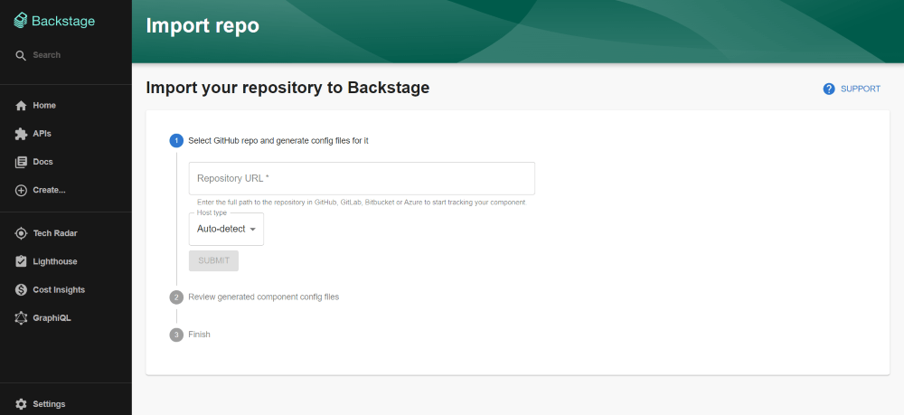

# Catalog import plugin

Welcome to the catalog-import plugin!

This plugin allows you to bootstrap a component-config YAML file for your repository and open a pull request to add it.

When installed it is accessible on [localhost:3000/catalog-import](localhost:3000/catalog-import).



## Running

Just run the backstage.

```
yarn start && yarn --cwd packages/backend start
```

## Usage

Pretty straightforward, navigate to [localhost:3000/catalog-import](localhost:3000/catalog-import) and enter your repo's URL.
