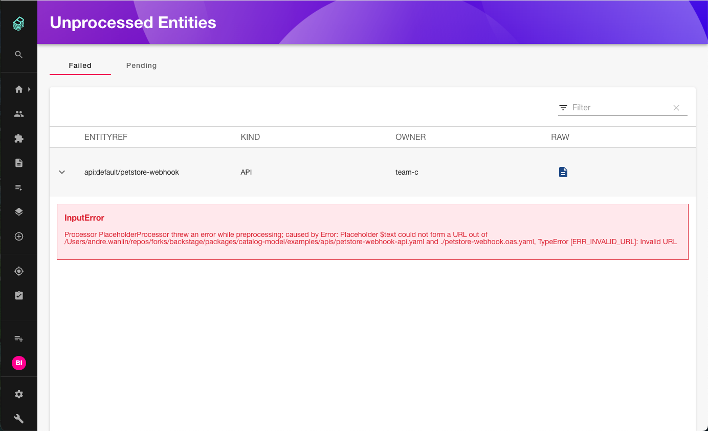
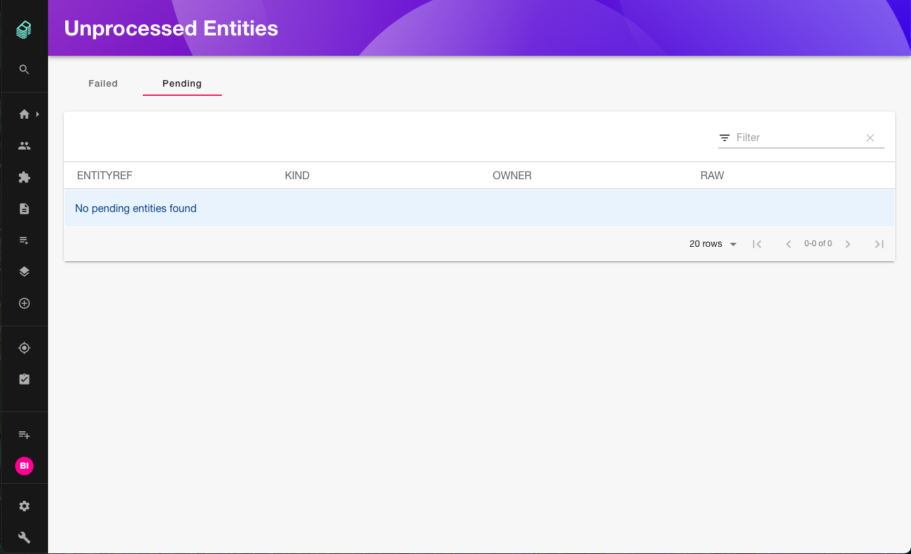
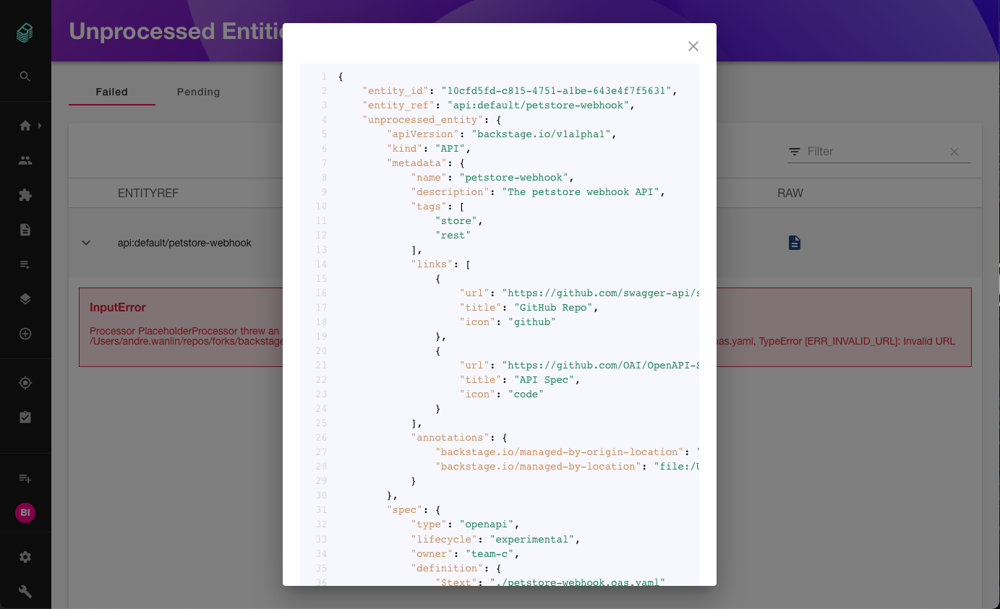

# Catalog Unprocessed Entities

## Features

Frontend plugin to view unprocessed entities.

### Failed Entities

You can see entities that are in a failed state:



### Pending Entities

You can see entities that are in a pending state:



### Raw View

In either of the failed or pending tabs you have the option to see the raw entity as JSON:



## Requirements

Requires the `@backstage/plugin-catalog-backend-module-unprocessed` module to be installed.

## Installation

```shell
yarn --cwd packages/app add @backstage/plugin-catalog-unprocessed-entities
```

Import into your `App.tsx` and include into the `<FlatRoutes>` component:

```tsx title="packages/app/src/App.tsx"
import { CatalogUnprocessedEntitiesPage } from '@backstage/plugin-catalog-unprocessed-entities';
//...

<Route
  path="/catalog-unprocessed-entities"
  element={<CatalogUnprocessedEntitiesPage />}
/>;
```

### Integrating with the New Frontend System

Follow this section if you are using Backstage's [new frontend system](https://backstage.io/docs/frontend-system/).

Import `catalogUnprocessedEntitiesPlugin` in your `App.tsx` and add it to your app's `features` array:

```typescript
import catalogUnprocessedEntitiesPlugin from '@backstage/plugin-catalog-unprocessed-entities';

// ...

export const app = createApp({
  features: [
    // ...
    catalogUnprocessedEntitiesPlugin,
    // ...
  ],
});
```

## Customization

If you want to use the provided endpoints in a different way, you can use the ApiRef doing the following:

```typescript
import { catalogUnprocessedEntitiesApiRef } from '@backstage/plugin-catalog-unprocessed-entities';
import { useApi } from '@backstage/core-plugin-api';

const catalogUnprocessedEntitiesApi = useApi(catalogUnprocessedEntitiesApiRef);
```

Note that if you are not rendering the `CatalogUnprocessedEntitiesPage` in the `App.tsx` tree, you will need to export the `catalogUnproccessedEntitiesPlugin` from your `plugins.ts` file to setup the plugin otherwise you will receive an error like `No implementation available for apiRef{plugin.catalog-unprocessed-entities.service}`

```typescript
// In packages/app/src/plugins.ts
...
export { catalogUnprocessedEntitiesPlugin } from '@backstage/plugin-catalog-unprocessed-entities';
```

If you don't have a `plugins.ts` file, you can create it with the path `packages/app/src/plugins.ts` and then import it into your `App.tsx`:

```diff
+ import * as plugins from './plugins';

const app = createApp({
  apis,
+   plugins: Object.values(plugins),
  bindRoutes({ bind }) {
    /* ... */
  },
});
```

## Getting started

Your plugin has been added to the example app in this repository,
meaning you'll be able to access it by running `yarn start` in the root directory,
and then navigating to [/catalog-unprocessed-entities](http://localhost:3000/catalog-unprocessed-entities).

You can also serve the plugin in isolation by running `yarn start` in the plugin directory.
This method of serving the plugin provides quicker iteration speed and a faster startup and hot reloads.
It is only meant for local development, and the setup for it can be found inside the [/dev](./dev) directory.
