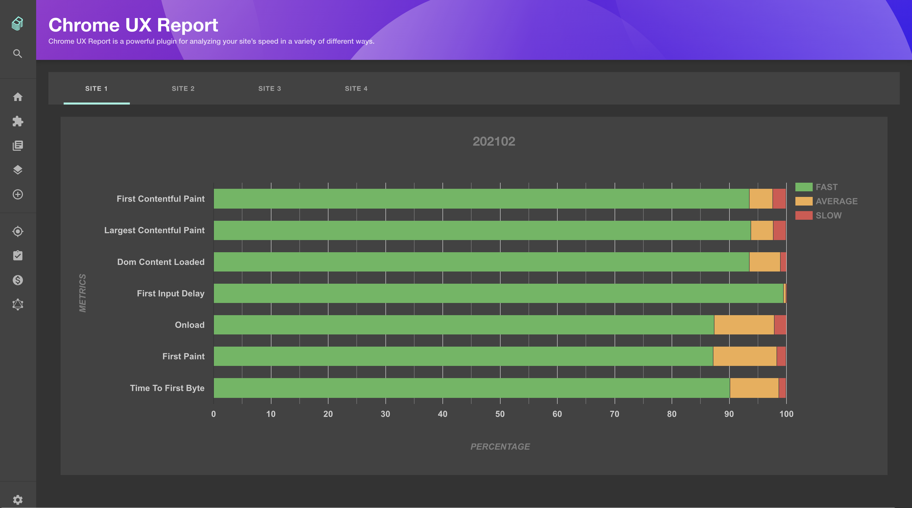
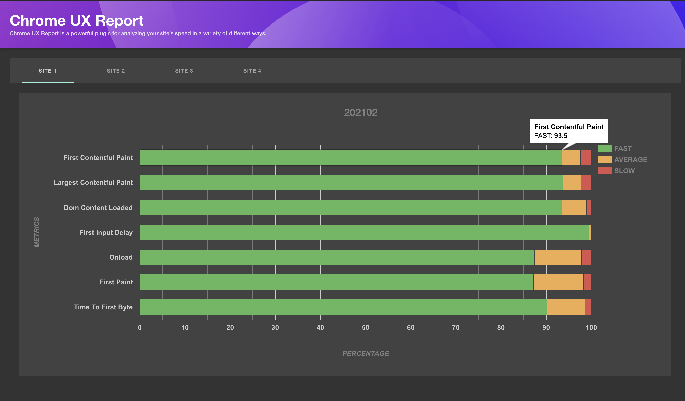
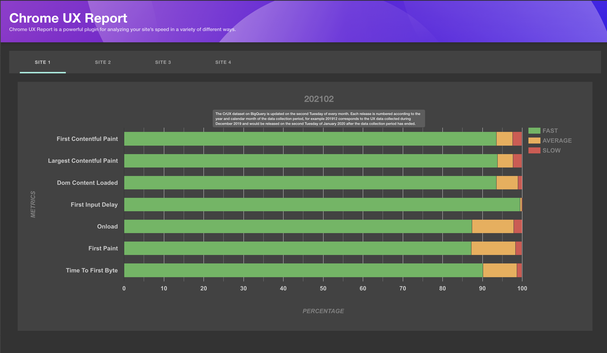

## What is Chrome UX Report?

The Chrome User Experience Report is powered by real user measurement of key user experience metrics across the public web, aggregated from users who have opted-in to syncing their browsing history, have not set up a Sync passphrase, and have usage statistic reporting enabled. If you are curious of what is the metrics, you can go to [UX Metrics](https://developers.google.com/web/tools/chrome-user-experience-report).

## Configuring the Plugin

You can add this plugin to the project follow these steps.

1. Run:

```sh
$ yarn add @backstage/plugin-chrome-ux-report @backstage/plugin-chrome-ux-report-backend
```

2. Add the plugin backend:

In a new file named `chromeuxreport.ts` under `backend/src/plugins`:

```ts
import { createRouter } from '@backstage/plugin-chrome-ux-report-backend';
import { Router } from 'express';
import { PluginEnvironment } from '../types';

export default async function createPlugin({
  logger,
  config,
  database,
}: PluginEnvironment): Promise<Router> {
  return await createRouter({ logger, config, database });
}
```

And then add to `packages/backend/src/index.ts`:

```ts
// ...
import chromeuxreport from './plugins/chromeuxreport';
// ...
async function main() {
  // ...
  const chromeuxreportEnv = useHotMemoize(module, () =>
    createEnv('chromeuxreport'),
  );
  // ...

  const apiRouter = Router();
  // ...
  apiRouter.use('/chromeuxreport', await chromeuxreport(chromeuxreportEnv));
  // ...
}
```

3. Add the plugin frontend to `packages/app/src/plugin.ts`:

```ts
export { plugin as chromeUXReport } from '@backstage/plugin-chrome-ux-report';
```

4. Register the plugin frontend router in `packages/app/src/App.tsx`:

```tsx
// At the top imports
import { ChromeUXReportPage } from '@backstage/plugin-chrome-ux-report';

// Inside App component
<Routes>
  // ...
  <Route path="/chrome-ux-report" element={<ChromeUXReportPage />} />
  // ...
</Routes>;
```

5. Add chrome user experience report configs for the backend in your `app-config.yaml` (see
   [chrome-ux-report-backend](https://github.com/backstage/backstage/blob/master/plugins/chrome-ux-report-backend/README.md)
   for more options):

```yaml
chromeUXReport:
  projectId: projectId # Project id of your project in Google Cloud
  keyPath:
    $env: GOOGLE_APPLICATION_CREDENTIALS
  origins:
    - site: siteUrl # Any site url e.g. 'https://backstage.io'
      name: siteName # Name of the relevant site
```

## That's it!

Your Backstage app is now ready to use Google Chrome UX Report Plugin! When you start the
backend of the app, you should be able to see
`'Plugin Chrome UX Report has started'`
in the logs and then you can see these screens.

| List of metrics                                                                | Info about metric                                                                                   | Info about period                                                                                  |
| ------------------------------------------------------------------------------ | --------------------------------------------------------------------------------------------------- | -------------------------------------------------------------------------------------------------- |
|  |  |  |
