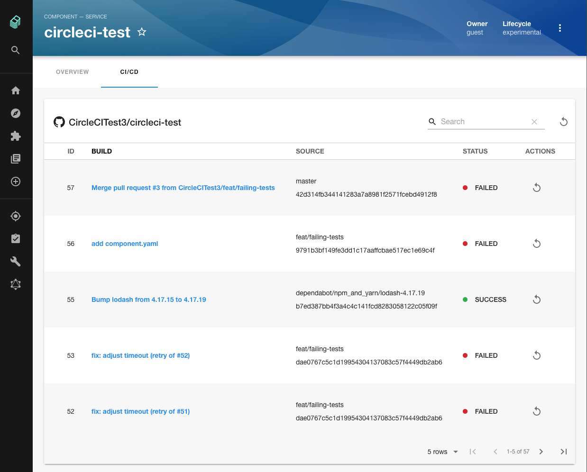
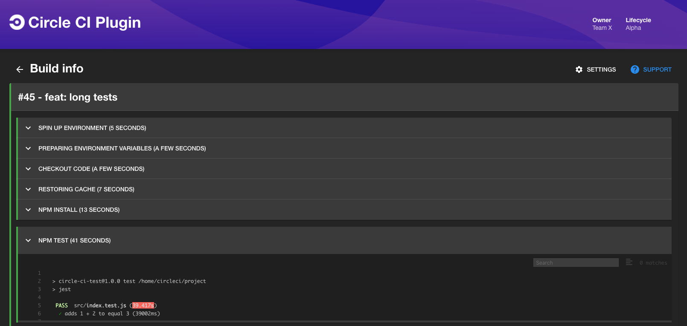

# CircleCI Plugin

Website: [https://circleci.com/](https://circleci.com/)




## Setup

1. If you have a standalone app (you didn't clone this repo), then do

```bash
# From your Backstage root directory
cd packages/app
yarn add @backstage/plugin-circleci
```

2. Add the `EntityCircleCIContent` extension to the entity page in your app:

```tsx
// In packages/app/src/components/catalog/EntityPage.tsx
import {
  EntityCircleCIContent,
  isCircleCIAvailable,
} from '@backstage/plugin-circleci';

// For example in the CI/CD section
const cicdContent = (
  <EntitySwitch>
    <EntitySwitch.Case if={isCircleCIAvailable}>
      <EntityCircleCIContent />
    </EntitySwitch.Case>
```

4. Add proxy config:

```yaml
# In app-config.yaml
proxy:
  '/circleci/api':
    target: https://circleci.com/api/v1.1
    headers:
      Circle-Token: ${CIRCLECI_AUTH_TOKEN}
```

5. Get and provide a `CIRCLECI_AUTH_TOKEN` as an environment variable (see the [CircleCI docs](https://circleci.com/docs/api/#add-an-api-token)).
6. Add a `circleci.com/project-slug` annotation to your respective `catalog-info.yaml` files, on the format <git-provider>/<owner>/<project> (https://backstage.io/docs/architecture-decisions/adrs-adr002#format).

```yaml
# Example catalog-info.yaml entity definition file
apiVersion: backstage.io/v1alpha1
kind: Component
metadata:
  # ...
  annotations:
    # This also supports bitbucket/xxx/yyy
    circleci.com/project-slug: github/my-org/my-repo
spec:
  type: service
  # ...
```

## Features

- List top 50 builds for a project
- Dive into one build to see logs
- Polling (logs only)
- Retry builds
- Works for both project and personal tokens
- Pagination for builds

## Limitations

- CircleCI has pretty strict rate limits per token, be careful with opened tabs
- CircleCI doesn't provide a way to auth by 3rd party (e.g. GitHub) token, nor by calling their OAuth endpoints, which currently stands in the way of better auth integration with Backstage (https://discuss.circleci.com/t/circleci-api-authorization-with-github-token/5356)
