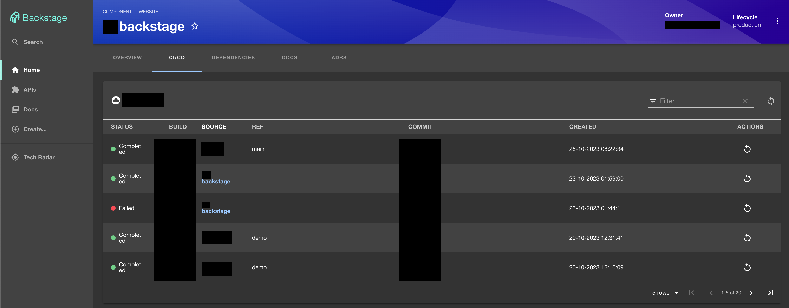

# Google Cloud Build Plugin

### Welcome to the Google Cloud Build plugin!

This plugin allows you to include Google Cloud Build history in your backstage CI/CD page.



## Installation Steps

### Install the plugin into backstage

```bash
cd packages/app
yarn add @backstage/plugin-cloudbuild
```

### Modify EntityPage.tsx

packages/app/src/components/catalog/EntityPage.tsx

#### Add the Plugin import to the list of imports

```diff
// packages/app/src/components/catalog/EntityPage.tsx
import { TechDocsAddons } from '@backstage/plugin-techdocs-react';

import { ReportIssue } from '@backstage/plugin-techdocs-module-addons-contrib';

+import { EntityCloudbuildContent, isCloudbuildAvailable } from '@backstage/plugin-cloudbuild';
```

#### In your `cicdContent` constant, add the following switch case

```diff
// packages/app/src/components/catalog/EntityPage.tsx
const cicdContent = (
  <EntitySwitch>
+    <EntitySwitch.Case if={isCloudbuildAvailable}>
+      <EntityCloudbuildContent />
+    </EntitySwitch.Case>

    <EntitySwitch.Case if={isGithubActionsAvailable}>
      <EntityGithubActionsContent />
    </EntitySwitch.Case>
```

##### OPTIONAL

If you don't use GitHub Actions, or don't want to show it on your CI/CD page, then you can remove the switch case for it:

```diff
// packages/app/src/components/catalog/EntityPage.tsx
const cicdContent = (
  <EntitySwitch>
+    <EntitySwitch.Case if={isCloudbuildAvailable}>
+      <EntityCloudbuildContent />
+    </EntitySwitch.Case>

-    <EntitySwitch.Case if={isGithubActionsAvailable}>
-      <EntityGithubActionsContent />
-    </EntitySwitch.Case>
```

### Add annotation(s) to your component-info.yaml file

Any component, that you would like the Cloud Build Plugin to populate for, should include the following `cloudbuild-project-slug` annotation. This annotation sets the GCP project name to be used for pulling the Cloud Build details from.

```diff
// component-info.yaml
apiVersion: backstage.io/v1alpha1
kind: Component
metadata:
  name: backstage
  description: Backstage application.
+  annotations:
+    google.com/cloudbuild-project-slug: your-project-name
spec:
  type: website
  lifecycle: development
```

By default, the cloud build results list is filtered by repository name equal to the name you have set in your component-info.yaml file. This is `metadata.name`. So if your metadata.name is `backstage` then it will only show builds matching the backstage repo name.

Additionally, build results are pulled from the `global` region by default.

#### Change Filtering

If you need the page to be filtered on a different repository name, then you can use the following annotation:

```diff
// component-info.yaml
apiVersion: backstage.io/v1alpha1
kind: Component
metadata:
  name: backstage
  description: Backstage application.
  annotations:
    google.com/cloudbuild-project-slug: your-project-name
+   google.com/cloudbuild-repo-name: my-backstage
spec:
  type: website
  lifecycle: development
```

You can also automatically filter the results based on trigger name instead of repository name. To do so, use the following annotation:

```diff
// component-info.yaml
apiVersion: backstage.io/v1alpha1
kind: Component
metadata:
  name: backstage
  description: Backstage application.
  annotations:
    google.com/cloudbuild-project-slug: your-project-name
+   google.com/cloudbuild-trigger-name: my-trigger-name
spec:
  type: website
  lifecycle: development
```

`Note:` The `cloudbuild-repo-name` annotation takes precedence over the `cloudbuild-trigger-name` annotation. So if you happen to use both annotations, cloudbuild-repo-name will be used. It is recommended to use one or the other if required.

If you need to pull Cloud Build results from a location or region other than the global scope, then use the following annotation:

```diff
// component-info.yaml
apiVersion: backstage.io/v1alpha1
kind: Component
metadata:
  name: backstage
  description: Backstage application.
  annotations:
    google.com/cloudbuild-project-slug: your-project-name
+   google.com/cloudbuild-location: us-central1
spec:
  type: website
  lifecycle: development
```
