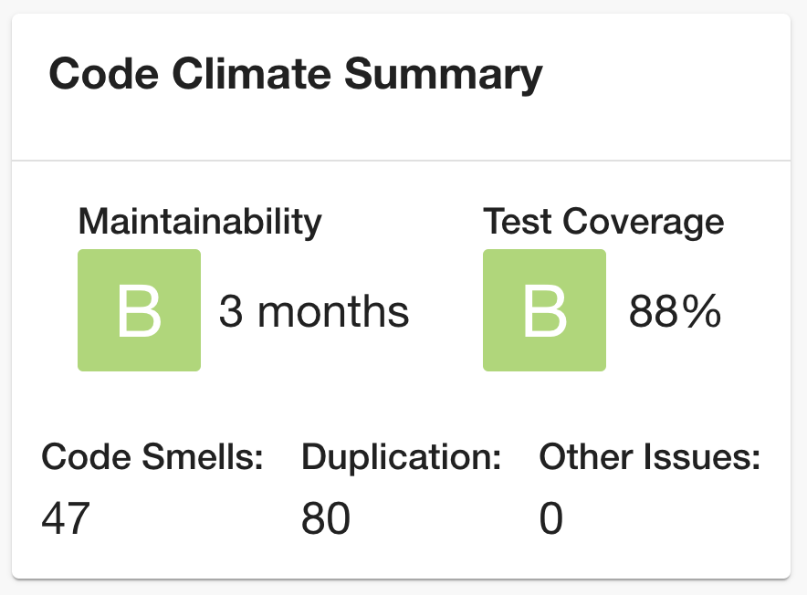

# Code Climate Plugin

The Code Climate Plugin displays a few stats from the quality section from [Code Climate](https://codeclimate.com).



## Getting Started

1. Install the Code Climate Plugin:

```bash
# From your Backstage root directory
yarn --cwd packages/app add @backstage/plugin-code-climate
```

2. Add the `EntityCodeClimateCard` to the EntityPage:

```jsx
// packages/app/src/components/catalog/EntityPage.tsx

import { EntityCodeClimateCard } from '@backstage/plugin-code-climate';

const overviewContent = (
  <Grid container spacing={3} alignItems="stretch">
    // ...
    <Grid item>
      <EntityCodeClimateCard />
    </Grid>
    // ...
  </Grid>
);
```

3. Add the proxy config:

```yaml
# app-config.yaml

proxy:
  '/codeclimate/api':
    target: https://api.codeclimate.com/v1
    headers:
      Authorization: Token token=${CODECLIMATE_TOKEN}
```

4. Create a new API access token (https://codeclimate.com/profile/tokens) and provide `CODECLIMATE_TOKEN` as an env variable.

5. Add the `codeclimate.com/repo-id` annotation to your `catalog-info.yaml` file:

```yaml
apiVersion: backstage.io/v1alpha1
kind: Component
metadata:
  name: backstage
  description: |
    Backstage is an open-source developer portal that puts the developer experience first.
  annotations:
    codeclimate.com/repo-id: YOUR_REPO_ID
spec:
  type: library
  owner: CNCF
  lifecycle: experimental
```

### Demo Mode

The plugin provides a MockAPI that always returns dummy data instead of talking to the Code Climate backend.
You can add it by overriding the `codeClimateApiRef`:

```ts
// packages/app/src/apis.ts

import { createApiFactory } from '@backstage/core-plugin-api';
import {
  MockCodeClimateApi,
  codeClimateApiRef,
} from '@backstage/plugin-code-climate';

export const apis = [
  // ...

  createApiFactory(codeClimateApiRef, new MockCodeClimateApi()),
];
```
