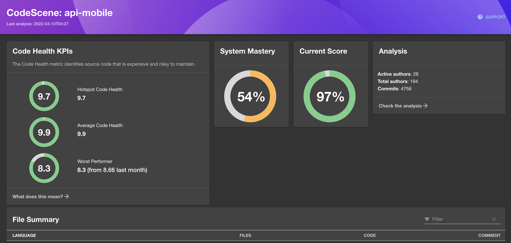

# codescene

[CodeScene](https://codescene.com/) is a multi-purpose tool that connects code, businesses, and people. Discover hidden hazards and social trends in your code. Prioritise and minimise technical debt.

The CodeScene Backstage Plugin provides a page component that displays a list of existing projects and associated analysis data on your CodeScene instance.



## Setup

1. Install the plugin by running:

```bash
# From your Backstage root directory
yarn --cwd packages/app add @backstage/plugin-codescene
```

2. Add the routes and pages to your `App.tsx`:

```tsx
import {
  CodeScenePage,
  CodeSceneProjectDetailsPage,
} from '@backstage/plugin-codescene';

...

<Route path="/codescene" element={<CodeScenePage />} />
<Route
    path="/codescene/:projectId"
    element={<CodeSceneProjectDetailsPage />}
/>
```

3. Add to the sidebar item routing to the new page:

```tsx
// In packages/app/src/components/Root/Root.tsx
import { CodeSceneIcon } from '@backstage/plugin-codescene';

{
  /* other sidebar items... */
}
<SidebarItem icon={CodeSceneIcon} to="codescene" text="CodeScene" />;
```

4. Setup the `app-config.yaml` `codescene` proxy and configuration blocks:

```yaml
proxy:
  '/codescene-api':
    target: '<INSTANCE_HOSTNAME>/api/v1'
    allowedMethods: ['GET']
    allowedHeaders: ['Authorization']
    headers:
      Authorization: Basic ${CODESCENE_AUTH_CREDENTIALS}
```

```yaml
codescene:
  baseUrl: https://codescene.my-company.net # replace with your own URL
```
