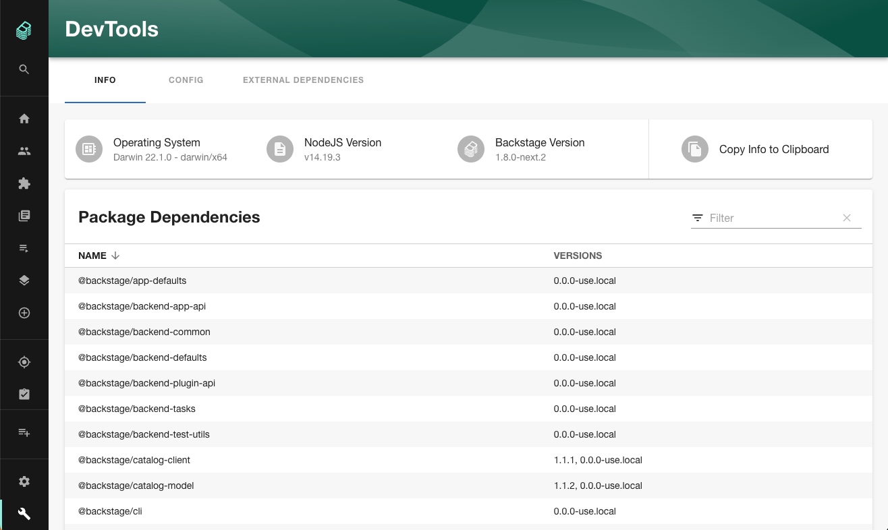
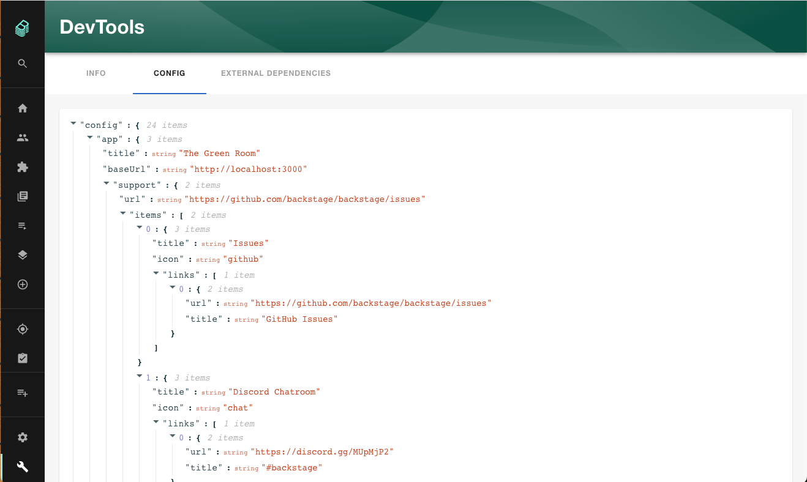
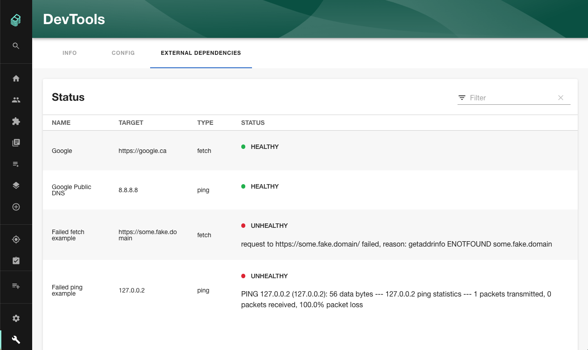

# DevTools

Welcome to the DevTools plugin! This plugin helps elevate useful information about a Backstage instance through the frontend, which can be helpful for an integrator for troubleshooting, reviewing, and understanding their installation.

## Features

The DevTools plugin comes with two tabs out of the box.

### Info

Lists helpful information about your current running Backstage instance such as: OS, NodeJS version, Backstage version, and package versions.



#### Backstage Version Reporting

The Backstage Version that is reported requires `backstage.json` to be present at the root of the running backstage instance.  
You may need to modify your Dockerfile to ensure `backstage.json` is copied into the `WORKDIR` of your image.

```sh
WORKDIR /app
# This switches many Node.js dependencies to production mode.
ENV NODE_ENV production

# Then copy the rest of the backend bundle, along with any other files we might want (including backstage.json).
COPY --chown=node:node ... backstage.json ./
```

### Config

Lists the configuration being used by your current running Backstage instance.

**Note:** The Config tab uses the configuration schema [defined by each plugin](https://backstage.io/docs/conf/defining) to be able to mask secrets. It does this by checking that the [visibility](https://backstage.io/docs/conf/defining#visibility) has been marked as `secret`. If this is not set then the secret will appear in clear text. To mitigate this it is highly recommended that you enable the [permission framework](https://backstage.io/docs/permissions/overview) and [apply the proper permissions](#permissions)). If you do see secrets in clear text please contact the plugin's author to get the visibility set to secret for the applicable property.



## Optional Features

The DevTools plugin can be setup with other tabs with additional helpful features.

### External Dependencies

Lists the status of configured External Dependencies based on your current running Backstage instance's ability to reach them.



## Setup

The following sections will help you get the DevTools plugin setup and running.

### Backend

You need to setup the [DevTools backend plugin](../devtools-backend/README.md) before you move forward with any of the following steps if you haven't already.

### Frontend

To setup the DevTools frontend you'll need to do the following steps:

1. First we need to add the `@backstage/plugin-devtools` package to your frontend app:

   ```sh
   # From your Backstage root directory
   yarn add --cwd packages/app @backstage/plugin-devtools
   ```

2. Now open the `packages/app/src/App.tsx` file
3. Then after all the import statements add the following line:

   ```ts
   import { DevToolsPage } from '@backstage/plugin-devtools';
   ```

4. In this same file just before the closing `</ FlatRoutes>`, this will be near the bottom of the file, add this line:

   ```ts
   <Route path="/devtools" element={<DevToolsPage />} />
   ```

5. Next open the `packages/app/src/components/Root/Root.tsx` file
6. We want to add this icon import after all the existing import statements:

   ```ts
   import BuildIcon from '@material-ui/icons/Build';
   ```

7. Then add this line just after the `<SidebarSettings />` line:

   ```ts
   <SidebarItem icon={BuildIcon} to="devtools" text="DevTools" />
   ```

8. Now run `yarn dev` from the root of your project and you should see the DevTools option show up just below Settings in your sidebar and clicking on it will get you to the [Info tab](#info)

## Customizing

The DevTools plugin has been designed so that you can customize the tabs to suite your needs. You may only want some or none of the out of the box tabs or you may want to add your own. The following sections explains how to do that (assuming you've already done the [setup steps](#setup)). As part of this example we'll also be showing how you can add the optional [External Dependencies](#external-dependencies) tab.

1. In the `packages/app/src/components` folder create a new sub-folder called `devtools`
2. Then in this new `devtools` folder add a file called `CustomDevToolsPage.tsx`
3. In the `CustomDevToolsPage.tsx` file add the following content:

   ```tsx
   import {
     ConfigContent,
     ExternalDependenciesContent,
     InfoContent,
   } from '@backstage/plugin-devtools';
   import { DevToolsLayout } from '@backstage/plugin-devtools';
   import React from 'react';

   export const DevToolsPage = () => {
     return (
       <DevToolsLayout>
         <DevToolsLayout.Route path="info" title="Info">
           <InfoContent />
         </DevToolsLayout.Route>
         <DevToolsLayout.Route path="config" title="Config">
           <ConfigContent />
         </DevToolsLayout.Route>
         <DevToolsLayout.Route
           path="external-dependencies"
           title="External Dependencies"
         >
           <ExternalDependenciesContent />
         </DevToolsLayout.Route>
       </DevToolsLayout>
     );
   };

   export const customDevToolsPage = <DevToolsPage />;
   ```

4. Now open the `packages/app/src/App.tsx` file and add the following import after all the existing import statements:

   ```ts
   import { customDevToolsPage } from './components/devtools/CustomDevToolsPage';
   ```

5. Then we need to adjust our route as follows

   ```diff
   -    <Route path="/devtools" element={<DevToolsPage />} />
   +    <Route path="/devtools" element={<DevToolsPage />} >
   +      {customDevToolsPage}
   +    </Route>
   ```

6. Now run `yarn dev` from the root of your project. When you go to the DevTools you'll now see you have a third tab for [External Dependencies](#external-dependencies)

With this setup you can add or remove the tabs as you'd like or add your own simply by editing your `CustomDevToolsPage.tsx` file

## Permissions

The DevTools plugin supports the [permissions framework](https://backstage.io/docs/permissions/overview), the following sections outline how you can use them with the assumption that you have the permissions framework setup and working.

**Note:** These sections are intended as guidance and are completely optional. The DevTools plugin will work with the permission framework off or on without any specific policy setup.

### Secure Sidebar Option

To use the permission framework to secure the DevTools sidebar option you'll want to do the following:

1. First we need to add the `@backstage/plugin-devtools-common` package to your frontend app:

   ```sh
   # From your Backstage root directory
   yarn add --cwd packages/app @backstage/plugin-devtools-common
   ```

2. Then open the `packages/app/src/components/Root/Root.tsx` file
3. The add these imports after all the existing import statements:

   ```ts
   import { devToolsAdministerPermission } from '@backstage/plugin-devtools-common';
   import { RequirePermission } from '@backstage/plugin-permission-react';
   ```

4. Then make the following change:

   ```diff
   -   <SidebarItem icon={BuildIcon} to="devtools" text="DevTools" />
   +   <RequirePermission
   +     permission={devToolsAdministerPermission}
   +     errorPage={<></>}>
   +     <SidebarItem icon={BuildIcon} to="devtools" text="DevTools" />
   +   </RequirePermission>
   ```

### Secure the DevTools Route

To use the permission framework to secure the DevTools route you'll want to do the following:

1. First we need to add the `@backstage/plugin-devtools-common` package to your frontend app (skip this step if you've already done this):

   ```sh
   # From your Backstage root directory
   yarn add --cwd packages/app @backstage/plugin-devtools-common
   ```

2. Then open the `packages/app/src/App.tsx` file
3. The add this import after all the existing import statements:

   ```ts
   import { devToolsAdministerPermission } from '@backstage/plugin-devtools-common';
   ```

4. Then make the following change:

   ```diff
   -   <Route path="/devtools" element={<DevToolsPage />} />
   +   <Route path="/devtools"
   +     element={
   +     <RequirePermission permission={devToolsAdministerPermission}>
   +       <DevToolsPage />
   +     </RequirePermission>
   +     }
   +   />
   ```

Note: if you are using a `customDevToolsPage` as per the [Customizing](#customizing) documentation the changes for Step 4 will be:

```diff
-   <Route path="/devtools" element={<DevToolsPage />} />
+   <Route path="/devtools"
+     element={
+     <RequirePermission permission={devToolsAdministerPermission}>
+       <DevToolsPage />
+     </RequirePermission>
+     }
+   >
+     {customDevToolsPage}
+   </Route>
```

### Permission Policy

Here is an example permission policy that you might use to secure the DevTools plugin:

```ts
// packages/backend/src/plugins/permission.ts

class TestPermissionPolicy implements PermissionPolicy {
  async handle(request: PolicyQuery): Promise<PolicyDecision> {
    if (isPermission(request.permission, devToolsAdministerPermission)) {
      if (
        user?.identity.ownershipEntityRefs.includes(
          'group:default/backstage-admins',
        )
      ) {
        return { result: AuthorizeResult.ALLOW };
      }
      return { result: AuthorizeResult.DENY };
    }

    if (isPermission(request.permission, devToolsInfoReadPermission)) {
      if (
        user?.identity.ownershipEntityRefs.includes(
          'group:default/backstage-admins',
        )
      ) {
        return { result: AuthorizeResult.ALLOW };
      }
      return { result: AuthorizeResult.DENY };
    }

    if (isPermission(request.permission, devToolsConfigReadPermission)) {
      if (
        user?.identity.ownershipEntityRefs.includes(
          'group:default/backstage-admins',
        )
      ) {
        return { result: AuthorizeResult.ALLOW };
      }
      return { result: AuthorizeResult.DENY };
    }

    if (
      isPermission(
        request.permission,
        devToolsExternalDependenciesReadPermission,
      )
    ) {
      if (
        user?.identity.ownershipEntityRefs.includes(
          'group:default/backstage-admins',
        )
      ) {
        return { result: AuthorizeResult.ALLOW };
      }
      return { result: AuthorizeResult.DENY };
    }

    return { result: AuthorizeResult.ALLOW };
  }
}
```

To use this policy you'll need to make sure to add the `@backstage/plugin-devtools-common` package to your backend you can do that by running this command:

```sh
# From your Backstage root directory
yarn add --cwd packages/backend @backstage/plugin-devtools-common
```

You'll also need to add these imports:

```ts
import {
  devToolsAdministerPermission,
  devToolsConfigReadPermission,
  devToolsExternalDependenciesReadPermission,
  devToolsInfoReadPermission,
} from '@backstage/plugin-devtools-common';
```

**Note:** The group "group:default/backstage-admins" is simply an example and does not exist. You can point this to any group you have in your catalog instead.

### Customizing with Permissions

If you followed the [Customizing](#customizing) documentation and want to use permission there this is what your `CustomDevToolsPage.tsx` would look like:

```tsx
import {
  ConfigContent,
  ExternalDependenciesContent,
  InfoContent,
} from '@backstage/plugin-devtools';
import { DevToolsLayout } from '@backstage/plugin-devtools';
import {
  devToolsConfigReadPermission,
  devToolsExternalDependenciesReadPermission,
  devToolsInfoReadPermission,
} from '@backstage/plugin-devtools-common';
import { RequirePermission } from '@backstage/plugin-permission-react';
import React from 'react';

const DevToolsPage = () => {
  return (
    <DevToolsLayout>
      <DevToolsLayout.Route path="info" title="Info">
        <RequirePermission permission={devToolsInfoReadPermission}>
          <InfoContent />
        </RequirePermission>
      </DevToolsLayout.Route>
      <DevToolsLayout.Route path="config" title="Config">
        <RequirePermission permission={devToolsConfigReadPermission}>
          <ConfigContent />
        </RequirePermission>
      </DevToolsLayout.Route>
      <DevToolsLayout.Route
        path="external-dependencies"
        title="External Dependencies"
      >
        <RequirePermission
          permission={devToolsExternalDependenciesReadPermission}
        >
          <ExternalDependenciesContent />
        </RequirePermission>
      </DevToolsLayout.Route>
    </DevToolsLayout>
  );
};

export const customDevToolsPage = <DevToolsPage />;
```

## Configuration

The following sections outline the configuration for the DevTools plugin

### External Dependencies Configuration

If you decide to use the External Dependencies tab then you'll need to setup the configuration for it in your `app-config.yaml`, if there is no config setup then the tab will be empty. Here's an example:

```yaml
devTools:
  externalDependencies:
    endpoints:
      - name: 'Google'
        type: 'fetch'
        target: 'https://google.ca'
      - name: 'Google Public DNS'
        type: 'ping'
        target: '8.8.8.8'
```

Configuration details:

- `endpoints` is an array
- `name` is the friendly name for your endpoint
- `type` can be either `ping` or `fetch` and will perform the respective action on the `target`
- `target` is either a URL or server that you want to trigger a `type` action on

### External Dependencies Requirements

If you are using the `ping` type you must ensure that `ping` is available in the Host OS that is running Backstage.
For example you may need to add `ping` into the Dockerfile that builds your Backstage image:

```sh
RUN --mount=type=cache,target=/var/cache/apt,sharing=locked \
    --mount=type=cache,target=/var/lib/apt,sharing=locked \
    apt-get update && \
    apt-get install -y  ... iputils-ping
```
