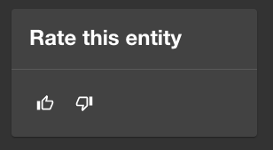
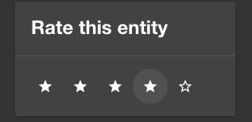
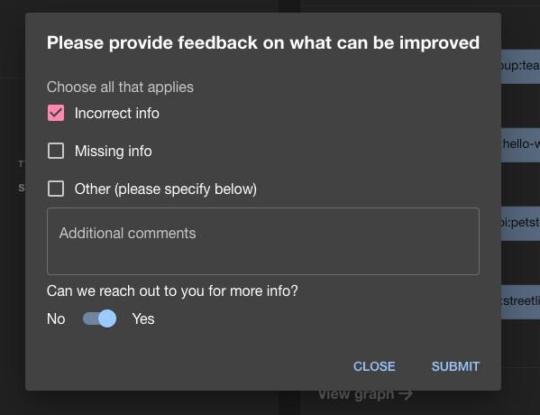
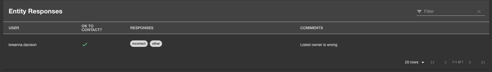
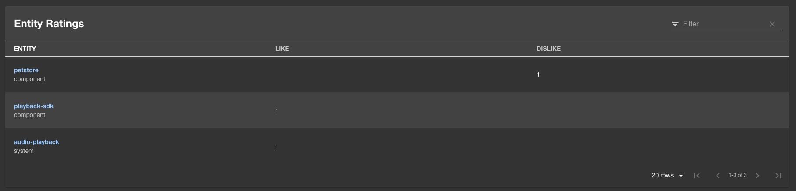
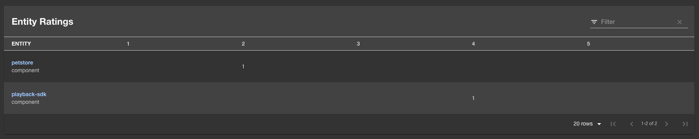

# Entity Feedback Plugin

Welcome to the entity-feedback plugin!

This plugin allows you give and view feedback on entities available in the Backstage catalog.

## Features

### Rate entities

#### Like/Dislike rating



#### Starred rating



### Request additional feedback when poorly rated



### View entity feedback responses



### View aggregated ratings on owned entities

#### Total likes/dislikes



#### Star breakdowns



## Setup

The following sections will help you get the Entity Feedback plugin setup and running

### Backend

You need to setup the [Entity Feedback backend plugin](https://github.com/backstage/backstage/tree/master/plugins/entity-feedback-backend) before you move forward with any of these steps if you haven't already

### Installation

Install this plugin:

```bash
# From your Backstage root directory
yarn --cwd packages/app add @backstage/plugin-entity-feedback
```

### Entity Pages

Add rating and feedback components to your `EntityPage.tsx` to hook up UI so that users
can rate your entities and for owners to view feedback/responses.

To allow users to apply "Like" and "Dislike" ratings add the following to each kind/type of
entity in your `EntityPage.tsx` you want to be rated (if you prefer to use star ratings, replace
`EntityLikeDislikeRatingsCard` with `EntityStarredRatingsCard` and `LikeDislikeButtons` with
`StarredRatingButtons`):

```diff
import {
  ...
+ InfoCard,
  ...
} from '@backstage/core-components';
+import {
+ EntityFeedbackResponseContent,
+ EntityLikeDislikeRatingsCard,
+ LikeDislikeButtons,
+} from '@backstage/plugin-entity-feedback';

// Add to each applicable kind/type of entity as desired
const overviewContent = (
  <Grid container spacing={3} alignItems="stretch">
    ...
+   <Grid item md={2}>
+     <InfoCard title="Rate this entity">
+       <LikeDislikeButtons />
+     </InfoCard>
+   </Grid>
    ...
  </Grid>
);

...

// Add to each applicable kind/type of entity as desired
const serviceEntityPage = (
  <EntityLayoutWrapper>
    ...
+   <EntityLayout.Route path="/feedback" title="Feedback">
+     <EntityFeedbackResponseContent />
+   </EntityLayout.Route>
    ...
  </EntityLayoutWrapper>
);

...

// Add ratings card component to user/group entities to view ratings of owned entities
const userPage = (
  <EntityLayoutWrapper>
    <EntityLayout.Route path="/" title="Overview">
      <Grid container spacing={3}>
        ...
+       <Grid item xs={12}>
+         <EntityLikeDislikeRatingsCard />
+       </Grid>
        ...
        </Grid>
      </Grid>
    </EntityLayout.Route>
  </EntityLayoutWrapper>
);

const groupPage = (
  <EntityLayoutWrapper>
    <EntityLayout.Route path="/" title="Overview">
      <Grid container spacing={3}>
        ...
+       <Grid item xs={12}>
+         <EntityLikeDislikeRatingsCard />
+       </Grid>
        ...
        </Grid>
      </Grid>
    </EntityLayout.Route>
  </EntityLayoutWrapper>
);
```

Note: For a full example of this you can look at [this EntityPage](../../packages/app/src/components/catalog/EntityPage.tsx)
