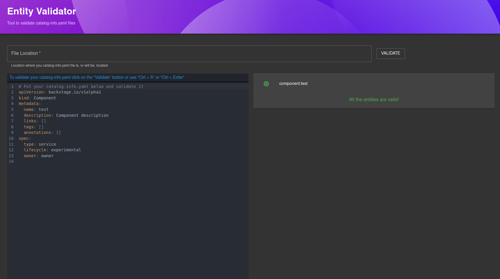

# entity-validation

This plugin creates a new page in Backstage where the user can validate the entities.



## Getting started

First of all, install the package in the `app` package by running the following command:

```bash
# From your Backstage root directory
yarn --cwd packages/app add @backstage/plugin-entity-validation
```

Add the new route to the app by adding the following line:

```typescript
// In packages/app/src/App.tsx
import { EntityValidationPage } from '@backstage/plugin-entity-validation';

const routes = (
  <FlatRoutes>
    {/* ...other routes */}
    <Route path="/entity-validation" element={<EntityValidationPage />} />
  </FlatRoutes>
);
```

To add the new page to your sidebar, you must include these lines in your `Root.tsx` file:

```typescript
    // In packages/app/src/components/Root/Root.tsx
    import BuildIcon from '@material-ui/icons/Build';

    ...

    export const Root = ({ children }: PropsWithChildren<{}>) => (
      <SidebarPage>
        <Sidebar>
          {/* ...other elements */}
          <SidebarGroup label="Menu" icon={<MenuIcon />}>
            {/* Global nav, not org-specific */}
            {/* ...other sidebars */}
            <SidebarItem icon={BuildIcon} to="entity-validation" text="Validator" />
            {/* End global nav */}
            <SidebarDivider />
          </SidebarGroup>
          {/* ...other elements */}
        </Sidebar>
        {children}
      </SidebarPage>
    );
```
