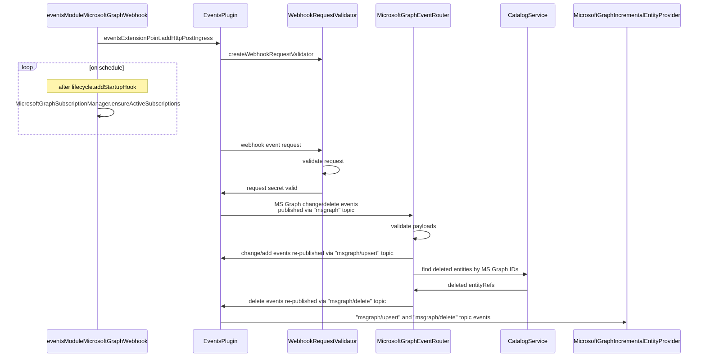
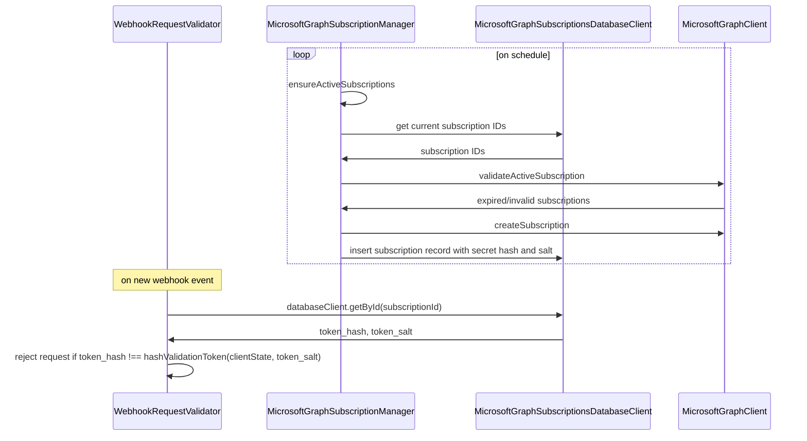

# @backstage/plugin-events-backend-module-msgraph

The Microsoft Graph backend module for the `@backstage/plugin-events-backend` plugin.

This module helps you ingest Microsoft Graph change notifications into Backstage events. It does two things:

- Registers an HTTP ingress for the `msgraph` topic and validates incoming webhook requests.
- Subscribes to `msgraph` events and republishes them to specific topics for user/group upsert and delete operations.

## Installation

Install the [`@backstage/plugin-events-backend`](../events-backend/README.md) plugin if you have not done so already.

Then add this module to your backend package:

```bash
# From your Backstage root directory
yarn --cwd packages/backend add @backstage/plugin-events-backend-module-msgraph
```

```ts
// packages/backend/src/index.ts
backend.add(import('@backstage/plugin-events-backend-module-msgraph'));
```

## Configuration

Add module configuration in your `app-config.yaml`:

```yaml
events:
  modules:
    msgraph:
      # Public URL that Microsoft Graph can call
      notificationUrl: ${MSGRAPH_NOTIFICATION_URL}

      # Resource types to subscribe to
      subscriptionResources:
        - users
        - groups

      # Entra tenant and app registration credentials
      tenantId: ${MSGRAPH_TENANT_ID}
      clientId: ${MSGRAPH_CLIENT_ID}
      clientSecret: ${MSGRAPH_CLIENT_SECRET}

      # Optional startup delay before subscription scheduling
      startupDelay: 30 seconds
```

## Published Topics

After receiving Microsoft Graph notifications on `msgraph`, the module republishes:

- `msgraph/upsert` with payload items in the shape `{ resourceType, resourceId }`.
- `msgraph/delete` with payload items in the shape `{ entityRef }`.

For delete events, the module resolves entity references from the catalog using these annotations:

- `metadata.annotations.graph.microsoft.com/user-id` for users
- `metadata.annotations.graph.microsoft.com/group-id` for groups

## How it works

Unlike GitHub webhook events, MS Graph events cannot be configured in the portal. Client Apps have to create new
subscriptions themselves, specifying the webhook URLs, verification secrets/tokens and all other
params [through an endpoint](https://learn.microsoft.com/en-us/graph/change-notifications-delivery-webhooks?tabs=javascript#create-a-subscription).
The new module `@backstage/plugin-catalog-backend-module-msgraph` looks up deleted entity references in the Catalog and
re-publishes events to more specific `upsert`/`delete` topics.



All incoming event requests are validated on client secret.



Upsert/Delete events can later be received by `MicrosoftGraphOrgEntityProvider` or
`MicrosoftGraphIncrementalEntityProvider`. Group/User IDs from the Upsert events can be used to query MS Graph APIs for
all data necessary to build Group/User entities. Delete events already contain `CompoundEntityRefs` at this point.
Catalog entities can be deleted/added/updated via `connection.applyMutation({..., type: 'delta'})`.

## How to test locally

LocalTunnel can be used to receive webhook events in local environments.

1. `brew install localtunnel`
2. `lt --port 7007`
3. Copy the URL printed and add it to your events config:

```yaml
events:
  modules:
    msgraph:
      notificationUrl: https://shaggy-mirrors-admire.loca.lt/api/events/http/msgraph # append the URL here
      resources:
        - groups
        - users
      clientId: <...>
      clientSecret: <...>
      tenantId: <...>
```

4. Run with DEBUG log level if you want to see all messages `LOG_LEVEL=DEBUG yarn start backend`
