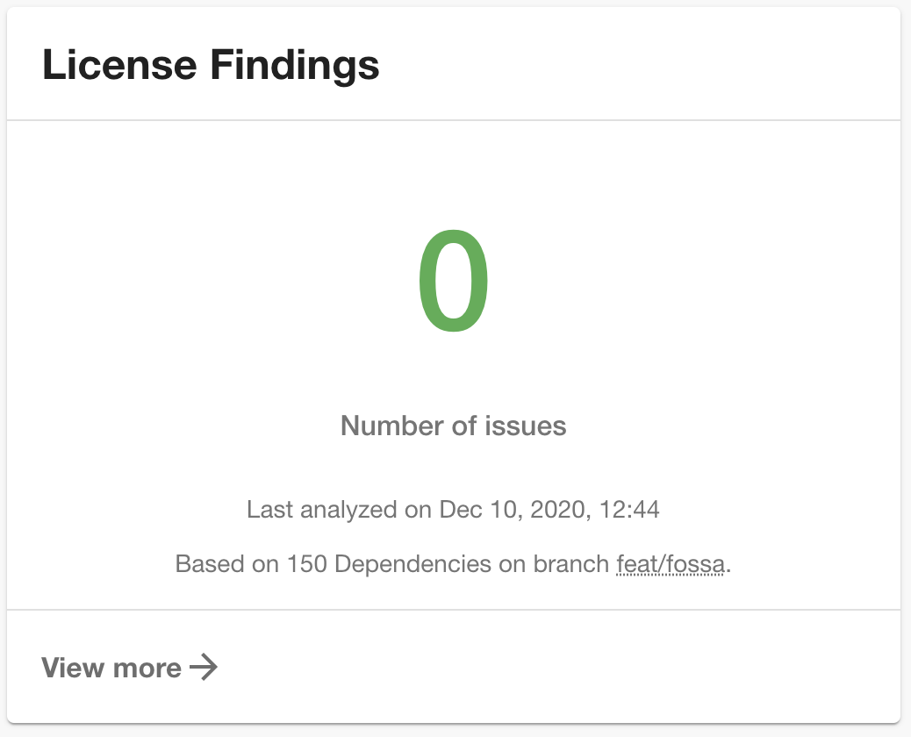
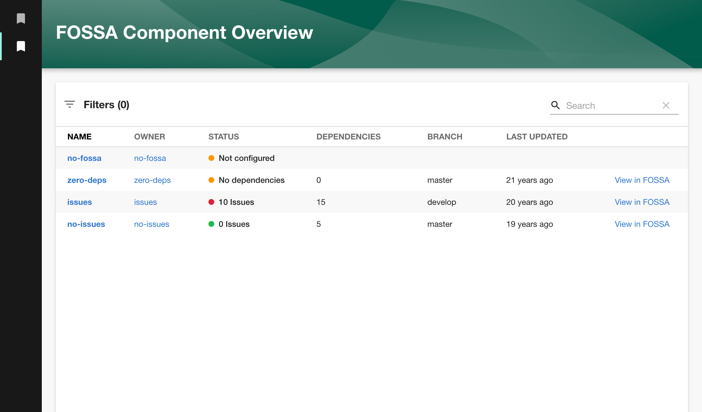

# FOSSA Plugin

The FOSSA Plugin displays code statistics from [FOSSA](https://fossa.com/).



## Getting Started

1. Install the FOSSA Plugin:

```bash
# From your Backstage root directory
cd packages/app
yarn add @backstage/plugin-fossa
```

2. Add the `EntityFossaCard` to the EntityPage:

```jsx
// packages/app/src/components/catalog/EntityPage.tsx

import { EntityFossaCard } from '@backstage/plugin-fossa';

const OverviewContent = ({ entity }: { entity: Entity }) => (
  <Grid container spacing={3} alignItems="stretch">
    // ...
    <Grid item xs={12} sm={6} md={4}>
      <EntityFossaCard />
    </Grid>
    // ...
  </Grid>
);
```

3. Add the proxy config:

```yaml
# app-config.yaml

proxy:
  '/fossa':
    target: https://app.fossa.io/api
    allowedMethods: ['GET']
    headers:
      Authorization: token ${FOSSA_API_TOKEN}

# if you have a fossa organization, configure your id here
fossa:
  organizationId: <your-fossa-organization-id>
```

4. Get an api-token and provide `FOSSA_AUTH_HEADER` as env variable (https://app.fossa.com/account/settings/integrations/api_tokens)

5. Add the `fossa.io/project-name` annotation to your catalog-info.yaml file:

```yaml
apiVersion: backstage.io/v1alpha1
kind: Component
metadata:
  name: backstage
  description: |
    Backstage is an open-source developer portal that puts the developer experience first.
  annotations:
    fossa.io/project-name: YOUR_PROJECT_NAME
spec:
  type: library
  owner: CNCF
  lifecycle: experimental
```

## Other Components

### FOSSA Overview Page

The plugin provides an optional page that can be used to check the license compliance of all components.



Add it to your Backstage application:

1. Install the FOSSA Plugin (see [Getting Started](#getting-started)).

2. Register the page:

```tsx
// packages/app/src/App.tsx

import { FossaPage } from '@backstage/plugin-fossa';

// ...

const routes = (
  <FlatRoutes>
    // ...
    <Route path="/fossa" element={<FossaPage />} />
  </FlatRoutes>
);
```

3. (Optional) Add a Sidebar Icon:

```tsx
// packages/app/src/components/Root/Root.tsx

// ...

export const Root = ({ children }: PropsWithChildren<{}>) => (
  <SidebarPage>
    <Sidebar>
      // ...
      <SidebarItem icon={CheckCircleIcon} to="fossa" text="FOSSA" />
      // ...
    </Sidebar>
    {children}
  </SidebarPage>
);
```
