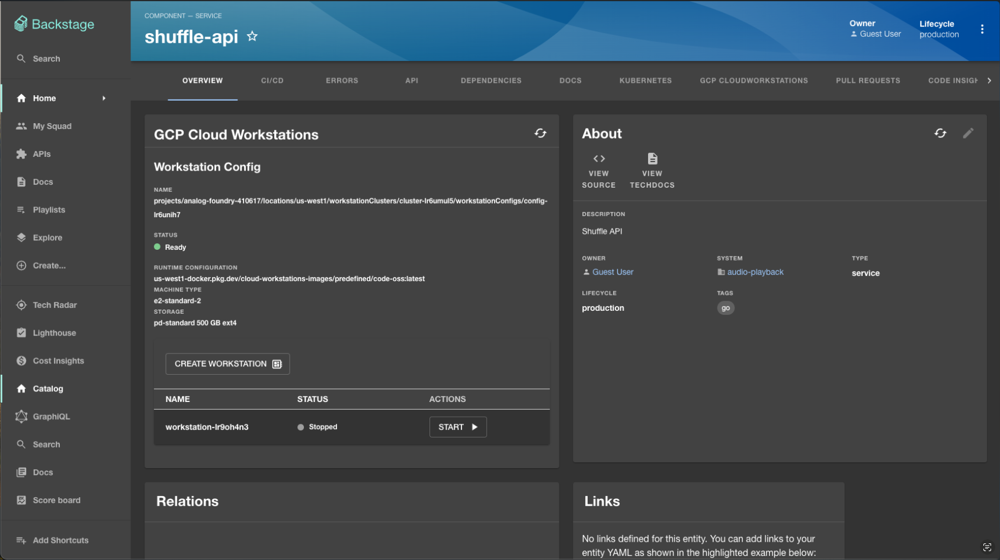
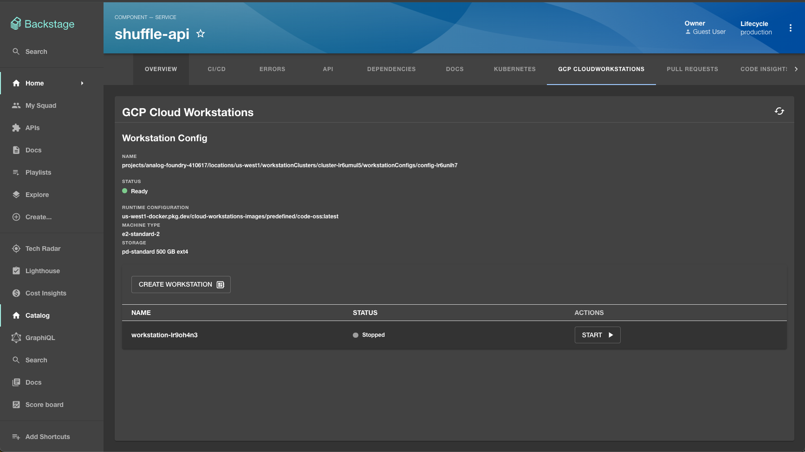

# Google Cloud Workstations

This plugin allows you to link [GCP Cloud Workstations](https://cloud.google.com/workstations/docs/overview) with Backstage components.





## Installation Steps

### Install the plugin into backstage

```bash
cd packages/app
yarn add @backstage/plugin-gcp-cloudworkstations
```

### Add annotation to your component-info.yaml file.

Any component, that you would like the cloud workstations be related to, should include the following [GCP workstation config](https://cloud.google.com/workstations/docs/quickstart-set-up-workstations-console) annotation:

```diff
// component-info.yaml
apiVersion: backstage.io/v1alpha1
kind: Component
metadata:
  name: backstage
  description: Backstage application.
+  annotations:
+    google.com/cloudworkstations-config: projects/analog-foundry-221089/locations/us-west1/workstationClusters/cluster-lr6umul5/workstationConfigs/config-lr6unih7
spec:
  type: website
  lifecycle: development
```

Annotation value should consist of: Google Cloud project id (analog-foundry-221089), Google Cloud project zone (us-west1), Google Cloud workstations cluster name (cluster-lr6umul5) and Google Cloud workstations config name (config-lr6unih7).

### Modify EntityPage.tsx

packages/app/src/components/catalog/EntityPage.tsx

#### Add the Plugin import to the list of imports

```diff
// packages/app/src/components/catalog/EntityPage.tsx
import { TechDocsAddons } from '@backstage/plugin-techdocs-react';

import { ReportIssue } from '@backstage/plugin-techdocs-module-addons-contrib';

+import { WorkstationsCard } from '@backstage/plugin-gcp-cloudworkstations';
+import { isGCPCloudWorkstationsAvailable } from '@backstage/plugin-gcp-cloudworkstations';
+import { GcpCloudworkstationsPage } from '@backstage/plugin-gcp-cloudworkstations';
```

#### In your `overviewContent` constant, add the following switch case:

```diff
// packages/app/src/components/catalog/EntityPage.tsx
const overviewContent = (
  <Grid container spacing={3} alignItems="stretch">
    {entityWarningContent}
+
+   <EntitySwitch>
+     <EntitySwitch.Case if={isGCPCloudWorkstationsAvailable}>
+       <Grid item md={6} xs={12}>
+         <WorkstationsCard />
+       </Grid>
+     </EntitySwitch.Case>
+   </EntitySwitch>
```

#### or

#### For a routable tab section on the entity page. In your `serviceEntityPage` constant, add the following entity layout route:

```diff
// packages/app/src/components/catalog/EntityPage.tsx
const serviceEntityPage = (
     <EntityLayout.Route path="/kubernetes" title="Kubernetes">
      <EntityKubernetesContent />
    </EntityLayout.Route>

+    <EntityLayout.Route
+      path="/gcp-cloudworkstations"
+      title="GCP CloudWorkstations"
+    >
+      <GcpCloudworkstationsPage />
+    </EntityLayout.Route>
)
```
