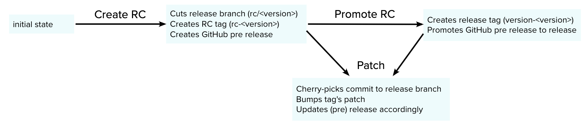

# Git Release Manager (GRM)

## Overview

`GRM` enables developers to manage their releases without having to juggle git commands.

Does it build and ship your code? **No**.

What `GRM` does is manage your Git **[releases](https://docs.github.com/en/github/administering-a-repository/managing-releases-in-a-repository)**, building and shipping is entirely up to you as a developer to handle in your CI.

`GRM` is built with industry standards in mind and the flow is as follows:

> **Git**: The source control system where releases reside in a practical sense. Read more about [Git releases](https://docs.github.com/en/github/administering-a-repository/managing-releases-in-a-repository). (Note that this plugin works just as well with any system implementing `Git`.)
>
> **Release Candidate (RC)**: A Git pre-release intended primarily for internal testing
>
> **Release Version**: A Git release intended for end users

Looking at the flow above, a common release lifecycle could be:

- User presses **Create Release Candidate**
  - `GRM`
    1. Creates a release branch `rc/<version>`
    1. Creates Release Candidate tag `rc-<version>`
    1. Creates a Git prerelease with Release Candidate tag
  - Your CI
    1. Detects the new tag by matching the git reference `refs/tags/rc-.*`
    1. Builds and deploys to staging environment for testing
- User presses **Patch**
  - `GRM`
    1. The selected commit is cherry-picked to the release branch
    1. The release tag is bumped
    1. Updates Git release's tag and description with the patch's details
  - Your CI
    1. Detects the new tag by matching the git reference `refs/tags/(rc|version)-.*` (Release Versions are patchable as well)
    1. Builds and deploys to staging (or production if Release Version) for testing
- User presses **Promote Release Candidate to Release Version**
  - `GRM`
    1. Creates Release Version tag `version-<version>`
    1. Promotes the Git release by removing the prerelease flag
  - Your CI
    1. Detects the new tag by matching the git reference `refs/tags/version-.*`
    1. Builds and deploys to production for testing

## Usage

### Importing

The plugin exports a single full-page extension `GitReleaseManagerPage`, which one can add to an app like a usual top-level tool on a dedicated route.

### Configuration

The plugin is configurable either via props or the select elements on the page.

If project configuration is provided via props, the select elements are disabled. It is also possible to omit features from the page via props, as well as attaching callbacks for successful executions.

See the plugin's dev folder (`dev/index.tsx`) to see some examples.
