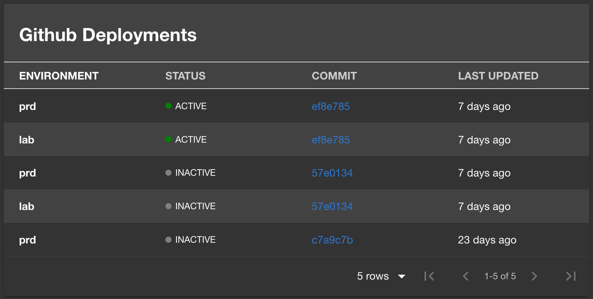

# Github Deployments Plugin

The Github Deployments Plugin displays recent deployments from Github.



## Getting Started

1. Install the Github Deployments Plugin

```bash
# packages/app

yarn add @backstage/plugin-github-deployments
```

2. Add proxy and auth token for Github

```yaml
# app-config.yaml

proxy:
  ...
  '/github/api':
    target: https://api.github.com
    changeOrigin: true
    secure: true
    headers:
      Authorization:
        # Content: 'token OAUTH-TOKEN'
        $env: GITHUB_OAUTH_TOKEN
```

3. Add the plugin to the app

```typescript
// packages/app/src/plugins.ts

export { plugin as GithubDeployments } from '@backstage/plugin-github-deployments';
```

4. Add the ... to the EntityPage:

```typescript
// packages/app/src/components/catalog/EntityPage.tsx

import { EntityGithubDeploymentsCard } from '@backstage/plugin-github-deployments';

const OverviewContent = ({ entity }: { entity: Entity }) => (
  <Grid container spacing={3} alignItems="stretch">
    // ...
    <Grid item xs={12} sm={6} md={4}>
      <EntityGithubDeploymentsCard entity={entity} />
    </Grid>
    // ...
  </Grid>
);
```

5. Add the github.com/project-slug annotation to your catalog-info.yaml file:

```yaml
apiVersion: backstage.io/v1alpha1
kind: Component
metadata:
  name: backstage
  description: |
    Backstage is an open-source developer portal that puts the developer experience first.
  annotations:
    github.com/project-slug: YOUR_PROJECT_SLUG
spec:
  type: library
  owner: CNCF
  lifecycle: experimental
```
