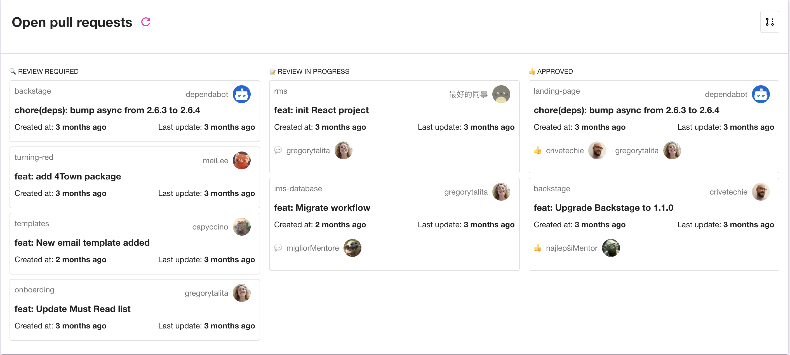

# GitHub Pull Requests Board Plugin

The GitHub Pull Requests Board Plugin helps to visualise all **Open Pull Requests** related to the owned team repository.



It will help you and your team stay on top of open pull requests, hopefully reducing the time from open to merged. It's particularly useful when your team deals with many repositories.

## Prerequisites

- [GitHub Authentication Provider](https://backstage.io/docs/auth/github/provider)

## Getting started

Install the plugin by running the following command **from your Backstage root directory**

`yarn --cwd packages/app add @backstage/plugin-github-pull-requests-board`

The plugin exports the **EntityTeamPullRequestsCard** component which can be added to the Overview page of the team at `backstage/packages/app/src/components/catalog/EntityPage.tsx`

```javascript
import { EntityTeamPullRequestsCard } from '@backstage/plugin-github-pull-requests-board';

const groupPage = (
  <EntityLayoutWrapper>
    <EntityLayout.Route path="/" title="Overview">
      <Grid container spacing={3}>
        {entityWarningContent}
        <Grid item xs={12} md={6}>
          <EntityGroupProfileCard variant="gridItem" />
        </Grid>
        <Grid item xs={12} md={6}>
          <EntityOwnershipCard
            variant="gridItem"
            entityFilterKind={customEntityFilterKind}
          />
        </Grid>
        <Grid item xs={12}>
          <EntityMembersListCard />
        </Grid>
        <Grid item xs={12}>
          <EntityTeamPullRequestsCard />
        </Grid>
      </Grid>
    </EntityLayout.Route>
  </EntityLayoutWrapper>
);
```

Or you can also import the **EntityTeamPullRequestsContent** component which can be used to add a new tab under the group page at `backstage/packages/app/src/components/catalog/EntityPage.tsx`

```javascript
import { EntityTeamPullRequestsContent } from '@backstage/plugin-github-pull-requests-board';

const groupPage = (
    <EntityLayoutWrapper>
        <EntityLayout.Route path="/" title="Overview">
            <Grid container spacing={3}>
            {entityWarningContent}
            <Grid item xs={12} md={6}>
                <EntityGroupProfileCard variant="gridItem" />
            </Grid>
            <Grid item xs={12} md={6}>
                <EntityOwnershipCard
                variant="gridItem"
                entityFilterKind={customEntityFilterKind}
                />
            </Grid>
            <Grid item xs={12}>
                <EntityMembersListCard />
            </Grid>
            </Grid>
        </EntityLayout.Route>
        <EntityLayout.Route path="/pull-requests" title="Pull Requests">
            <EntityTeamPullRequestsContent />
        </EntityLayout.Route>
    </EntityLayoutWrapper>;
)
```
