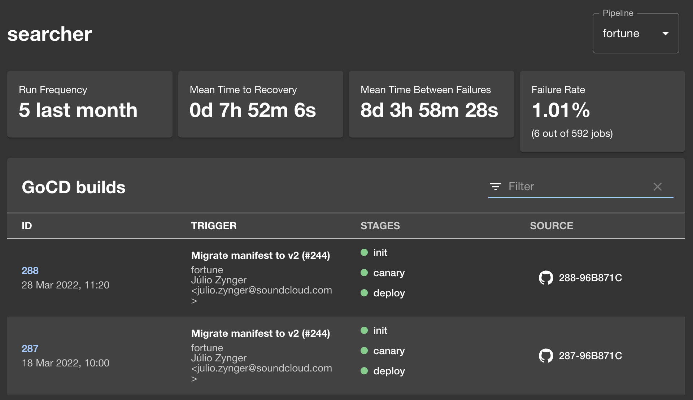

# GoCD

Welcome to the GoCD plugin!

- View recent GoCD Builds



## Installation

GoCD Plugin exposes an entity tab component named `EntityGoCdContent`. You can include it in the
[`EntityPage.tsx`](https://github.com/backstage/backstage/blob/master/packages/app/src/components/catalog/EntityPage.tsx)`:

```tsx
// At the top imports
import { EntityGoCdContent } from '@backstage/plugin-gocd';

// Farther down at the component declaration
const componentEntityPage = (
  <EntityLayout>
    {/* Place the following section where you want the tab to appear */}
    <EntityLayout.Route path="/go-cd" title="GoCD">
      <EntityGoCdContent />
    </EntityLayout.Route>
```

Now your plugin should be visible as a tab at the top of the entity pages,
specifically for components that are of the type `component`.
However, it warns of a missing `gocd.org/pipelines` annotation.

Add the annotation to your component [catalog-info.yaml](https://github.com/backstage/backstage/blob/master/catalog-info.yaml). You can refer to multiple GoCD pipelines by defining their names separated by commas, as shown in the highlighted example below:

```yaml
metadata:
  annotations:
    gocd.org/pipelines: '<NAME OF THE PIPELINE 1>[,<NAME OF PIPELINE 2>]'
```

The plugin requires to configure a GoCD API proxy with a `GOCD_AUTH_CREDENTIALS` for authentication in the [app-config.yaml](https://github.com/backstage/backstage/blob/master/app-config.yaml). Its value is an opaque token you can obtain directly from your GoCD instance, in the shape `base64(user + ':' + pass)`. For example, a user "root" and password "root" would become `base64('root:root') = cm9vdDpyb290`:

```yaml
proxy:
  '/gocd':
    target: '<go cd server host>/go/api'
    allowedMethods: ['GET']
    allowedHeaders: ['Authorization']
    headers:
      Authorization: Basic ${GOCD_AUTH_CREDENTIALS}
```

You should also include the `gocd` section to allow for the plugin to redirect back to GoCD pipelines in your deployed instance:

```yaml
gocd:
  baseUrl: <go cd server host>
```
