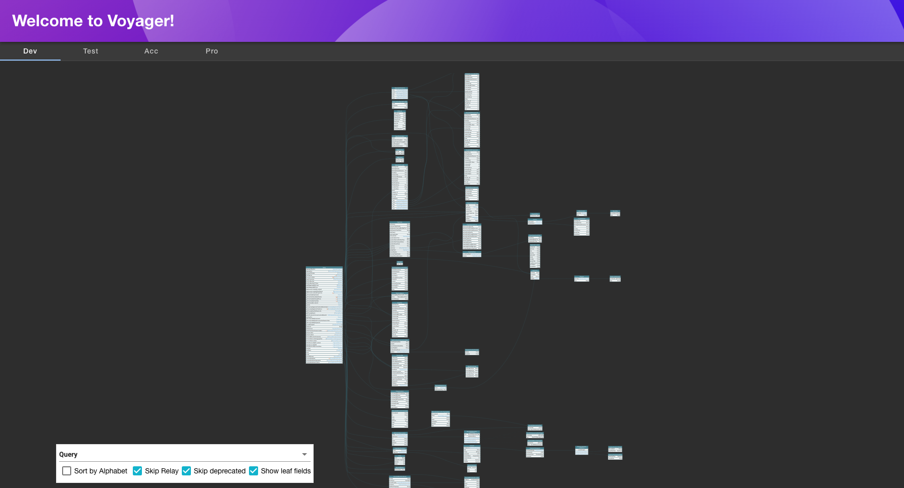

# graphql-voyager

Welcome to the graphql-voyager plugin!

Presents a graph structure of your entire GraphQL API, with tabs for multiple API urls:


## Getting started

### Installing

To get started, first install the plugin with the following command:

```bash
# From your Backstage root directory
yarn --cwd packages/app add @backstage/plugin-graphql-voyager
```

### Adding the page

In order to be able to navigate to the graphQL voyager page, a new route needs to be added to the app. This can be done in the following way:

```tsx
// packages/app/App.tsx

  import { GraphQLVoyagerPage } from '@backstage/plugin-graphql-voyager';

  const routes = (
    <FlatRoutes>
      <Route path="/graphql-voyager" element={<GraphQLVoyagerPage title="This is Voyager!"/>}/>
```

### Configuration

In order for the plugin to function correctly. GraphQL endpoints need to be added / configured through the GraphQLVoyager API. This can be done by implementing the `graphQlVoyagerApiRef` exported by this plugin.

Add your own configuration to the `packages/app/src/apis.ts` file the following way:

```ts
import { identityApiRef } from '@backstage/core-plugin-api';
import { GraphQLVoyagerEndpoints } from '@backstage/plugin-graphql-voyager';

export const apis: AnyApiFactory[] = [
  createApiFactory({
    api: graphQlVoyagerApiRef,
    deps: { identityApi: identityApiRef },
    factory: ({ identityApiRef }) => {
      return GraphQLVoyagerEndpoints.from([
        {
          id: `graphql-voyager-endpoint-id`,
          title: 'endpoint-title',
          introspectionErrorMessage:
            'Unable to perform introspection, make sure you are on the correct environment.',
          introspection: async (query: any) => {
            const token = 'someSecretJWTComingFromIdentityApiRef';

            const res = await fetch('graphQLEndpoint', {
              method: 'POST',
              body: JSON.stringify({ query }),
              headers: {
                'Content-Type': 'application/json',
                Authorization: token,
              },
            });

            return res.json();
          },
          voyagerProps: {
            hideDocs: true,
          },
        },
      ]);
    },
  }),
];
```
