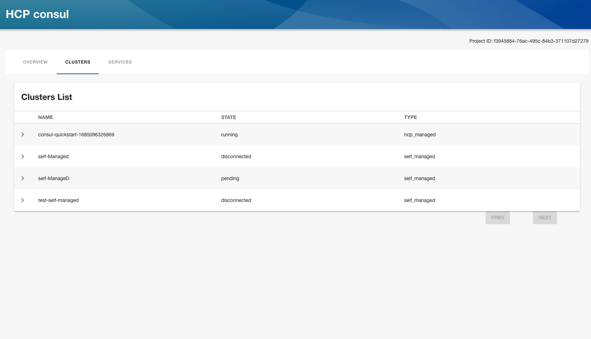
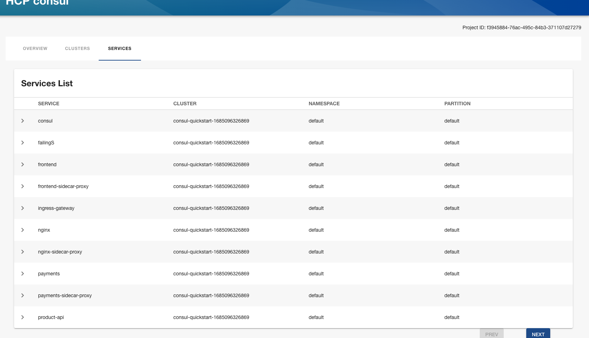
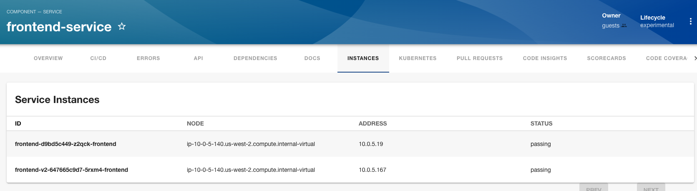

# hcp-consul

This is a frontend plugin for viewing hcp consul overview and service instances of a services.
This plugin has a corresponding backend plugin required to call the HCP consul's API: @backstage/plugin-hcp-consul-backend.

## Introduction

### [HCP Consul Central](https://developer.hashicorp.com/hcp/docs/consul/concepts/consul-central)

> HCP Consul Central is a management plane service hosted by HashiCorp that enables you to monitor and manage multiple Consul server clusters regardless of where the clusters are hosted.

### Features

This plugin provides two items:

- a plugin page to view overview of the project
- a service instance component table

## Getting started

### Requirements

You will need to have the backend HCP consul plugin, `@backstage/plugin-hcp-consul-backend`, installed and running. See its README for set up instructions.

You will need clusters added in HCP Consul central. Learn more about [HCP Consul Central](https://developer.hashicorp.com/hcp/docs/consul/concepts/consul-central).

You need to generate a service principal key. You can follow [this tutorial](https://developer.hashicorp.com/hcp/docs/hcp/admin/iam/service-principals#generate-a-service-principal-key) to generate the clientID and client Secret.

### Installation

```bash
# From your Backstage root directory
yarn add --cwd packages/app @backstage/plugin-hcp-consul
```

### Configuration

Add configuration to your [`app-config.yaml`](https://github.com/backstage/backstage/blob/master/app-config.yaml). For example:

```yaml
consul:
  clientID: abcdefabcdefabcdefabcdefabcdef
  clientSecret: xyxy111xyxy111xyxy111xyxy111xyxy111xyxy111xyxy111
  organizationID: ff14c2a2-a937-4240-bf11-9d23ca01761d
  projectID: f3945084-71ac-495c-84b3-371100d27279
```

### HCP overview page

The snippet below adds the plugin page to the `/hcp-consul` path . The page shows overall overview of the clusters.

```typescript
// In packages/app/src/App.tsx

import { HcpConsulPluginPage } from '@backstage/plugin-hcp-consul';

const routes = (
  <FlatRoutes>
    ...
    <Route path="/hcp-consul" element={<HcpConsulPluginPage />} />
);
```

<div>

</div>
<div>

</div>
<div>

</div>

#### Requirements

- `clientID`, `clientSecret` and `organizationID` should be provided in the config file
- Default `projectID` can be provided in the config file. To override it, the projectID can be added as part of props of the component. `<HcpConsulPluginPage projectID="f3945084-71ac-495c-84b3-371100d27279"/>`

### Service Instance Table Component

The snippet below adds a `/hcp-consul-instances` tab to the EntityPage that displays all service instances of the service

```typescript
// In packages/app/src/components/catalog/EntityPage.tsx

import { EntityServiceInstancesTable, isHcpConsulServiceAvailable } from '@backstage/plugin-hcp-consul';

const serviceEntityPage = (
    ...
    <EntityLayout.Route
        if={isHcpConsulServiceAvailable}
        path="/hcp-consul-instaces"
        title="Instances"
    >
      <EntityServiceInstancesTable />
    </EntityLayout.Route>
)
```

<div>

</div>

#### Requirements

The component should have the necessary annotations:

- `consul.io/cluster_resource_name` annotation's value is the cluster resource name in HCP. It is required.
- `consul.io/name` annotation's value is the service name. It is required
- `consul.io/namespace` is the Namespace of the service. If omitted, it defaults to `default`
- `consul.io/partition` is the Partition of the service. If omitted, it defaults to `default`

```yaml
apiVersion: backstage.io/v1alpha1
kind: Component
metadata:
  annotations:
    consul.io/cluster_resource_name: consul/project/f3945084-71ac-495c-84b3-371100d27279/cluster/consul-cluster
    consul.io/name: frontend
    consul.io/namespace: default
    consul.io/partition: default
```
