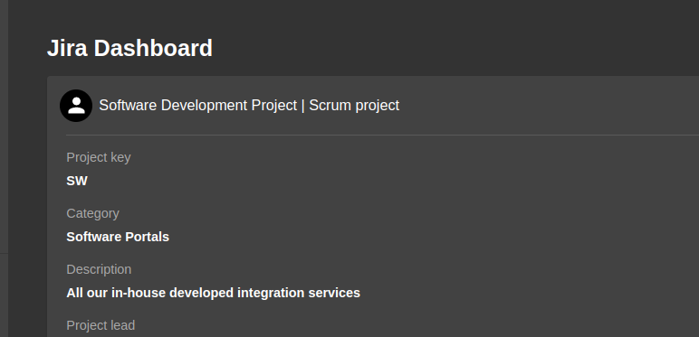
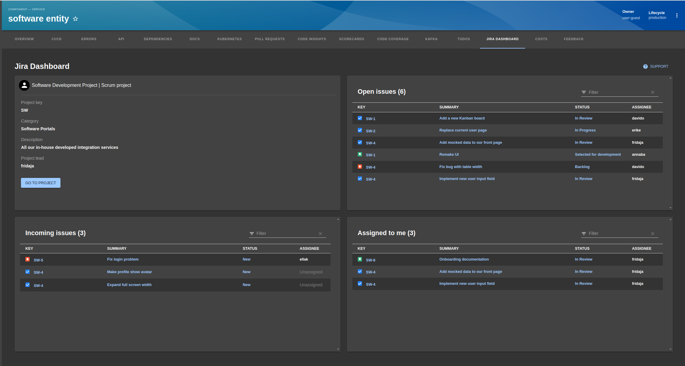

# Jira Dashboard plugin

Welcome to the Jira Dashboard plugin!



## Introduction

The **Jira Dashboard** plugin allows you to fetch and display Jira issues for your entity. You get quickly access to issue summaries to achieve better task visibility and more efficient project management. The issue overview that is provided can be customized to display the information that is relevant for your entity, by defining Jira filters and components.

By default, the issue views that are provided are **incoming issues**, **open issues** and **assigned to you**.

## Note

You will **need** to also perform the installation instructions in [Jira Dashboard Backend](https://github.com/backstage/backstage/tree/master/plugins/jira-dashboard-backend) in order for this plugin to work.

## Getting Started

1. First, install the plugin into your app:

```bash
# From your Backstage root directory
yarn add --cwd packages/app @backstage/plugin-jira-dashboard
```

2. Then, modify your entity page in `EntityPage.tsx` to include the `EntityJiraDashboardContent` component and the `isJiraDashboardAvailable` function. Both are exported from the plugin.

> NOTE: You can choose for which kind of entity you want to include the plugin by adding the plugin in that specific entity kind, for instance `serviceEntityPage` or `apiPage`.

The example below show how you can add the plugin to the `defaultEntityPage`:

```tsx
// In packages/app/src/components/catalog/Entity.tsx
import { EntityJiraDashboardContent } from '@backstage/plugin-jira-dashboard';
import { isJiraDashboardAvailable } from '@backstage/plugin-jira-dashboard';

const defaultEntityPage = (
  <EntityLayout.Route
    if={isJiraDashboardAvailable}
    path="/jira-dashboard"
    title="Jira Dashboard"
  >
    <EntityJiraDashboardContent />
  </EntityLayout.Route>
  ...
;
```

### Integration with the Catalog

To enable the Jira Dashboard plugin for your entity, the entity yaml must have the following annotation:

```yaml
apiVersion: backstage.io/v1alpha1
kind: Component
metadata:
  # ...
  annotations:
    jira.com/project-key: value # The key of the Jira project to track for this entity
```

### Optional annotations

If you want to track specific components or filters for your entity, you can add the optional annotations `components` and `filters-ids`. You can specify an endless number of Jira components or filters.

```yaml
apiVersion: backstage.io/v1alpha1
kind: Component
metadata:
  # ...
  annotations:
    jira.com/project-key: value # The key of the Jira project to track for this entity
    jira.com/components: component,component,component # Jira component name separated with a comma
    jira.com/filter-ids: 12345,67890 # Jira filter id separated with a comma
```

## Layout

The issue overview is located under the tab "Jira Dashboard" on the entity page. The overview displays information about the specific Jira project, and then renders one table for each type of issue view. In each view you can see the priority, assignee and status for that issue.


