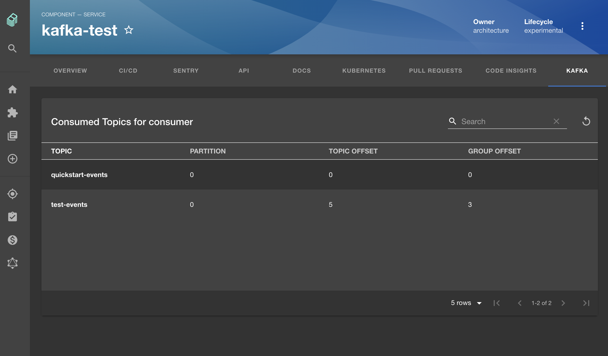

# Kafka Plugin



## Setup

1. Run:

```bash
# From your Backstage root directory
yarn --cwd packages/app add @backstage/plugin-kafka
yarn --cwd packages/backend add @backstage/plugin-kafka-backend
```

2. Add the plugin backend:

In a new file named `kafka.ts` under `backend/src/plugins`:

```js
import { createRouter } from '@backstage/plugin-kafka-backend';
import { PluginEnvironment } from '../types';

export default async function createPlugin({
  logger,
  config,
}: PluginEnvironment) {
  return await createRouter({ logger, config });
}
```

And then add to `packages/backend/src/index.ts`:

```js
// In packages/backend/src/index.ts
import kafka from './plugins/kafka';
// ...
async function main() {
  // ...
  const kafkaEnv = useHotMemoize(module, () => createEnv('kafka'));
  // ...
  apiRouter.use('/kafka', await kafka(kafkaEnv));
```

3. Add the plugin as a tab to your service entities:

```jsx
// In packages/app/src/components/catalog/EntityPage.tsx
import { EntityKafkaContent } from '@backstage/plugin-kafka';

const serviceEntityPage = (
  <EntityLayout>
    {/* other tabs... */}
    <EntityLayout.Route path="/kafka" title="Kafka">
      <EntityKafkaContent />
    </EntityLayout.Route>
```

4. Add broker configs for the backend in your `app-config.yaml` (see
   [kafka-backend](https://github.com/backstage/backstage/blob/master/plugins/kafka-backend/README.md)
   for more options):

```yaml
kafka:
  clientId: backstage
  clusters:
    - name: cluster-name
      brokers:
        - localhost:9092
```

5. Add the `kafka.apache.org/consumer-groups` annotation to your services:

```yaml
apiVersion: backstage.io/v1alpha1
kind: Component
metadata:
  # ...
  annotations:
    kafka.apache.org/consumer-groups: cluster-name/consumer-group-name
spec:
  type: service
```

## Features

- List topics offsets and consumer group offsets for configured services.
