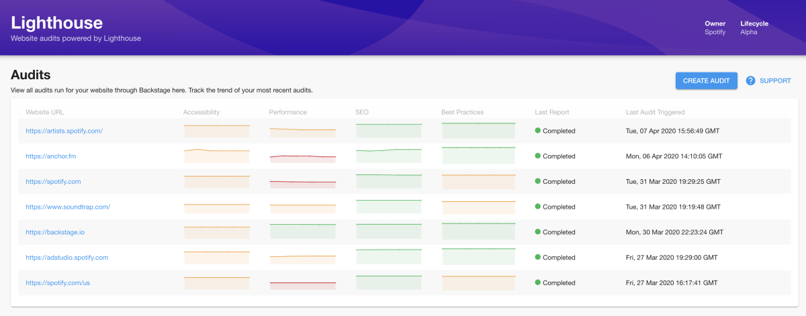
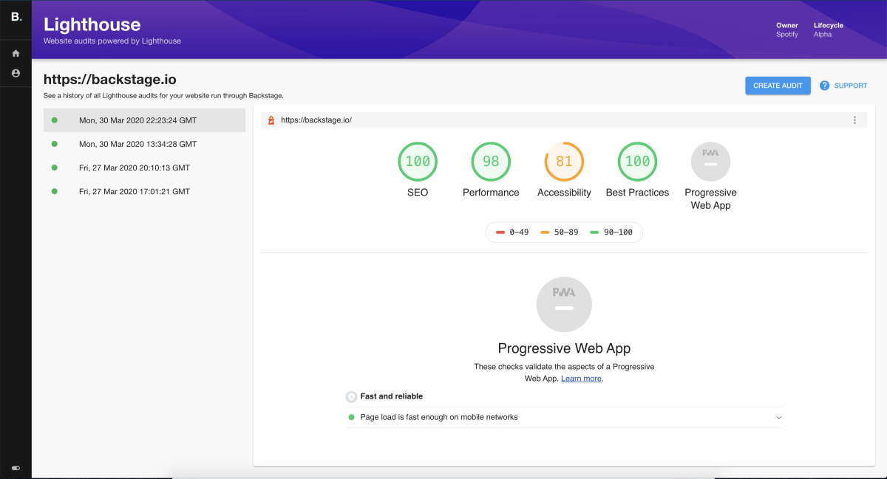

# @backstage/plugin-lighthouse

A frontend for [lighthouse-audit-service](https://github.com/spotify/lighthouse-audit-service), this plugin allows you to trigger Lighthouse audits on websites and track them over time.

## Introduction

Google's [Lighthouse](https://developers.google.com/web/tools/lighthouse) auditing tool for websites
is a great open-source resource for benchmarking and improving the accessibility, performance, SEO, and best practices of your site.
At Spotify, we keep track of Lighthouse audit scores over time to look at trends and overall areas for investment.

This plugin allows you to generate on-demand Lighthouse audits for websites, and to track the trends for the
top-level categories of Lighthouse at a glance.

You can learn more in our blog post [Introducing Lighthouse for Backstage](https://backstage.io/blog/2020/04/06/lighthouse-plugin).

| List of audits                                                                | Specific audit                                                                        |
| ----------------------------------------------------------------------------- | ------------------------------------------------------------------------------------- |
|  |  |

In the future, we hope to add support for scheduling audits (which we do internally), as well as allowing
custom runs of Lighthouse to be ingested (for auditing sites that require authentication or some session state).

## Getting Started

To get started, you will need a running instance of [`lighthouse-audit-service`](https://github.com/spotify/lighthouse-audit-service).
_It's likely you will need to [enable CORS](https://developer.mozilla.org/en-US/docs/Web/HTTP/CORS) to integrate with Backstage, so initialize the `lighthouse-audit-service` with the environment variable `LAS_CORS` set to `true`._

When you have an instance running that Backstage can hook into, first install the plugin into your app:

```sh
$ yarn add @backstage/plugin-lighthouse
```

Modify your app routes in `App.tsx` to include the `LighthousePage` component exported from the plugin, for example:

```tsx
// At the top imports
import { LighthousePage } from '@backstage/plugin-lighthouse';

<FlatRoutes>
  // ...
  <Route path="/lighthouse" element={<LighthousePage />} />
  // ...
</FlatRoutes>;
```

Then configure the `lighthouse-audit-service` URL in your [`app-config.yaml`](https://github.com/backstage/backstage/blob/master/app-config.yaml).

```yaml
lighthouse:
  baseUrl: http://your-service-url
```

## Integration with the Catalog

The Lighthouse plugin can be integrated into the catalog so that Lighthouse audit information relating to a component
can be displayed within that component's entity page. In order to link an Entity to its Lighthouse audits, the entity
must be annotated as follows:

```yaml
apiVersion: backstage.io/v1alpha1
kind: Component
metadata:
  # ...
  annotations:
    # ...
    lighthouse.com/website-url: # A single website url e.g. https://backstage.io/
```

> NOTE: The plugin only supports one website URL per component at this time.

Add a **Lighthouse tab** to the EntityPage:

```tsx
// packages/app/src/components/catalog/EntityPage.tsx
import { EmbeddedRouter as LighthouseRouter } from '@backstage/plugin-lighthouse';

// ...
const WebsiteEntityPage = ({ entity }: { entity: Entity }) => (
  <EntityPageLayout>
    // ...
    <EntityPageLayout.Content
      path="/lighthouse/*"
      title="Lighthouse"
      element={<LighthouseRouter entity={entity} />}
    />
  </EntityPageLayout>
);
```

> NOTE: The embedded router renders page content without a header section allowing it to be rendered within a
> catalog plugin page.

Add a **Lighthouse card** to the overview tab on the EntityPage:

```tsx
// packages/app/src/components/catalog/EntityPage.tsx
import {
  LastLighthouseAuditCard,
  isPluginApplicableToEntity as isLighthouseAvailable,
} from '@backstage/plugin-lighthouse';

// ...

const OverviewContent = ({ entity }: { entity: Entity }) => (
  <Grid container spacing={3}>
    // ...
    {isLighthouseAvailable(entity) && (
      <Grid item sm={4}>
        <LastLighthouseAuditCard />
      </Grid>
    )}
  </Grid>
);
```

Link Lighthouse
