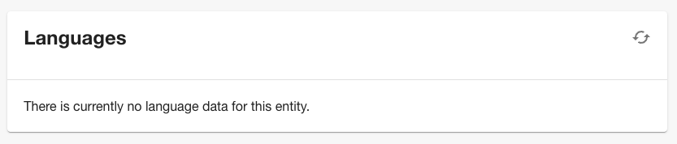
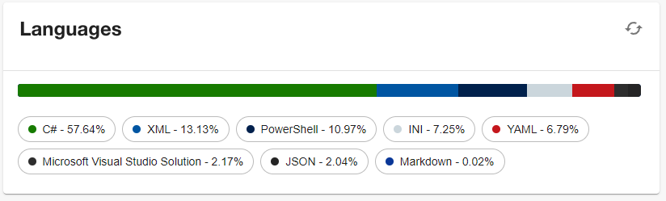

# Linguist

Welcome to the Linguist plugin!

## Features

The Linguist plugin consists of a card that will give you the breakdown of the languages used by the configured Entity in the Catalog.

When there is no Linguist data yet the card will be empty:



Once the language breakdown has been generated the card will look like this:



## Setup

The following sections will help you get the Linguist plugin setup and running.

### Backend

You need to setup the [Linguist backend plugin](../linguist-backend/README.md) before you move forward with any of the following steps if you haven't already.

### Entity Annotation

To be able to use the Linguist plugin you need to add the following annotation to any entities you want to use it with:

```yaml
backstage.io/linguist: https://url.to/your/srouce/code
```

Linguist uses the `UrlReader` to pull down the files before it scans them to determine the languages, this means you can pull files from all the supported providers - GitHub, GitLab, Bitbucket, Azure, Google GCS, AWS S3, etc.

Here's what that will look like in action using the Backstage repo as an example:

```yaml
# Example catalog-info.yaml entity definition file
apiVersion: backstage.io/v1alpha1
kind: Component
metadata:
  # ...
  annotations:
    backstage.io/linguist: https://github.com/backstage/backstage
spec:
  type: service
  # ...
```

### Frontend

To setup the Linguist Card frontend you'll need to do the following steps:

1. First we need to add the `@backstage/plugin-linguist` package to your frontend app:

   ```sh
   # From your Backstage root directory
   yarn --cwd packages/app add @backstage/plugin-linguist
   ```

2. Second we need to add the `EntityLinguistCard` extension to the entity page in your app:

   ```tsx
   // In packages/app/src/components/catalog/EntityPage.tsx
   import { isLinguistAvailable, EntityLinguistCard } from '@backstage/plugin-linguist';

   // For example in the Overview section
   const overviewContent = (
    <Grid container spacing={3} alignItems="stretch">
        // ...
        <EntitySwitch>
            <EntitySwitch.Case if={isLinguistAvailable}>
                <Grid item md={6}>
                    <EntityLinguistCard />
                </Grid>
            </EntitySwitch.Case>
        </EntitySwitch>
        // ...
    </Grid>
   ```

**Notes:**

- The `if` prop is optional on the `EntitySwitch.Case`, you can remove it if you always want to see the tab even if the entity being viewed does not have the needed annotation
