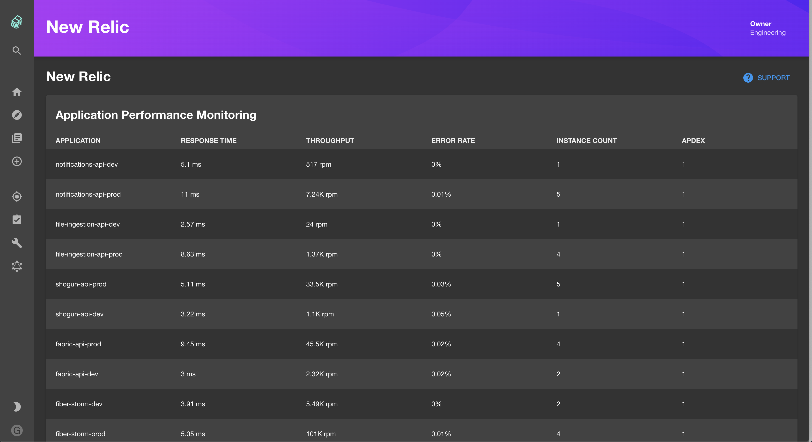
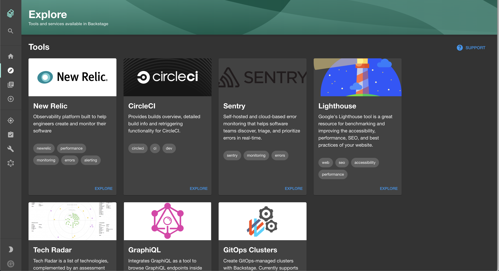

# New Relic Plugin (Alpha)

Website: [https://newrelic.com](https://newrelic.com)




## Getting Started

This plugin uses the Backstage proxy to securely communicate with New Relic's
APIs. Add the following to your `app-config.yaml` to enable this configuration:

```yaml
proxy:
  '/newrelic/apm/api':
    target: https://api.newrelic.com/v2
    headers:
      X-Api-Key: ${NEW_RELIC_REST_API_KEY}
```

In your production deployment of Backstage, you would also need to ensure that
you've set the `NEW_RELIC_REST_API_KEY` environment variable before starting
the backend.

While working locally, you may wish to hard-code your API key in your
`app-config.local.yaml` like this:

```yaml
# app-config.local.yaml
proxy:
  '/newrelic/apm/api':
    headers:
      X-Api-Key: NRRA-YourActualApiKey
```

Read more about how to find or generate this key in
[New Relic's Documentation](https://docs.newrelic.com/docs/apis/get-started/intro-apis/types-new-relic-api-keys#rest-api-key).

See if it's working by visiting the New Relic Plugin Path:
[/newrelic](http://localhost:3000/newrelic)

## Features

- View New Relic Application Performance Monitoring (APM) data such as:
  - Application Name
  - Response Time (ms)
  - Throughput (rpm)
  - Error Rate
  - Instance Count
  - Apdex Score

## Limitations

- Currently only supports New Relic APM data

---

You can also serve the plugin in isolation by running `yarn start` in the plugin directory.
This method of serving the plugin provides quicker iteration speed and a faster startup and hot reloads.
It is only meant for local development, and the setup for it can be found inside the [/dev](./dev) directory.
