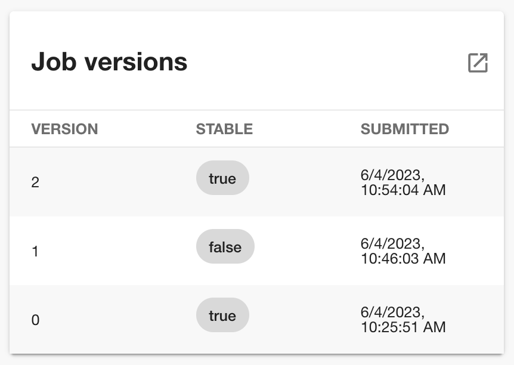
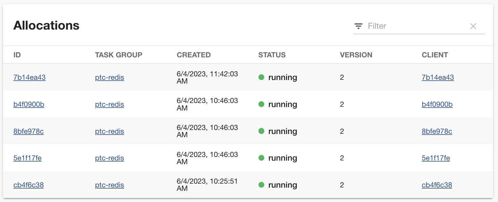

# @backstage/plugin-nomad

This is a frontend plugin is for viewing [Nomad](https://www.nomadproject.io/) [job versions](https://developer.hashicorp.com/nomad/docs/concepts/architecture#job) and [task group allocations](https://developer.hashicorp.com/nomad/docs/concepts/architecture#allocation).

This plugin has a corresponding backend plugin required to call the Nomad cluster's API: ` @backstage/plugin-nomad-backend`.

## Introduction

### [Nomad](https://www.nomadproject.io/)

> A simple and flexible scheduler and orchestrator to deploy and manage containers and non-containerized applications across on-prem and clouds at scale.

### Features

This plugin provides two components:

- a table to view recent [job versions](https://developer.hashicorp.com/nomad/docs/commands/job/history)
- a table to view [allocations for a job and/or group](https://developer.hashicorp.com/nomad/tutorials/manage-jobs/jobs-inspect)

## Getting Started

### Requirements

You will need to have the backend Nomad plugin, `@backstage/plugin-nomad-backend`, installed and running. See its README for set up instructions.

You will need a running Nomad cluster with an API address that is reachable from the `@backstage/plugin-nomad/backend` plugin [running in the back end](https://backstage.io/docs/overview/architecture-overview/#third-party-backed-plugins). You can follow [this tutorial](https://developer.hashicorp.com/nomad/tutorials/enterprise/production-deployment-guide-vm-with-consul) to learn how to deploy one.

If your Nomad cluster has ACLs enabled, you will need a `token` with at least the [`list-jobs`capability](https://developer.hashicorp.com/nomad/tutorials/access-control/access-control-policies#namespace-rules). You can check [this tutorial](https://developer.hashicorp.com/nomad/tutorials/access-control/access-control-create-policy) for more info or the minimal [example below](#example-policy).

### Installation

```bash
# From your Backstage root directory
yarn --cwd packages/app add @backstage/plugin-nomad
```

### Configuration

Add configuration to your [`app-config.yaml`](https://github.com/backstage/backstage/blob/master/app-config.yaml). For example:

```yaml
nomad:
  addr: 'http://localhost:4646'
  token: '93e034ad-e504-42f9-129d-5d81be9f13d3'
```

The `token` can be excluded if [ACLs are not enabled](https://developer.hashicorp.com/nomad/api-docs#authentication).

### Annotate Components

Several annotations are available for Components that make use of this plugin:

```yaml
apiVersion: backstage.io/v1alpha1
kind: Component
metadata:
  annotations:
    nomad.io/namespace: default
    nomad.io/job-id: redis
    nomad.io/group: 'redis|prometheus-collector'
```

- `nomad.io/job-id` annotation's value is matched exactly and corresponds to `JobID` in the Nomad API. It is required for the Job Versions Card but optional for the Allocations Table
- `nomad.io/group` annotation's value is used as a regex pattern against `TaskGroup` using [Nomad's server-side filtering](https://developer.hashicorp.com/nomad/api-docs#filtering). It is optional for the [Allocations Table](#allocations-table)
- `nomad.io/namespace` is the Namespace of the Job and Allocations of the Component. If omitted, it defaults to `default`

### Job Versions Card

The snippet below adds a card to the overview tab on the EntityPage. It shows versions of a Nomad job associated with a Component in the Catalog.

```typescript
// In packages/app/src/components/catalog/EntityPage.tsx

import { EntityNomadJobVersionListCard, isNomadJobIDAvailable } from '@backstage/plugin-nomad';

const overviewContent = (
  ...
  <EntitySwitch>
    <EntitySwitch.Case if={isNomadJobIDAvailable}>
      <Grid item md={6} xs={12}>
        <EntityNomadJobVersionListCard />
      </Grid>
    </EntitySwitch.Case>
  </EntitySwitch>
);
```

<div>

</div>

#### Requirements

- the `nomad.io/job-id` annotation must be set

### Allocations Table

The snippet below adds a `/nomad` tab to the EntityPage that displays all allocations associated the `nomad.io/job-id` and/or `nomad.io/group` of Component's annotations.

```typescript
// In packages/app/src/components/catalog/EntityPage.tsx

import { EntityNomadAllocationListTable, isNomadAllocationsAvailable } from '@backstage/plugin-nomad';

const serviceEntityPage = (
    ...
    <EntityLayout.Route
      if={isNomadAllocationsAvailable}
      path="/nomad"
      title="Nomad"
    >
      <EntityNomadAllocationListTable />
    </EntityLayout.Route>
)
```

<div>

</div>

#### Requirements

- `nomad.io/job-id` and/or `nomad.io/group` annotations must be set

## ACL Policy Example

Because this plugin uses API endpoints that require the `list-jobs` capability, the token you provide to the plugin's [`nomad` configuration](#configuration) needs at least that.

To create such a token you can create a policy like below. This policy applies to all namespaces:

```hcl
# backstage.policy.hcl
namespace "*" {
  policy = "read"
}

node {
  policy = "read"
}
```

And create a policy for it:

```bash
nomad acl policy apply backstage backstage.policy.hcl
```

Then create a client token for it:

```bash
nomad acl token create -name=backstage -policy=backstage
Accessor ID  = 5e9fe97b-76c5-8803-21b8-083308dc6c11
Secret ID    = 93e034ad-e504-42f9-129d-5d81be9f13d3
Name         = backstage
Type         = client
Global       = false
Create Time  = 2023-06-05 00:45:20.51905 +0000 UTC
Expiry Time  = <none>
Create Index = 54
Modify Index = 54
Policies     = [backstage]

Roles
<none>
```

In the example above, the `Secret ID` is the `token` to use in the [configuration](#configuration).
