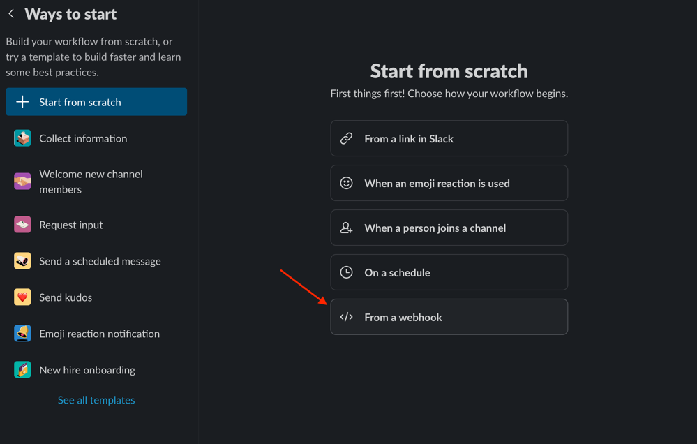
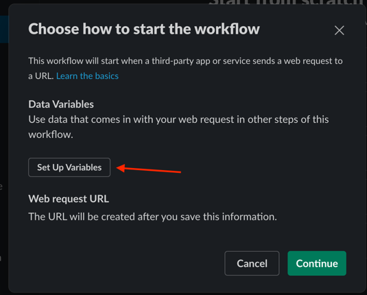
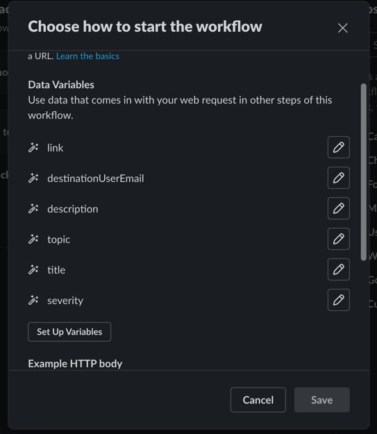
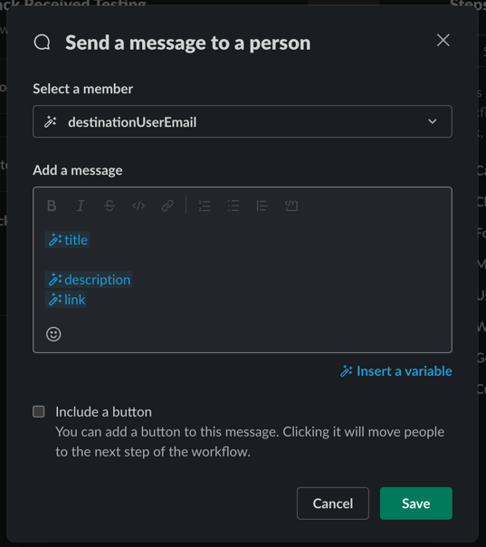

# @backstage/plugin-notifications-backend-module-slack

The Slack backend module for the notifications plugin.

## Getting Started

### Module Installation

Add the module to your backend:

```ts
// packages/backend/src/index.ts
backend.add(import('@backstage/plugin-notifications-backend-module-slack'));
```

### Slack Configuration

To use this you'll need to create two new automations in Slack that have a webhook trigger.
This is because we need one for sending direct messages and one for sending messages to channels. Slack
does not currently support conditional logic within workflows.

1. First, create a new automation/workflow that uses a webhook trigger
   
1. Next, click on set up variables to define incoming variables
   
1. The variables should match the attributes of the outgoing notification payload as shown in the screenshot. You can omit any you don't need.
   
1. Now, add a step to send a Slack message to a user or channel and configure the template however you wish. Note that we use the email field to determine which user to send to based on the Backstage user's profile email and for channel messages, we use an annotation `slack.com/notifications` which should contain `<channel id>`.
   
1. Lastly, ensure to publish the automation and copy the webhook url. We'll need to add it to the `app-config.yaml`
   

### Configure Backstage

You'll now need to configure the Slack module in your `app-config.yaml`.

```yaml
notifications:
  processors:
    slack:
      - directWebhookUrl: https://hooks.slack.com/triggers/...
        channelWebhookUrl: https://hooks.slack.com/triggers/...
```

Multiple instances can be added in the `slack` array, allowing you to have multiple configurations if you need to send
messages to more than one Slack workspace.
