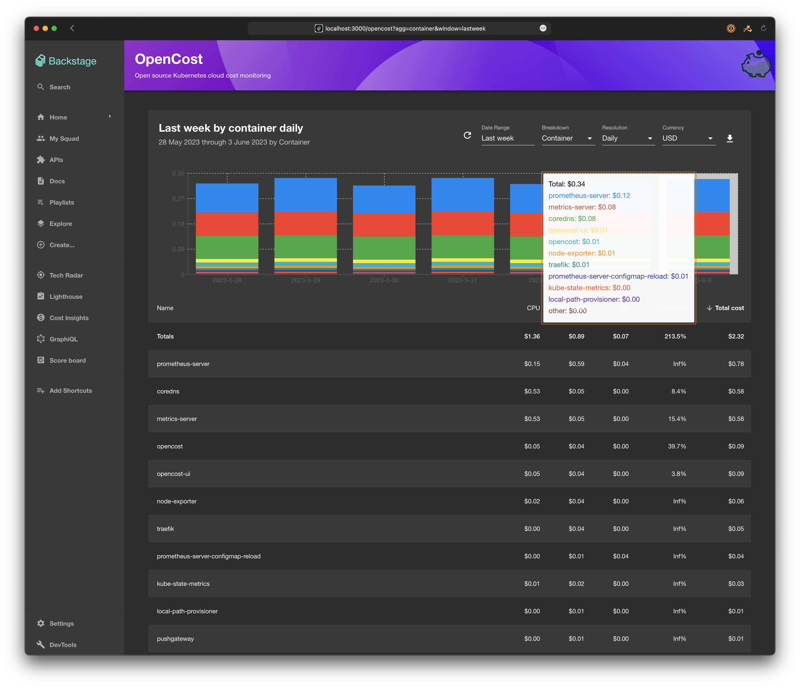

# OpenCost

Welcome to the [OpenCost](https://opencost.io) plugin!

Currently this is a port of the [OpenCost UI](https://github.com/opencost/opencost/tree/develop/ui), but we will continue to expand it to expose any relevant data or pre-configured views that may be preferred.

All of the code was originally ported from https://github.com/opencost/opencost/blob/develop/ui/ which is under by the Apache v2 License and also managed by the CNCF.

## Installation

1.  Add the OpenCost dependency to the `packages/app/package.json`:
    ```sh
    # From your Backstage root directory
    yarn --cwd packages/app add @backstage/plugin-opencost
    ```
2.  Add the `OpenCostPage` to your `packages/app/src/App.tsx`:

    ```tsx
    import { OpenCostPage } from '@backstage/plugin-opencost';
    ```

and

    ```tsx
    <FlatRoutes>
      …
      <Route path="/opencost" element={<OpenCostPage />} />
    </FlatRoutes>
    ```

3.  Import the `MoneyIcon` and add link to OpenCost to your sidebar

    ```typescript
    // packages/app/src/components/Root/Root.tsx
     import MoneyIcon from '@material-ui/icons/MonetizationOn';

     ...

     export const Root = ({ children }: PropsWithChildren<{}>) => (
       <SidebarPage>
         <Sidebar>
           ...
          <SidebarItem icon={MoneyIcon} to="opencost" text="OpenCost" />
           ...
         </Sidebar>
       </SidebarPage>
     );

    ```

## Plugin Configuration

Since OpenCost doesn't have any authentication at this point, you just need to give API access to the plugin to access your data.

If you haven't set up an ingress rule, you can port-forward the API with

```
kubectl -n opencost port-forward deployment/opencost 9003
```

Add the following to your `app-config.yaml`:

```yaml
opencost:
  baseUrl: http://localhost:9003
```

## Ideas/Next Steps

- More testing
- Use the OpenCost mascot for the sidebar logo
- Use the Backstage proxy to communicate with the OpenCost API if necessary for authentication
- Convert AllocationReport.js to use the [Backstage Table](https://backstage.io/storybook/?path=/story/data-display-table--default-table)
- Allow for user-provided default reports and/or disabling controls
- Support multiple hard-coded reports
- clean up deprecation warnings and upgrade to all the latest React components
- Fork(?) to support `Kubecost`, which could provide Alerts and Recommendations, similar to the Cost Explorer plugin


