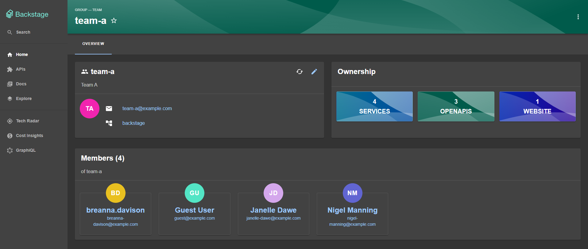
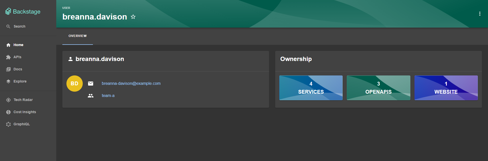

# Org Plugin - Extension Reference

This page contains detailed documentation for all extensions provided by the `@backstage/plugin-org` plugin. For general information about the plugin, see the [README](./README.md).

This is a plugin that extends the Catalog entity page with some users and groups overview cards:

- Group Profile Entity Card
- Member List Entity Card
- Ownership Entity Card
- User Profile Entity Card

Here is a Catalog group page showing the group profile, members, and ownership cards:



And below is an example of how a user page looks with the user profile and ownership cards:



## Table of Content

- [Installation](#installation)
- [Packages](#packages)
- [Routes](#routes)
- [Extensions](#extensions)
  - [Entity Group Profile Card](#entity-group-profile-card)
  - [Entity Members List Card](#entity-members-list-card)
  - [Entity Ownership Card](#entity-ownership-card)
  - [Entity User Profile Card](#entity-user-profile-card)
  - [My Groups Sidebar Item](#my-groups-sidebar-item)

## Installation

1. Install the `org` plugin in your Backstage app:

   ```bash
   # From your Backstage root directory
   yarn --cwd packages/app add @backstage/plugin-org
   ```

2. Enable which entity cards and tabs you would like to see on the catalog entity page:

   > [!IMPORTANT]
   > The order in which cards are listed in the configuration file will determine the order in which they appear in overview cards and tab lists on entity pages.

   ```yaml
   # app-config.yaml
   app:
     # Auto discovering all plugins extensions
     packages: all
     extensions:
       # Enabling the org plugin cards
       - entity-card:org/group-profile
       - entity-card:org/members-list
       - entity-card:org/ownership
       - entity-card:org/user-profile
   ```

3. Then start the app, navigate to an entity's page and see the cards and contents in there.

## Packages

The `org` plugin can be automatically discovered, and it is also possible to enable it only in certain [environments](https://backstage.io/docs/conf/writing/#configuration-files). See [this](https://backstage.io/docs/frontend-system/architecture/app/#feature-discovery) packages documentation for more details.

## Routes

The `org` plugin exposes an external route ref that can be used to configure route bindings.

| Key            | Type           | Description                        |
| -------------- | -------------- | ---------------------------------- |
| `catalogIndex` | External route | A route ref to Catalog Index page. |

As an example, here is an association between the external catalog index page and a regular route from another plugin:

```yaml
# app-config.yaml
app:
  routes:
    bindings:
      # example binding org and catalog index pages
      org.catalogIndex: catalog.catalogIndex
```

Route binding is also possible through code. For more information, see [this](https://backstage.io/docs/frontend-system/architecture/routes#binding-external-route-references) documentation.

## Extensions

### Entity Group Profile Card

This [entity card](https://github.com/backstage/backstage/blob/master/plugins/catalog-react/report-alpha.api.md) extension allows you to view, edit, or update groups metadata, such as team avatar, name, email, parent, and child groups.

| Kind          | Namespace | Name            | Id                              |
| ------------- | --------- | --------------- | ------------------------------- |
| `entity-card` | `org`     | `group-profile` | `entity-card:org/group-profile` |

#### Config

Currently, this entity card extension has only one configuration:

| Config key | Default value       | Description                                                                                                                                 |
| ---------- | ------------------- | ------------------------------------------------------------------------------------------------------------------------------------------- |
| `filter`   | `{ kind: 'group' }` | An [entity filter](https://github.com/backstage/backstage/pull/21480) that determines when the card should be displayed on the entity page. |

This is how to configure the `group-profile` extension in the `app-config.yaml` file:

```yaml
app:
  extensions:
    - entity-card:org/group-profile:
        config:
          <Config-Key>: '<Config-Value>'
```

#### Override

Use extension overrides for completely re-implementing the group-profile entity card extension:

```tsx
import { createFrontendModule } from '@backstage/backstage-plugin-api';
import { EntityCardBlueprint } from '@backstage/plugin-catalog-react/alpha';

export default createFrontendModule({
  pluginId: 'org',
  extensions: [
    EntityCardBlueprint.make({
      // Name is necessary so the system knows that this extension will override the default 'group-profile' entity card extension provided by the 'org' plugin
      name: 'group-profile',
      params: {
        // By default, this card will show up only for groups
        filter: { kind: 'group' },
        // Returning a custom card component
        loader: () =>
          import('./components').then(m => (
            <m.MyCustomGroupProfileEntityCard />
          )),
      },
    }),
  ],
});
```

For more information about where to place extension overrides, see the official [documentation](https://backstage.io/docs/frontend-system/architecture/extension-overrides).

### Entity Members List Card

An [entity card](https://github.com/backstage/backstage/blob/master/plugins/catalog-react/report-alpha.api.md) extension that displays group members with avatars, names, and emails. Clicking a member's name opens the user's catalog page; clicking an email opens your default mail client.

By default, each member avatar uses `member.spec.profile.picture` from the catalog. When that field is empty, the card shows initials. If your organization loads profile photos lazily from an external source instead of storing them in the catalog during ingestion, override the shared [`UserAvatar`](#custom-user-avatars) swappable component.

| Kind          | Namespace | Name           | Id                             |
| ------------- | --------- | -------------- | ------------------------------ |
| `entity-card` | `org`     | `members-list` | `entity-card:org/members-list` |

#### Config

The following keys can be set under `app.extensions` for `entity-card:org/members-list`:

| Config key                   | Default value | Description                                                                                                      |
| ---------------------------- | ------------- | ---------------------------------------------------------------------------------------------------------------- |
| `showAggregateMembersToggle` | `false`       | When `true`, shows a toggle to switch between direct members and aggregated (descendant) group members.          |
| `initialRelationAggregation` | `direct`      | Initial member list mode: `direct` (immediate members only) or `aggregated` (includes descendant group members). |

Example:

```yaml
app:
  extensions:
    - entity-card:org/members-list:
        config:
          showAggregateMembersToggle: true
          initialRelationAggregation: aggregated
```

> [!NOTE]
> User avatar rendering is **not** configurable through `app-config.yaml`. See [Custom user avatars](#custom-user-avatars) below.

#### Custom user avatars

`MembersListCard` and `UserProfileCard` render user avatars through the shared `UserAvatar` swappable component. Apps can override it once via `SwappableComponentBlueprint` to customize avatar rendering consistently across org plugin surfaces.

```tsx
import { createFrontendModule } from '@backstage/frontend-plugin-api';
import { SwappableComponentBlueprint } from '@backstage/plugin-app-react';
import { UserAvatar, type DefaultUserAvatarProps } from '@backstage/plugin-org';
import { Avatar } from '@backstage/ui';
import { useLazyProfilePhoto } from './useLazyProfilePhoto';

function LazyUserAvatar(props: DefaultUserAvatarProps) {
  const picture = useLazyProfilePhoto(props.entity);
  return (
    <Avatar
      className={props.className}
      name={props.displayName}
      src={picture ?? ''}
      purpose={props.purpose ?? 'decoration'}
      size={props.size ?? 'x-large'}
    />
  );
}

export default createFrontendModule({
  pluginId: 'app',
  extensions: [
    SwappableComponentBlueprint.make({
      name: 'org-user-avatar',
      params: defineParams =>
        defineParams({
          component: UserAvatar,
          loader: () => Promise.resolve(LazyUserAvatar),
        }),
    }),
  ],
});
```

Components used as the swappable implementation receive `DefaultUserAvatarProps`:

| Prop          | Type         | Description                                                               |
| ------------- | ------------ | ------------------------------------------------------------------------- |
| `entity`      | `UserEntity` | Catalog user entity.                                                      |
| `displayName` | `string`     | `entity.spec.profile.displayName`, or `entity.metadata.name` as fallback. |
| `className`   | `string`     | Optional layout class from the caller.                                    |
| `size`        | `string`     | Avatar size passed by the caller (`small`, `x-large`, etc.).              |
| `purpose`     | `string`     | Avatar purpose passed by the caller.                                      |

When no override is registered, behavior is unchanged:

```tsx
<Avatar src={profile?.picture ?? ''} />
```

#### Override

Use extension overrides to customize the members-list card — for example to change pagination defaults or replace the card entirely:

```tsx
import { createFrontendModule } from '@backstage/frontend-plugin-api';
import { EntityCardBlueprint } from '@backstage/plugin-catalog-react/alpha';
import { MembersListCard } from '@backstage/plugin-org';

export default createFrontendModule({
  pluginId: 'org',
  extensions: [
    EntityCardBlueprint.make({
      name: 'members-list',
      params: {
        filter: { kind: 'group' },
        loader: async () => <MembersListCard showAggregateMembersToggle />,
      },
    }),
  ],
});
```

To fully replace the card UI, return your own component from `loader` instead:

```tsx
loader: () =>
  import('./components').then(m => <m.MyCustomMembersListEntityCard />),
```

For more information about where to place extension overrides, see the official [documentation](https://backstage.io/docs/frontend-system/architecture/extension-overrides).

### Entity Ownership Card

An [entity card](https://github.com/backstage/backstage/blob/master/plugins/catalog-react/report-alpha.api.md) extension that displays direct or aggregated group or user ownership relationships. Each entity listed in the card links to its respective entity page in the catalog.

| Kind          | Namespace | Name        | Id                          |
| ------------- | --------- | ----------- | --------------------------- |
| `entity-card` | `org`     | `ownership` | `entity-card:org/ownership` |

#### Config

Currently, this entity card extension has only one configuration:

| Config key | Default value                          | Description                                                                                                                                 |
| ---------- | -------------------------------------- | ------------------------------------------------------------------------------------------------------------------------------------------- |
| `filter`   | `{ kind: { $in: ['group', 'user'] } }` | An [entity filter](https://github.com/backstage/backstage/pull/21480) that determines when the card should be displayed on the entity page. |

This is how to configure the `ownership` extension in the `app-config.yaml` file:

```yaml
app:
  extensions:
    - entity-card:org/ownership:
        config:
          <Config-Key>: '<Config-Value>'
```

#### Override

Use extension overrides for completely re-implementing the ownership entity card extension:

```tsx
import { createFrontendModule } from '@backstage/backstage-plugin-api';
import { EntityCardBlueprint } from '@backstage/plugin-catalog-react/alpha';

export default createFrontendModule({
  pluginId: 'org',
  extensions: [
    EntityCardBlueprint.make({
      // Name is necessary so the system knows that this extension will override the default 'ownership' entity card extension provided by the 'org' plugin
      name: 'ownership',
      params: {
        // By default, this card will show up only for groups or users
        filter: { kind: { $in: ['group', 'user'] } },
        // Returning a custom card component
        loader: () =>
          import('./components').then(m => <m.MyCustomOwnershipEntityCard />),
      },
    }),
  ],
});
```

For more information about where to place extension overrides, see the official [documentation](https://backstage.io/docs/frontend-system/architecture/extension-overrides).

### Entity User Profile Card

This [entity card](https://github.com/backstage/backstage/blob/master/plugins/catalog-react/report-alpha.api.md) extension allows you to view user metadata including avatar, name, email, and team. Clicking on the email link will open your default email program while clicking on the team link will direct you to the team page in the catalog plugin.

| Kind          | Namespace | Name           | Id                             |
| ------------- | --------- | -------------- | ------------------------------ |
| `entity-card` | `org`     | `user-profile` | `entity-card:org/user-profile` |

#### Config

Currently, this entity card extension has only one configuration:

| Config key | Default value      | Description                                                                                                                                 |
| ---------- | ------------------ | ------------------------------------------------------------------------------------------------------------------------------------------- |
| `filter`   | `{ kind: 'user' }` | An [entity filter](https://github.com/backstage/backstage/pull/21480) that determines when the card should be displayed on the entity page. |

This is how to configure the `user-profile` extension in the `app-config.yaml` file:

```yaml
app:
  extensions:
    - entity-card:org/user-profile:
        config:
          <Config-Key>: '<Config-Value>'
```

#### Override

Use extension overrides for completely re-implementing the user-profile entity card extension:

```tsx
import { createFrontendModule } from '@backstage/backstage-plugin-api';
import { EntityCardBlueprint } from '@backstage/plugin-catalog-react/alpha';

export default createFrontendModule({
  pluginId: 'org',
  extensions: [
    EntityCardBlueprint.make({
      // Name is necessary so the system knows that this extension will override the default 'user-profile' entity card extension provided by the 'org' plugin
      name: 'user-profile',
      params: {
        // By default, this card will show up only for groups or users
        filter: { kind: 'user' },
        // Returning a custom card component
        loader: () =>
          import('./components').then(m => <m.MyCustomOwnershipEntityCard />),
      },
    }),
  ],
});
```

For more information about where to place extension overrides, see the official [documentation](https://backstage.io/docs/frontend-system/architecture/extension-overrides).

### My Groups Sidebar Item

This plugin does not provide a page extension for the groups sidebar item, since it requires conditional rendering based on the logged-in user. To use the `MyGroupsSidebarItem` component, add it to your custom sidebar implementation using the `NavContentBlueprint` in `packages/app/src/modules/nav/Sidebar.tsx`:

```tsx
import { MyGroupsSidebarItem } from '@backstage/plugin-org';
import GroupIcon from '@material-ui/icons/People';
import { NavContentBlueprint } from '@backstage/plugin-app-react';

export const SidebarContent = NavContentBlueprint.make({
  params: {
    component: ({ navItems }) => {
      const nav = navItems.withComponent(item => (
        <SidebarItem icon={() => item.icon} to={item.href} text={item.title} />
      ));

      return (
        <Sidebar>
          <SidebarLogo />
          <SidebarDivider />
          <SidebarGroup label="Menu" icon={<MenuIcon />}>
            {nav.rest()}
            <MyGroupsSidebarItem
              singularTitle="My Squad"
              pluralTitle="My Squads"
              icon={GroupIcon}
            />
          </SidebarGroup>
        </Sidebar>
      );
    },
  },
});
```

For more details on customizing the sidebar, see the [app migration guide](https://backstage.io/docs/frontend-system/building-apps/migrating#app-root-sidebar).
