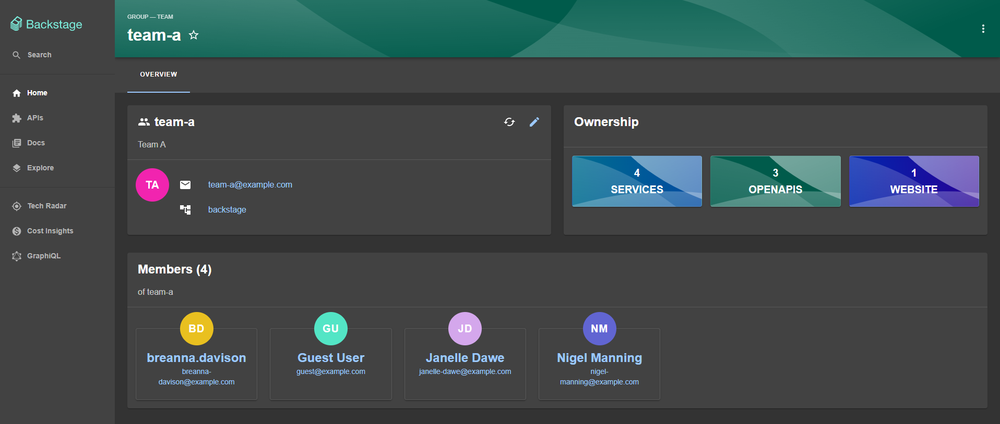

# Org Plugin

> [!WARNING]
> This documentation is made for those using the experimental new Frontend system.
> If you are not using the new frontend system, please go [here](./README.md).

This is a plugin that extends the Catalog entity page with some users and groups overview cards:

- Group Profile Entity Card
- Member List Entity Card
- Ownership Entity Card
- User Profile Entity Card

Here is a Catalog group page showing the group profile, members, and ownership cards:



And below is an example of how a user page looks with the user profile and ownership cards:


## Table of Content

- [Installation](#installation)
- [Packages](#packages)
- [Routes](#routes)
- [Extensions](#extensions)
  - [Entity Group Profile Card](#entity-group-profile-card)
  - [Entity Group Profile Card](#entity-members-list-card)
  - [Entity Group Profile Card](#entity-members-list-card)
  - [Entity Group Profile Card](#entity-user-profile-card)
  - [My Groups Sidebar Item](#my-groups-sidebar-item)

## Installation

1. Install the `org` plugin in you Backstage app:

   ```bash
   # From your Backstage root directory
   yarn --cwd packages/app add @backstage/plugin-org
   ```

2. Enable which entity cards and tabs you would like to see on the catalog entity page:

   ```yaml
   # app-config.yaml
   app:
     experimental:
       # Auto discovering all plugins extensions
       packages: all
     extensions:
       # Enabling the org plugin cards
       - entity-card:org/group-profile
       - entity-card:org/members-list
       - entity-card:org/ownership
       - entity-card:org/user-profile
   ```

3. Then start the app, navigate to an entity's page and see the cards and contents in there.

## Packages

The `org` plugin can be automatically discovered, and it is also possible to enable it only in certain [environments](https://backstage.io/docs/conf/writing/#configuration-files). See [this](https://backstage.io/docs/frontend-system/architecture/app/#feature-discovery) packages documentation for more details.

## Routes

The `org` plugin exposes a external route that can be used to configure route bindings.

| Key            | Type           | Description                        |
| -------------- | -------------- | ---------------------------------- |
| `catalogIndex` | External route | A route ref to Catalog Index page. |

As an example, here is an association between the external catalog index page and a regular route from another plugin:

```yaml
# app-config.yaml
app:
  routes:
    bindings:
      # example binding org and catalog index pages
      org.catalogIndex: catalog.catalogIndex
```

Route binding is also possible through code. For more information, see [this](https://backstage.io/docs/frontend-system/architecture/routes#binding-external-route-references) documentation.

## Extensions

### Entity Cards

The `org` plugin provide some entity cards you can enable to customize the Software Catalog entity page.

> [!IMPORTANT]
> The order in which cards are listed in the configuration file will determine the order in which they appear in overview cards and tab lists on entity pages.

See a complete cards list below:

#### Entity Group Profile Card

This [entity card](https://github.com/backstage/backstage/blob/master/plugins/catalog-react/api-report-alpha.md) extension allows you to view, edit, or update groups metadata, such as team avatar, name, email, parent, and child groups.

| Kind          | Namespace | Name            | Id                              |
| ------------- | --------- | --------------- | ------------------------------- |
| `entity-card` | `org`     | `group-profile` | `entity-card:org/group-profile` |

##### Disable

This card is disabled by default when you install the `org` plugin, but to ensure the card will always be disabled or enabled regardless of the extension's default definition, add the following configuration:

```yaml
# app-config.yaml
# example disabling the org group profile entity card extension
app:
  extensions:
    # this is the extension id and it follows the naming pattern bellow:
    # <extension-kind>/<plugin-namespace>:<extension-name>
    # use false as value for disabling the extension and true for enabling
    - entity-card:org/group-profile: false
    # or
    # - entity-card:org/group-profile:
    #   - config:
    #       # set 'true' for enabling it again
    #       disabled: true
```

##### Config

There is only one configuration available for this entity card extension, which is setting an entity filter that determines when the card should be displayed on the entity page.

Here is an example showing the `group-profile` overview card only for entities of kind group:

```yaml
# app-config.yaml
# example setting the extension to only show up for entities with kind "group"
app:
  extensions:
    # this is the extension id and it follows the naming pattern bellow:
    # <extension-kind>/<plugin-namespace>:<extension-name>
    - entity-card:org/group-profile:
        config:
          # The default value is "kind:group"
          # For more information about entity cards filters, check out this pull request
          # https://github.com/backstage/backstage/pull/21480
          filter: 'kind:group'
```

##### Override

Use extension overrides for completely re-implementing the group-profile entity card extension:

```tsx
import { createExtensionOverrides } from '@backstage/backstage-plugin-api';
import { createEntityCardExtension } from '@backstage/plugin-catalog-react/alpha';

export default createExtensionOverrides({
  extensions: [
    createEntityCardExtension({
      // These namespace and name are necessary so the system knows that this extension will override the default 'group-profile' entity card extension provided by the 'org' plugin
      namespace: 'org',
      name: 'group-profile',
      // By default, this card will show up only for groups
      filter: 'kind:group'
      // Returing a custom card component
      loader: () =>
        import('./components').then(m => <m.MyCustomGroupProfileEntityCard />),
    }),
  ],
});
```

For more information about where to place extension overrides, see the official [documentation](https://backstage.io/docs/frontend-system/architecture/extension-overrides).

#### Entity Members List Card

An [entity card](https://github.com/backstage/backstage/blob/master/plugins/catalog-react/api-report-alpha.md) extension that displays the names and emails of group members. By clicking the member's name, you'll be directed to the user's catalog page, and the email opens your default email program.

| Kind          | Namespace | Name           | Id                             |
| ------------- | --------- | -------------- | ------------------------------ |
| `entity-card` | `org`     | `members-list` | `entity-card:org/members-list` |

##### Disable

This card is disabled by default when you install the `org` plugin, but to ensure the card will always be disabled or enabled regardless of the extension's default definition, add the following configuration:

```yaml
# app-config.yaml
# example disabling the org members list entity card extension
app:
  extensions:
    # this is the extension id and it follows the naming pattern bellow:
    # <extension-kind>/<plugin-namespace>:<extension-name>
    # use false as value for disabling the extension and true for enabling
    - entity-card:org/members-list: false
    # or
    # - entity-card:org/members-list:
    #   - config:
    #       # set 'true' for enabling it again
    #       disabled: true
```

##### Config

There is only one configuration available for this entity card extension, which is setting an entity filter that determines when the card should be displayed on the entity page.

Here is an example showing the `members-list` overview card only for entities of kind group:

```yaml
# app-config.yaml
# example setting the extension to only show up for entities with kind "group"
app:
  extensions:
    # this is the extension id and it follows the naming pattern bellow:
    # <extension-kind>/<plugin-namespace>:<extension-name>
    - entity-card:org/members-list:
        config:
          # The default value is "kind:group"
          # For more information about entity cards filters, check out this pull request
          # https://github.com/backstage/backstage/pull/21480
          filter: 'kind:group'
```

##### Override

Use extension overrides for completely re-implementing the members-list entity card extension:

```tsx
import { createExtensionOverrides } from '@backstage/backstage-plugin-api';
import { createEntityCardExtension } from '@backstage/plugin-catalog-react/alpha';

export default createExtensionOverrides({
  extensions: [
    createEntityCardExtension({
      // These namespace and name are necessary so the system knows that this extension will override the default 'members-list' entity card extension provided by the 'org' plugin
      namespace: 'org',
      name: 'members-list',
      // By default, this card will show up only for groups
      filter: 'kind:group'
      // Returing a custom card component
      loader: () =>
        import('./components').then(m => <m.MyCustomMembersListEntityCard />),
    }),
  ],
});
```

For more information about where to place extension overrides, see the official [documentation](https://backstage.io/docs/frontend-system/architecture/extension-overrides).

#### Entity Ownership Card

An [entity card](https://github.com/backstage/backstage/blob/master/plugins/catalog-react/api-report-alpha.md) extension that displays direct or aggregated group or user ownership relationships. Each entity listed in the card links to its respective entity page in the catalog.

| Kind          | Namespace | Name        | Id                          |
| ------------- | --------- | ----------- | --------------------------- |
| `entity-card` | `org`     | `ownership` | `entity-card:org/ownership` |

##### Disable

This card is disabled by default when you install the `org` plugin, but to ensure the card will always be disabled or enabled regardless of the extension's default definition, add the following configuration:

```yaml
# app-config.yaml
# example disabling the org members list entity card extension
app:
  extensions:
    # this is the extension id and it follows the naming pattern bellow:
    # <extension-kind>/<plugin-namespace>:<extension-name>
    # use false as value for disabling the extension and true for enabling
    - entity-card:org/ownership: false
    # or
    # - entity-card:org/ownership:
    #   - config:
    #       # set 'true' for enabling it again
    #       disabled: true
```

##### Config

There is only one configuration available for this entity card extension, which is setting an entity filter that determines when the card should be displayed on the entity page.

Here is an example showing the `ownership` overview card only for entities of kind group or user:

```yaml
# app-config.yaml
# example setting the extension to only show up for entities with kind "group" or "user"
app:
  extensions:
    # this is the extension id and it follows the naming pattern bellow:
    # <extension-kind>/<plugin-namespace>:<extension-name>
    - entity-card:org/ownership:
        config:
          # The default value is "kind:group,user"
          # For more information about entity cards filters, check out this pull request
          # https://github.com/backstage/backstage/pull/21480
          filter: 'kind:group,user'
```

##### Override

Use extension overrides for completely re-implementing the ownership entity card extension:

```tsx
import { createExtensionOverrides } from '@backstage/backstage-plugin-api';
import { createEntityCardExtension } from '@backstage/plugin-catalog-react/alpha';

export default createExtensionOverrides({
  extensions: [
    createEntityCardExtension({
      // These namespace and name are necessary so the system knows that this extension will override the default 'ownership' entity card extension provided by the 'org' plugin
      namespace: 'org',
      name: 'ownership',
      // By default, this card will show up only for groups or users
      filter: 'kind:group,user'
      // Returing a custom card component
      loader: () =>
        import('./components').then(m => <m.MyCustomOwnershipEntityCard />),
    }),
  ],
});
```

For more information about where to place extension overrides, see the official [documentation](https://backstage.io/docs/frontend-system/architecture/extension-overrides).

#### Entity User Profile Card

This [entity card](https://github.com/backstage/backstage/blob/master/plugins/catalog-react/api-report-alpha.md) extension allows you to view user metadata including avatar, name, email, and team. Clicking on the email link will open your default email program while clicking on the team link will direct you to the team page in the catalog plugin.

| Kind          | Namespace | Name           | Id                             |
| ------------- | --------- | -------------- | ------------------------------ |
| `entity-card` | `org`     | `user-profile` | `entity-card:org/user-profile` |

##### Disable

This card is disabled by default when you install the `org` plugin, but to ensure the card will always be disabled or enabled regardless of the extension's default definition, add the following configuration:

```yaml
# app-config.yaml
# example disabling the org user profile entity card extension
app:
  extensions:
    # this is the extension id and it follows the naming pattern bellow:
    # <extension-kind>/<plugin-namespace>:<extension-name>
    # use false as value for disabling the extension and true for enabling
    - entity-card:org/user-profile: false
    # or
    # - entity-card:org/user-profile:
    #   - config:
    #       # set 'true' for enabling it again
    #       disabled: true
```

##### Config

There is only one configuration available for this entity card extension, which is setting an entity filter that determines when the card should be displayed on the entity page.

Here is an example showing the `user-profile` overview card only for entities of kind group or user:

```yaml
# app-config.yaml
# example setting the extension to only show up for entities with kind "user"
app:
  extensions:
    # this is the extension id and it follows the naming pattern bellow:
    # <extension-kind>/<plugin-namespace>:<extension-name>
    - entity-card:org/user-profile:
        config:
          # The default value is "kind:user"
          # For more information about entity cards filters, check out this pull request
          # https://github.com/backstage/backstage/pull/21480
          filter: 'kind:user'
```

##### Override

Use extension overrides for completely re-implementing the user-profile entity card extension:

```tsx
import { createExtensionOverrides } from '@backstage/backstage-plugin-api';
import { createEntityCardExtension } from '@backstage/plugin-catalog-react/alpha';

export default createExtensionOverrides({
  extensions: [
    createEntityCardExtension({
      // These namespace and name are necessary so the system knows that this extension will override the default 'user-profile' entity card extension provided by the 'org' plugin
      namespace: 'org',
      name: 'user-profile',
      // By default, this card will show up only for groups or users
      filter: 'kind:user'
      // Returing a custom card component
      loader: () =>
        import('./components').then(m => <m.MyCustomOwnershipEntityCard />),
    }),
  ],
});
```

For more information about where to place extension overrides, see the official [documentation](https://backstage.io/docs/frontend-system/architecture/extension-overrides).

### My Groups Sidebar Item

As the [NavItem](https://backstage.io/docs/reference/frontend-plugin-api.createnavitemextension) extension type does not support conditional rendering, this plugin does not provide navigation items, so to use the `MyGroupsSidebarItem` component, we recommend overriding the [App/Nav](https://backstage.io/docs/frontend-system/building-apps/built-in-extensions#app-nav) extension and adding the item statically.

> [!IMPORTANT]
> As you can see in the example below, we are using the same attachment point, inputs and outputs as the default App/Nav extension to avoid side effects on the NavItem and NavLogo extensions.

```tsx
// ...
import { MyGroupsSidebarItem } from '@backstage/plugin-org';
import GroupIcon from '@material-ui/icons/People';

export default createExtensionOverrides({
  extensions: [
    createExtension({
      // These namespace and name are necessary so the system knows that this extension will override the default app nav extension
      namespace: 'app',
      name: 'nav',
      // Keeping the same attachment point as in the default App/Nav extension
      attachTo: { id: 'app/layout', input: 'nav' },
      // Keeping the same inputs as in the default App/Nav extension
      inputs: {
        items: createExtensionInput({
          target: createNavItemExtension.targetDataRef,
        }),
        logos: createExtensionInput(
          {
            elements: createNavLogoExtension.logoElementsDataRef,
          },
          {
            singleton: true,
            optional: true,
          },
        ),
      },
      // Keeping the same output as in the default App/Nav extension
      output: {
        element: coreExtensionData.reactElement,
      },
      factory({ inputs }) {
        return {
          element: (
            <Sidebar>
              {/* Code borrowed from the default extension implementation to render the logos and items inputs */}
              <SidebarLogo {...inputs.logos?.output.elements} />
              <SidebarDivider />
              {inputs.items.map((item, index) => (
                <SidebarNavItem {...item.output.target} key={index} />
              ))}
              {/* Here is where we actually modifies the default implementation by adding a static item to render a group of squad pages */}
              <SidebarGroup label="Menu" icon={<MenuIcon />}>
                {/* The MyGroupsSidebarItem provides quick access to the group(s) the logged in user is a member of directly in the sidebar. */}
                <MyGroupsSidebarItem
                  singularTitle="My Squad"
                  pluralTitle="My Squads"
                  icon={GroupIcon}
                />
              </SidebarGroup>
            </Sidebar>
          ),
        };
      },
    }),
  ],
});
```
