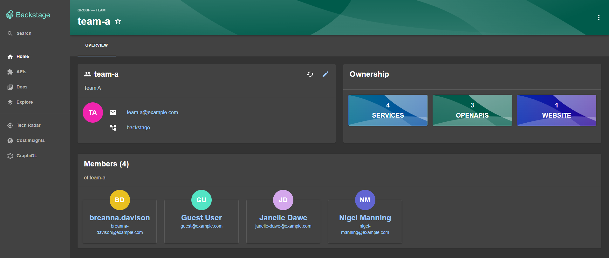
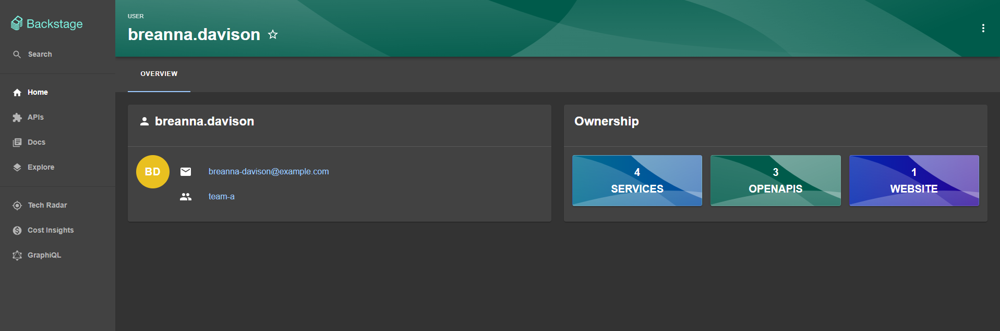
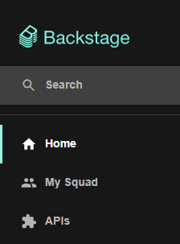
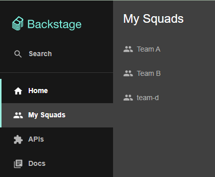

# Org Plugin for Backstage

## Features

- Show Group Page
- Show User Profile
- Quick access to Groups

### Group Page

Here's an example of what the Group Page looks like:



### User Profile

Here's an example of what the User Profile looks like:



## Installation

```bash
# From your Backstage root directory
yarn --cwd packages/app add @backstage/plugin-org
```

Once installed, the plugin is automatically available in your app through the default package discovery. For more details and alternative installation methods, see [installing plugins](https://backstage.io/docs/frontend-system/building-apps/installing-plugins).

You can enable entity cards on the catalog entity page through configuration:

```yaml
# app-config.yaml
app:
  extensions:
    - entity-card:org/group-profile
    - entity-card:org/members-list
    - entity-card:org/ownership
    - entity-card:org/user-profile
```

For the full list of available extensions and their configuration options, see the [README-alpha.md](./README-alpha.md).

## Old Frontend System

If your Backstage app uses the old frontend system, you need to manually wire the plugin into your app.

### MyGroupsSidebarItem

The MyGroupsSidebarItem provides quick access to the group(s) the logged in user is a member of directly in the sidebar.

To use the MyGroupsSidebarItem you'll need to add it to your `Root.tsx` - found at `packages\app\src\components\Root` - like this:

```diff
+ import { MyGroupsSidebarItem } from '@backstage/plugin-org';
+ import GroupIcon from '@material-ui/icons/People';

<SidebarPage>
    <Sidebar>
      //...
      <SidebarGroup label="Menu" icon={<MenuIcon />}>
        {/* Global nav, not org-specific */}
        //...
        <SidebarItem icon={HomeIcon} to="catalog" text="Home" />
+       <MyGroupsSidebarItem
+         singularTitle="My Squad"
+         pluralTitle="My Squads"
+         icon={GroupIcon}
+       />
       //...
      </SidebarGroup>
    </ Sidebar>
</SidebarPage>
```

Once added MyGroupsSidebarItem will work in three ways:

1. The user is not logged in or the logged in user is not a member of any group: the MyGroupsSidebarItem will not display anything in the sidebar
2. The user is logged in and a member of only one group: the MyGroupsSidebarItem will display a single item in the sidebar like this:

   

3. The user is logged in and a member of more than one group: the MyGroupsSidebarItem will display a single items with a sub-menu with all the related groups like this:

   
