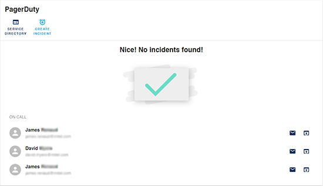
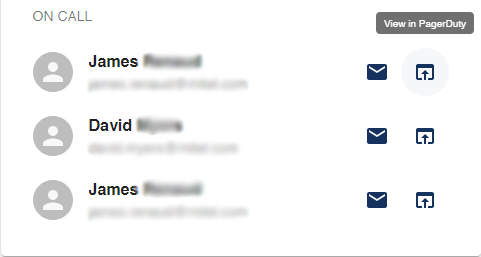
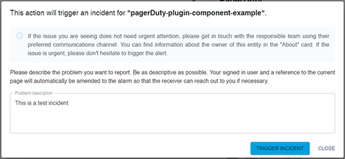
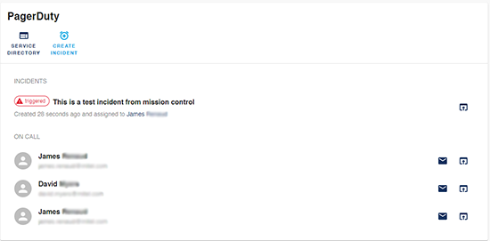

# PagerDuty

## Overview

This plugin displays PagerDuty information about an entity such as if there are any active incidents and what the escalation policy is.

There is also an easy way to trigger an alarm directly to the person who is currently on-call.

This plugin requires that entities are annotated with an [integration key](https://support.pagerduty.com/docs/services-and-integrations#add-integrations-to-an-existing-service). See more further down in this document.

## Features

### View any open incidents



### Email link, and view contact information for staff on call



### Trigger an incident for a service





## Setup instructions

Install the plugin:

```bash
# From your Backstage root directory
cd packages/app
yarn add @backstage/plugin-pagerduty
```

Add it to the `EntityPage.tsx`:

```ts
import {
  isPluginApplicableToEntity as isPagerDutyAvailable,
  EntityPagerDutyCard,
} from '@backstage/plugin-pagerduty';
// add to code
{
  isPagerDutyAvailable(entity) && (
    <Grid item md={6}>
      <EntityPagerDutyCard />
    </Grid>
  );
}
```

## Client configuration

If you want to override the default URL for events, you can add it to `app-config.yaml`.

In `app-config.yaml`:

```yaml
pagerduty:
  eventsBaseUrl: 'https://events.pagerduty.com/v2'
```

## Providing the API Token

In order for the client to make requests to the [PagerDuty API](https://developer.pagerduty.com/docs/rest-api-v2/rest-api/) it needs an [API Token](https://support.pagerduty.com/docs/generating-api-keys#generating-a-general-access-rest-api-key).

Add the proxy configuration in `app-config.yaml`

```yaml
proxy:
  ...
  '/pagerduty':
    target: https://api.pagerduty.com
    headers:
      Authorization: Token token=${PAGERDUTY_TOKEN}
```

Then start the backend passing the token as an environment variable:

```bash
$ PAGERDUTY_TOKEN='<TOKEN>' yarn start
```

This will proxy the request by adding `Authorization` header with the provided token.

## Integration Key

The information displayed for each entity is based on the [integration key](https://support.pagerduty.com/docs/services-and-integrations#add-integrations-to-an-existing-service).

### Adding the integration key to the entity annotation

If you want to use this plugin for an entity, you need to label it with the below annotation:

```yml
annotations:
  pagerduty.com/integration-key: [INTEGRATION_KEY]
```
