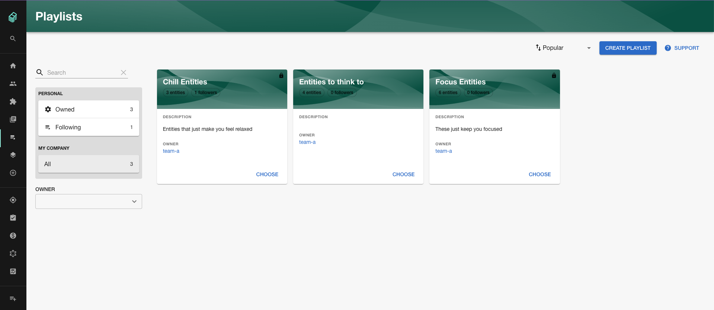
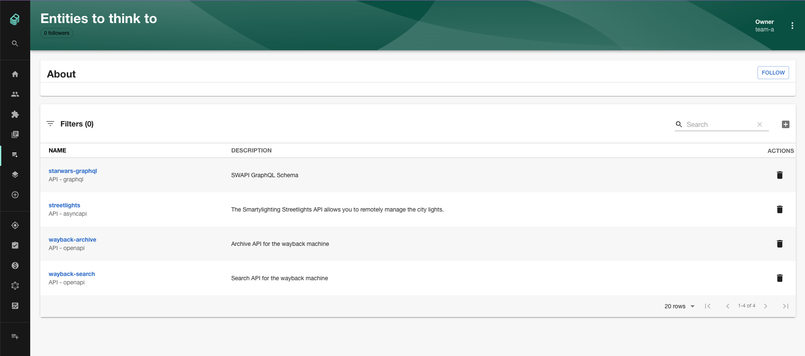
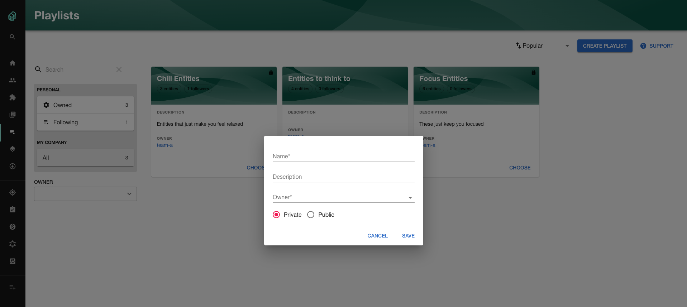
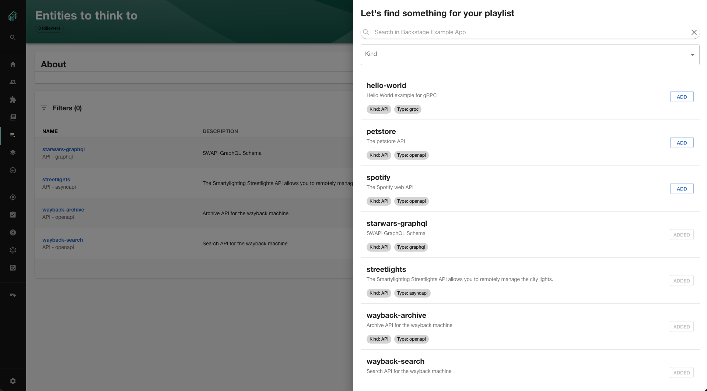
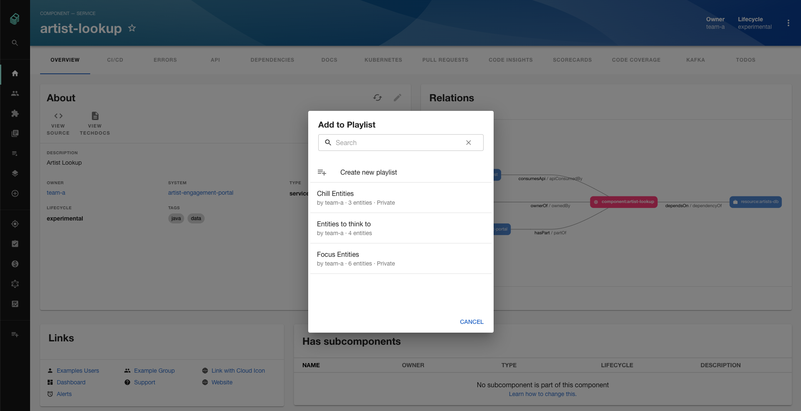

# Playlist Plugin

Welcome to the playlist plugin!

This plugin allows you to create, share, and follow custom collections of entities available in the Backstage catalog.

## Setup

The following sections will help you get the Playlist plugin setup and running

### Backend

You need to setup the [Playlist backend plugin](https://github.com/backstage/backstage/tree/master/plugins/playlist-backend) before you move forward with any of these steps if you haven't already

### Installation

Install this plugin:

```bash
# From your Backstage root directory
yarn --cwd packages/app add @backstage/plugin-playlist
```

### Add the plugin to your `packages/app`

Add the root page that the playlist plugin provides to your app. You can
choose any path for the route, but we recommend the following:

```diff
// packages/app/src/App.tsx
+import { PlaylistIndexPage } from '@backstage/plugin-playlist';


<FlatRoutes>
  <Route path="/catalog" element={<CatalogIndexPage />} />
  <Route path="/catalog/:namespace/:kind/:name" element={<CatalogEntityPage />}>
    {entityPage}
  </Route>
+  <Route path="/playlist" element={<PlaylistIndexPage />} />
  ...
</FlatRoutes>
```

You may also want to add a link to the playlist page to your application sidebar:

```diff
// packages/app/src/components/Root/Root.tsx
+import PlaylistPlayIcon from '@material-ui/icons/PlaylistPlay';

export const Root = ({ children }: PropsWithChildren<{}>) => (
  <SidebarPage>
    <Sidebar>
+      <SidebarItem icon={PlaylistPlayIcon} to="playlist" text="Playlists" />
      ...
    </Sidebar>
```

### Entity Pages

You can also make the following changes to add the playlist context menu to your `EntityPage.tsx`
to be able to add entities to playlists directly from your entity pages:

First we need to add the following imports:

```ts
import { EntityPlaylistDialog } from '@backstage/plugin-playlist';
import PlaylistAddIcon from '@material-ui/icons/PlaylistAdd';
```

Next we'll update the React import that looks like this:

```ts
import React from 'react';
```

To look like this:

```ts
import React, { ReactNode, useMemo, useState } from 'react';
```

Then we have to add this chunk of code after all the imports but before any of the other code:

```ts
const EntityLayoutWrapper = (props: { children?: ReactNode }) => {
  const [playlistDialogOpen, setPlaylistDialogOpen] = useState(false);

  const extraMenuItems = useMemo(() => {
    return [
      {
        title: 'Add to playlist',
        Icon: PlaylistAddIcon,
        onClick: () => setPlaylistDialogOpen(true),
      },
    ];
  }, []);

  return (
    <>
      <EntityLayout UNSTABLE_extraContextMenuItems={extraMenuItems}>
        {props.children}
      </EntityLayout>
      <EntityPlaylistDialog
        open={playlistDialogOpen}
        onClose={() => setPlaylistDialogOpen(false)}
      />
    </>
  );
};
```

The last step is to wrap all the entity pages in the `EntityLayoutWrapper` like this:

```diff
const defaultEntityPage = (
+  <EntityLayoutWrapper>
    <EntityLayout.Route path="/" title="Overview">
      {overviewContent}
    </EntityLayout.Route>

    <EntityLayout.Route path="/docs" title="Docs">
      <EntityTechdocsContent />
    </EntityLayout.Route>

    <EntityLayout.Route path="/todos" title="TODOs">
      <EntityTodoContent />
    </EntityLayout.Route>
+  </EntityLayoutWrapper>
);
```

Note: the above only shows an example for the `defaultEntityPage` for a full example of this you can look at [this EntityPage](../../packages/app/src/components/catalog/EntityPage.tsx)

## Features

### View All Playlists



### View Playlist



### Create New Playlist



### Add Entities to Playlist



### Add to Playlist from Entity



## Links

- [playlist-backend](../playlist-backend) provides the backend API for this frontend.
