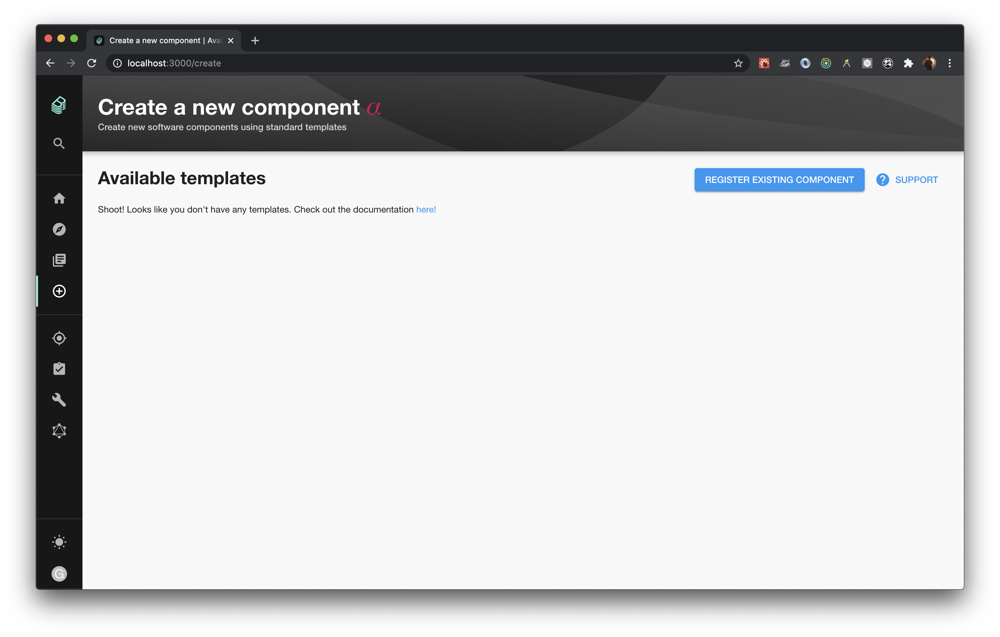
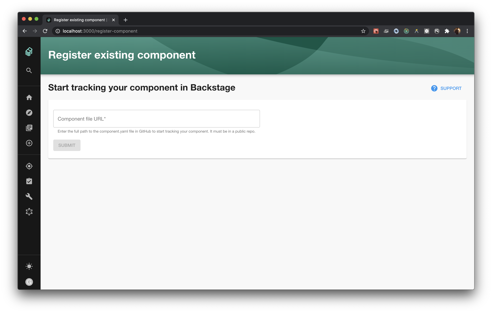
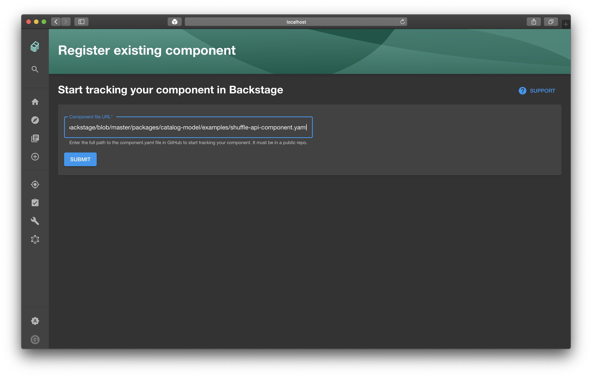
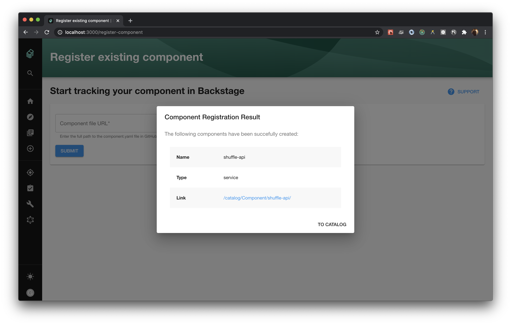

# Register component plugin

> This plugin is deprecated in favor of [`@backstage/catalog-import`](https://github.com/backstage/backstage/tree/master/plugins/catalog-import), and will be soon removed from the project.

Welcome to the register-component plugin!

This plugin allows you to submit your Backstage component using your software's YAML config.

When installed it is accessible on [localhost:3000/register-component](localhost:3000/register-component).







## Standalone setup

1. Install plugin and its dependency `plugin-catalog`

```bash
cd packages/app
yarn add @backstage/plugin-register-component
```

2. Add the `RegisterComponentPage` extension to your `App.tsx`:

```tsx
// packages/app/src/App.tsx
import { RegisterComponentPage } from '@backstage/plugin-cost-insights';

<FlatRoutes>
  ...
  <Route path="/register-component" element={<RegisterComponentPage />} />
  ...
</FlatRoutes>;
```

## Running

Just run the backstage.

```
yarn start && yarn --cwd packages/backend start
```

## Usage

Pretty straightforward, navigate to [localhost:3000/register-component](localhost:3000/register-component) and enter your component's YAML config URL.
