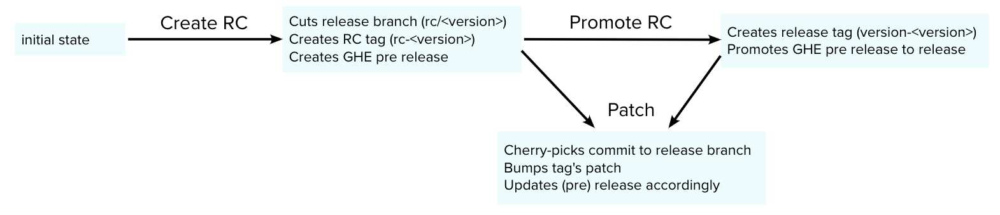

# Release Manager as a Service (RMaaS)

## Overview

`RMaaS` enables developers to manage their releases without having to juggle git commands.

Does it bundle and ship your code? **No**.

What `RMaaS` does is manage your **[releases](https://docs.github.com/en/free-pro-team@latest/github/administering-a-repository/managing-releases-in-a-repository)** on GitHub, building and shipping is entirely up to you as a developer to handle in your CI.

`RMaaS` is build with industry standards in mind and the flow is as follows:

> **GitHub Enterprise (GHE)**: The source control system where releases reside in a practical sense. Read more about GitHub releases here. Note that this plugin works just as well with a non-enterprise account.
>
> **Release Candidate (RC)**: A GHE pre-release intended primarily for internal testing
>
> **Release Version**: A GHE release intended for end users

Looking at the flow above, a common release lifecycle could be:

- User presses **Create Release Candidate**
  - `RMaaS`
    1. Creates a release branch `rc/<version>`
    1. Creates Release Candidate tag `rc-<version>`
    1. Creates a GitHub prerelease with Release Candidate tag
  - Your CI
    1. Detects the new tag by matching the git reference `refs/tags/rc-.*`
    1. Builds and deploys to staging environment for testing
- User presses **Patch**
  - `RMaaS`
    1. The selected commit is cherry-picked to the release branch
    1. The release tag is bumped
    1. Updates GitHub release's tag and description with the patch's details
  - Your CI
    1. Detects the new tag by matching the git reference `refs/tags/(rc|version)-.*` (Release Versions are patchable as well)
    1. Builds and deploys to staging (or production if Release Version) for testing
- User presses **Promote Release Candidate to Release Version**
  - `RMaaS`
    1. Creates Release Version tag `version-<version>`
    1. Promotes the GitHub release by removing the prerelease flag
  - Your CI
    1. Detects the new tag by matching the git reference `refs/tags/version-.*`
    1. Builds and deploys to production for testing

## Usage

The plugin exports a single full-page extension `ReleaseManagerAsAServicePage`, which one can add to an app like a usual top-level tool on a dedicated route.
