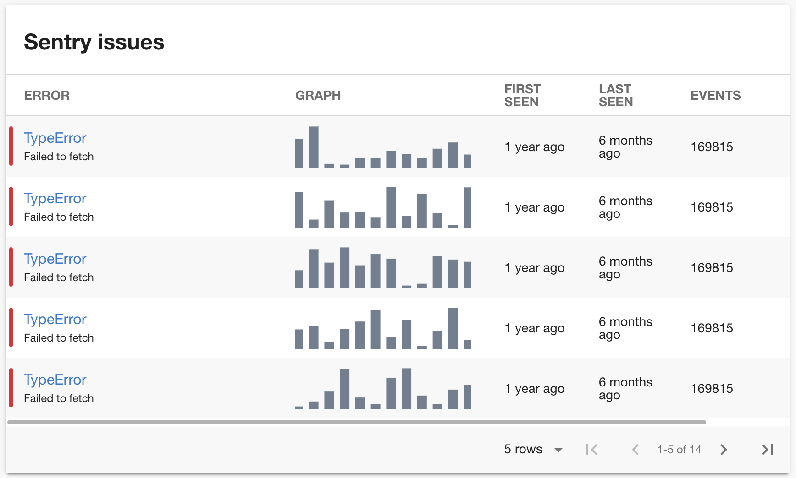

# Sentry Plugin

The Sentry Plugin displays issues from [Sentry](https://sentry.io).



## Getting Started

1. Install the Sentry Plugin:

```bash
# packages/app

yarn add @backstage/plugin-sentry
```

2. Add plugin to the app:

```js
// packages/app/src/plugins.ts

export { plugin as Sentry } from '@backstage/plugin-sentry';
```

3. Add the `SentryIssuesWidget` to the EntityPage:

```jsx
// packages/app/src/components/catalog/EntityPage.tsx

import { SentryIssuesWidget } from '@backstage/plugin-sentry';

const OverviewContent = ({ entity }: { entity: Entity }) => (
  <Grid container spacing={3} alignItems="stretch">
    // ...
    <Grid item xs={12} sm={6} md={4}>
      <SentryIssuesWidget entity={entity} />
    </Grid>
    // ...
  </Grid>
);
```

> You can also import a `Router` if you want to have a dedicated sentry page:
>
> ```tsx
> // packages/app/src/components/catalog/EntityPage.tsx
>
> import { Router as SentryRouter } from '@backstage/plugin-sentry';
>
> const ServiceEntityPage = ({ entity }: { entity: Entity }) => (
>   <EntityPageLayout>
>     // ...
>     <EntityPageLayout.Content
>       path="/sentry"
>       title="Sentry"
>       element={<SentryRouter entity={entity} />}
>     />
>     // ...
>   </EntityPageLayout>
> );
> ```

4. Add the proxy config:

```yaml
# app-config.yaml

proxy:
  '/sentry/api':
    target: https://sentry.io/api/
    allowedMethods: ['GET']
    headers:
      Authorization:
        # Content: 'Bearer <your-sentry-token>'
        $env: SENTRY_TOKEN

sentry:
  organization: <your-organization>
```

5. Create a new internal integration with the permissions `Issues & Events: Read` (https://docs.sentry.io/product/integrations/integration-platform/) and provide it as `SENTRY_TOKEN` as env variable.

6. Add the `sentry.io/project-slug` annotation to your catalog-info.yaml file:

```yaml
apiVersion: backstage.io/v1alpha1
kind: Component
metadata:
  name: backstage
  description: |
    Backstage is an open-source developer portal that puts the developer experience first.
  annotations:
    sentry.io/project-slug: YOUR_PROJECT_SLUG
spec:
  type: library
  owner: CNCF
  lifecycle: experimental
```

### Demo Mode

The plugin provides a MockAPI that always returns dummy data instead of talking to the sentry backend.
You can add it by overriding the `sentryApiRef`:

```ts
// packages/app/src/apis.ts

import { createApiFactory } from '@backstage/core';
import { MockSentryApi, sentryApiRef } from '@backstage/plugin-sentry';

export const apis = [
  // ...

  createApiFactory(sentryApiRef, new MockSentryApi()),
];
```
