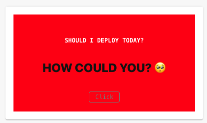
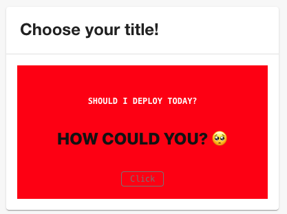

# @backstage/plugin-should-i-deploy

---

Welcome to the @backstage/plugin-should-i-deploy plugin!

## Overview

---

Tired of looking at the calendar to see if today is a good day to deploy? Your problems are solved! This plugin creates the perfect card containing this information for your home! The phrases and background color change according to the day, based on UTC or the time zone.

### Simple Card



### Card with title



## Getting started

---

### Install the package

```bash
# From your Backstage root directory
yarn add --cwd packages/app @backstage/plugin-should-i-deploy
```

### Import the card

Add a **Should I deploy card** to the home page on the `packages/app/src/components/home/HomePage.tsx` add:

```diff
+ import { ShouldIDeployCard } from '@backstage/plugin-should-i-deploy';

    <Page themeId="other">
      <Header title="Home" />
      <Content>
        <Grid container direction="row">
          <Grid item xs={12} md={3}>
            <Grid container direction="column">
+             <Grid item>
+               <ShouldIDeployCard title='Choose your title!' timeZone="America/Sao_Paulo"/>
+             </Grid>

    {/* ...other items */}
```

**_Note_**: Title and time zone are optional. If you don't specify a title, it will not be rendered. If you don't specify a time zone, the API will use UTC.

This project uses the API available at [shouldideploy](https://github.com/baires/shouldideploy) :heart:
