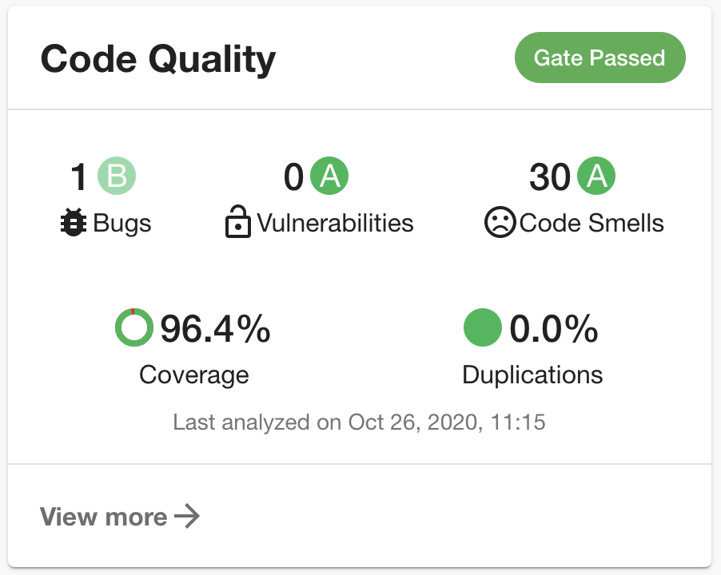

# SonarQube Plugin

The SonarQube Plugin displays code statistics from [SonarCloud](https://sonarcloud.io) or [SonarQube](https://sonarqube.com).



## Getting Started

1. Install the SonarQube Plugin:

```bash
# From your Backstage root directory
yarn --cwd packages/app add @backstage/plugin-sonarqube
```

2. Add the `EntitySonarQubeCard` to the EntityPage:

```diff
  // packages/app/src/components/catalog/EntityPage.tsx
+ import { EntitySonarQubeCard } from '@backstage/plugin-sonarqube';

 ...

 const overviewContent = (
   <Grid container spacing={3} alignItems="stretch">
     <Grid item md={6}>
       <EntityAboutCard variant="gridItem" />
     </Grid>
+    <Grid item md={6}>
+      <EntitySonarQubeCard variant="gridItem" />
+    </Grid>
   </Grid>
 );
```

3. Run the following commands in the root folder of the project to install and compile the changes.

```yaml
yarn install
yarn tsc
```

4. Add the `sonarqube.org/project-key` annotation to the `catalog-info.yaml` file of the target repo for which code quality analysis is needed.

```yaml
apiVersion: backstage.io/v1alpha1
kind: Component
metadata:
  name: backstage
  description: |
    Backstage is an open-source developer portal that puts the developer experience first.
  annotations:
    sonarqube.org/project-key: YOUR_INSTANCE_NAME/YOUR_PROJECT_KEY
spec:
  type: library
  owner: CNCF
  lifecycle: experimental
```

`YOUR_INSTANCE_NAME/` is optional and will query the default instance if not provided.

## Links

- [Sonarqube Backend](../sonarqube-backend/README.md)
