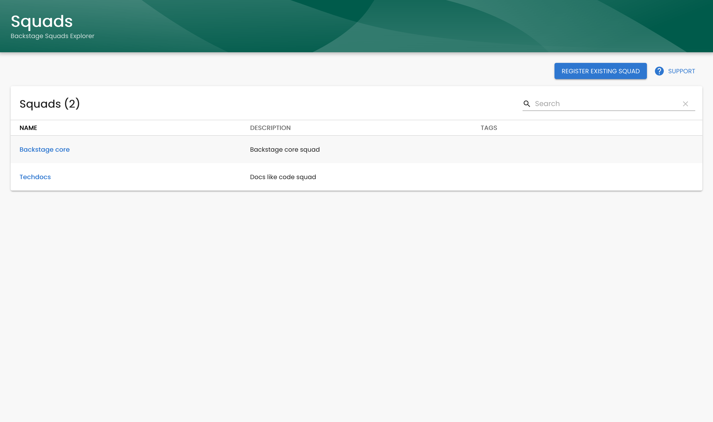
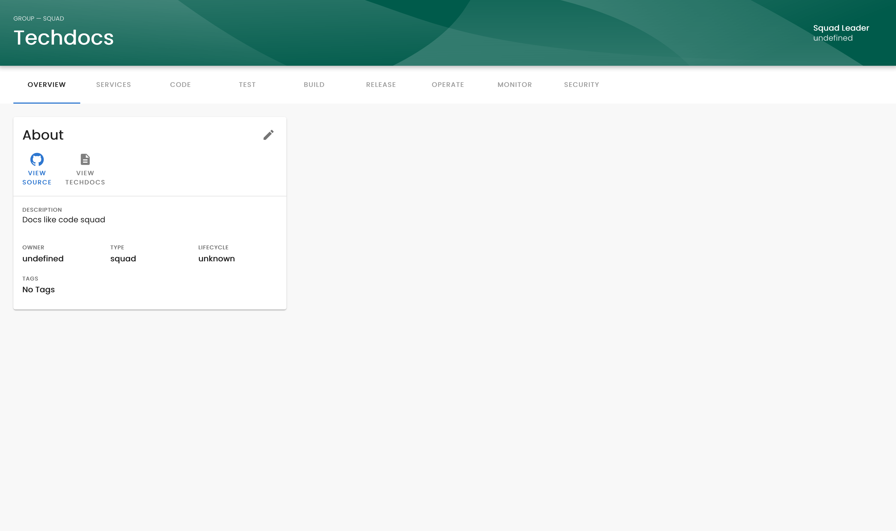

# Squads

The Squads plugin lets you view Group entities (Squads) inside Backstage.




## Setup

##### 1. Add plugin dependency

If you have a standalone app (you didn't clone this repo), then do in `packages/app`

```bash
yarn add @backstage/plugin-squads
```

##### 2. Add plugin:

```ts
// packages/app/src/plugins.ts
export { plugin as Squads } from '@backstage/plugin-squads';
```

##### 3. Add Router

```tsx
// packages/app/src/App.tsx
import { Router as SquadRouter, rootRouteRef } from '@backstage/plugin-squads'
import { SquadEntityPage } from './components/squads/SquadEntityPage'; // This file is created in next step

// (add this inside Routes)
<Route
    path={`${rootRouteRef.path}/*`}
    element={<SquadRouter EntityPage={SquadEntityPage} />}
/>
```

##### 4. Add SquadEntityPage

It's intented that you customize the squad entity page to fit your demands, so out of the box this won't really do anything.

Add file packages/app/src/components/squads/SquadEntityPage.tsx with the following content:

```tsx
import React from 'react';
import {
    AboutCard,
} from '@backstage/plugin-catalog';
import { Entity } from '@backstage/catalog-model';
import { Grid } from '@material-ui/core';
import { EntityPageLayout, getEntity } from '@backstage/plugin-squads'

const OverviewContent = ({ entity }: { entity: Entity }) => (
<Grid container spacing={3}>
    <Grid item>
    <AboutCard entity={entity} />
    </Grid>
</Grid>
);

const ServiceEntityPage = ({ entity }: { entity: Entity }) => (
<EntityPageLayout>
    <EntityPageLayout.Content
        path="/"
        title="Overview"
        element={<OverviewContent entity={entity} />}
    />
    <EntityPageLayout.Content
        path="/"
        title="Services"
        element={<OverviewContent entity={entity} />}
    />
    <EntityPageLayout.Content
        path="/"
        title="Code"
        element={<OverviewContent entity={entity} />}
    />
    <EntityPageLayout.Content
        path="/"
        title="Test"
        element={<OverviewContent entity={entity} />}
    />
    <EntityPageLayout.Content
        path="/"
        title="Build"
        element={<OverviewContent entity={entity} />}
    />
    <EntityPageLayout.Content
        path="/"
        title="Release"
        element={<OverviewContent entity={entity} />}
    />
    <EntityPageLayout.Content
        path="/"
        title="Operate"
        element={<OverviewContent entity={entity} />}
    />
    <EntityPageLayout.Content
        path="/"
        title="Monitor"
        element={<OverviewContent entity={entity} />}
    />
    <EntityPageLayout.Content
        path="/"
        title="Security"
        element={<OverviewContent entity={entity} />}
    />
</EntityPageLayout>
);

export const SquadEntityPage = () => {
    // Get the entity by calling the Catalog API
    const { entity } = getEntity();

    // When entity is undefined it actually only means that it is 
    // waiting for the result from the async call to the catalog API
    if (entity == undefined){
        return <EntityPageLayout />;
    }

    // When the entity is loaded we return the actual SquadPage
    return <ServiceEntityPage entity={entity} />;
};
```

##### 5. Add Squads to your sidebar

Add the following content
```tsx
// packages/app/src/components/Root/Root.tsx
import GroupIcon from '@material-ui/icons/Group';

<SidebarItem icon={GroupIcon} to="squads" text="Squads" />
```


**Congrats! You should now be ready to go 🥳**