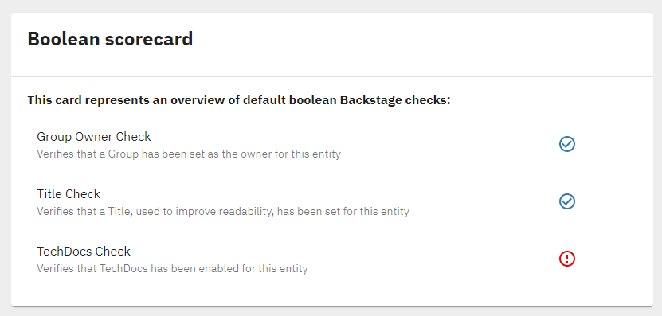

# Tech Insights

This plugin provides the UI for the `@backstage/tech-insights-backend` plugin, in order to display results of the checks running following the rules and the logic defined in the `@backstage/tech-insights-backend` plugin itself.

Main areas covered by this plugin currently are:

- Providing an overview for default boolean checks in a form of Scorecards.

- Providing an option to render different custom components based on type of the checks running in the backend.

## Installation

### Install the plugin

```bash
# From your Backstage root directory
yarn --cwd packages/app add @backstage/plugin-tech-insights
```

### Add boolean checks overview (Scorecards) page to the EntityPage:

```tsx
// packages/app/src/components/catalog/EntityPage.tsx

import { EntityTechInsightsScorecardContent } from '@backstage/plugin-tech-insights';

const serviceEntityPage = (
  <EntityLayoutWrapper>
    <EntityLayout.Route path="/" title="Overview">
      {overviewContent}
    </EntityLayout.Route>
    <EntityLayout.Route path="/ci-cd" title="CI/CD">
      {cicdContent}
    </EntityLayout.Route>
    ...
    <EntityLayout.Route path="/tech-insights" title="Scorecards">
      <EntityTechInsightsScorecardContent
        title="Customized title for the scorecard"
        description="Small description about scorecards"
      />
    </EntityLayout.Route>
    ...
  </EntityLayoutWrapper>
);
```

It is obligatory to pass `title` prop to `EntityTechInsightsScorecardContent`, `description` prop is optional.

If you like to display multiple cards in a `EntityLayout.Route` use `EntityTechInsightsScorecardCard`.

You can pass an array `checksId` as a prop with the [Fact Retrievers ids](../tech-insights-backend#creating-fact-retrievers) to limit which checks you want to show in this card. If you don't pass, the default value is show all checks.

```tsx
<EntityTechInsightsScorecardContent
  title="Show only simpleTestCheck in this card"
  checksId={['simpleTestCheck']}
/>
```

If you want to show checks in the overview of an entity use `EntityTechInsightsScorecardCard`.

```tsx
// packages/app/src/components/catalog/EntityPage.tsx

import { EntityTechInsightsScorecardCard } from '@backstage/plugin-tech-insights';

const overviewContent = (
  <Grid container spacing={3} alignItems="stretch">
    {entityWarningContent}
    <Grid item md={6} xs={12}>
      <EntityAboutCard variant="gridItem" />
    </Grid>
    <Grid item md={6} xs={12}>
      <EntityCatalogGraphCard variant="gridItem" height={400} />
    </Grid>
    ...
    <Grid item md={8} xs={12}>
      <EntityTechInsightsScorecardCard
        title="Customized title for the scorecard"
        description="Small description about scorecards"
        checksId={['simpleTestCheck']}
      />
    </Grid>
  </Grid>
);
```

## Boolean Scorecard Example

If you follow the [Backend Example](https://github.com/backstage/backstage/tree/master/plugins/tech-insights-backend#backend-example), once the needed facts have been generated the default boolean scorecard will look like this:



## Adding custom rendering components

Default scorecard implementation displays only `json-rules-engine` check results. If you would like to support different types, you need to inject custom rendering components to the `TechInsightsClient` constructor.

```ts
// packages/app/src/apis.ts

export const apis: AnyApiFactory[] = [
...
  createApiFactory({
    api: techInsightsApiRef,
    deps: { discoveryApi: discoveryApiRef, identityApi: identityApiRef },
    factory: ({ discoveryApi, identityApi }) =>
      new TechInsightsClient({
        discoveryApi,
        identityApi,
        renderers: [
          jsonRulesEngineCheckResultRenderer, // default json-rules-engine renderer
          myCustomBooleanRenderer, // custom renderer
        ],
      }),
  }),
...
];
```

```tsx
// packages/app/src/components/myCustomBooleanRenderer.tsx

export const myCustomBooleanRenderer: CheckResultRenderer = {
  type: 'boolean',
  component: (checkResult: CheckResult) => (
    <BooleanCheck checkResult={checkResult} />
  ),
};
```

It's also possible to customize the description. Both strings and React components are accepted. As an example, you would like
to display another information if the check has failed. In such cases, you could do something like the following:

```tsx
// packages/app/src/components/myCustomBooleanRenderer.tsx

export const myCustomBooleanRenderer: CheckResultRenderer = {
  type: 'boolean',
  component: (checkResult: CheckResult) => (
    <BooleanCheck checkResult={checkResult} />
  ),
  description: (checkResult: CheckResult) => (
    <>
      {
        checkResult.result
          ? checkResult.check.description // In case of success, return the same description
          : `The check has failed! ${checkResult.check.description}` // Add a prefix text if the check failed
      }
    </>
  ),
};
```
