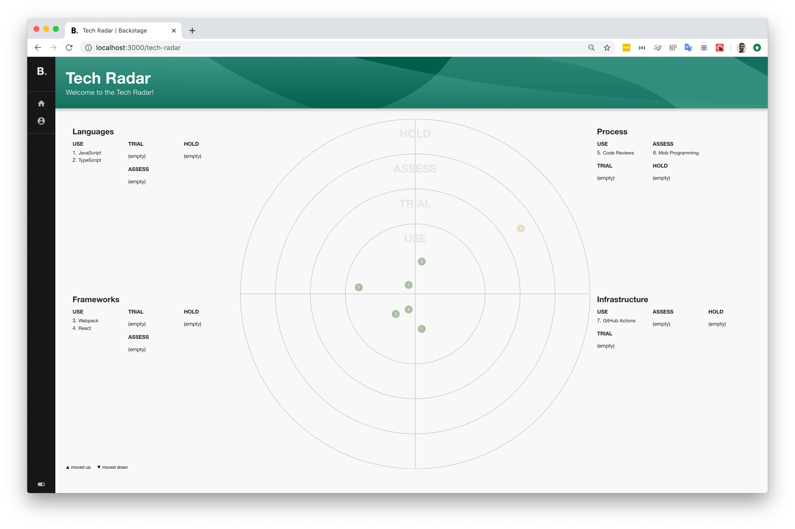

# @backstage/plugin-tech-radar



The Backstage integration for the Tech Radar based on [Zalando's Tech Radar](https://opensource.zalando.com/tech-radar/) open sourced on [GitHub](https://github.com/zalando/tech-radar). This is used at [Spotify](https://spotify.github.io) for visualizing the official guidelines of different areas of software development such as languages, frameworks, infrastructure and processes.

Read the [blog post on backstage.io about the Tech Radar](https://backstage.io/blog/2020/05/14/tech-radar-plugin).

## Purpose

Zalando has a fantastic description [on their website](https://opensource.zalando.com/tech-radar/):

> The Tech Radar is a tool to inspire and support engineering teams at Zalando to pick the best technologies for new projects; it provides a platform to share knowledge and experience in technologies, to reflect on technology decisions and continuously evolve our technology landscape. Based on the pioneering work of ThoughtWorks, our Tech Radar sets out the changes in technologies that are interesting in software development — changes that we think our engineering teams should pay attention to and consider using in their projects.

It serves and scales well for teams and companies of all sizes that want to have alignment across dozens of technologies and visualize it in a simple way.

## Getting Started

The Tech Radar can be used in two ways:

- **Simple (Recommended)** - This gives you an out-of-the-box Tech Radar experience. It lives on the `/tech-radar` URL of your Backstage installation.
- **Advanced** - This gives you the React UI component directly. It enables you to insert the Radar on your own layout or page for a more customized feel.

### Install

For either simple or advanced installations, you'll need to add the dependency using Yarn:

```bash
# From your Backstage root directory
yarn --cwd packages/app add @backstage/plugin-tech-radar
```

### Configuration

Modify your app routes to include the Router component exported from the tech radar, for example:

```tsx
// In packages/app/src/App.tsx
import { TechRadarPage } from '@backstage/plugin-tech-radar';

const routes = (
  <FlatRoutes>
    {/* ...other routes */}
    <Route
      path="/tech-radar"
      element={<TechRadarPage width={1500} height={800} />}
    />
```

If you'd like to configure it more, see the `TechRadarPageProps` and `TechRadarComponentProps` types for options:

```ts
export type TechRadarPageProps = TechRadarComponentProps & {
  title?: string;
  subtitle?: string;
  pageTitle?: string;
};

export interface TechRadarPageProps {
  width: number;
  height: number;
  svgProps?: object;
}
```

### Radar properties

When defining the radar entries you can see the available properties on the file [api](./src/api.ts)

## Tech radar data model

| Name        | Type                    | Description                                                          | Required? |
| ----------- | ----------------------- | -------------------------------------------------------------------- | --------- |
| `title`     | string                  | The title of the radar                                               | Yes       |
| `quadrants` | [quadrant[]](#quadrant) | The 4 quadrants of the radar, clockwise starting at the bottom right | Yes       |
| `rings`     | [ring[]](#ring)         | The radar rings, starting from the inside                            | Yes       |
| `entries`   | [entry[]](#entry)       | The radar entries                                                    | Yes       |

### quadrant

| Name   | Type   | Description              | Required? |
| ------ | ------ | ------------------------ | --------- |
| `id`   | string | The id of the quadrant   | Yes       |
| `name` | string | The name of the quadrant | Yes       |

### ring

| Name          | Type   | Description                                       | Required? |
| ------------- | ------ | ------------------------------------------------- | --------- |
| `id`          | string | The id of the ring                                | Yes       |
| `name`        | string | The name of the ring                              | Yes       |
| `color`       | string | The color of the ring and entries inside the ring | Yes       |
| `description` | string | Description of the Ring                           | No        |

### entry

| Name          | Type                    | Description                                     | Required? |
| ------------- | ----------------------- | ----------------------------------------------- | --------- |
| `id`          | string                  | The unique id from the entry                    | Yes       |
| `title`       | string                  | The title that is shown in the radar            | Yes       |
| `description` | string                  | The full description of the entry               | No        |
| key           | string                  | The entry key                                   | Yes       |
| `url`         | string                  | The URL to the entry internal or external page  | No        |
| `quadrant`    | string                  | The name of the quadrant connected to the entry | Yes       |
| `timeline`    | [timeline[]](#timeline) | Requires minimal one timeline entry             | Yes       |

### timeline

| Name          | Type   | Description                                                   | Required? |
| ------------- | ------ | ------------------------------------------------------------- | --------- |
| `moved`       | number | Possible values are: -1 (moved out), 0 (stayed), 1 (moved in) | Yes       |
| `ringId`      | string | The ring id                                                   | Yes       |
| `date`        | string | Date in format (YYYY-MM-dd)                                   | Yes       |
| `description` | string | A long description                                            | Yes       |

### Sample

This is a sample on how the JSON file could look like.
The TS example can be found [here](src/sample.ts).

```JSON
{
    "title": "Title of your Tech radar",
    "quadrants": [
        {
            "id": "1",
            "name": "Bottom right"
        },
        {
            "id": "2",
            "name": "Bottom left"
        },
        {
            "id": "3",
            "name": "Top left"
        },
        {
            "id": "4",
            "name": "Top right"
        }
    ],
    "rings": [
        {
            "id": "adopt",
            "name": "ADOPT",
            "color": "#93c47d"
        },
        {
            "id": "trial",
            "name": "TRIAL",
            "color": "#93d2c2"
        },
        {
            "id": "assess",
            "name": "ASSESS",
            "color": "#fbdb84"
        },
        {
            "id": "hold",
            "name": "HOLD",
            "color": "#efafa9"
        }
    ],
    "entries": [
        {
            "id": "typescript",
            "title": "Typescript",
            "description": "Long description for Typescript",
            "key": "typescript",
            "url": "#",
            "quadrant": "1",
            "timeline": [
                {
                    "moved": 0,
                    "ringId": "trial",
                    "date": "2022-02-06",
                    "description": "Long description for trial"
                },
                {
                    "moved": 1,
                    "ringId": "adopt",
                    "date": "2022-02-08",
                    "description": "Long description for adopt"
                }
            ]
        },
        ...
    ]
}
```

## Frequently Asked Questions

### Who created the Tech Radar?

[ThoughtWorks](https://thoughtworks.com/radar) created the Tech Radar concept, and [Zalando created the visualization](https://opensource.zalando.com/tech-radar/) that we use at Spotify and in this plugin.

### How do I load in my own data?

The `TechRadar` plugin uses the `techRadarApiRef` to get a client which implements the `TechRadarApi` interface. The default sample one is located [here](https://github.com/backstage/backstage/blob/master/plugins/tech-radar/src/sample.ts). To load your own data, you'll need to provide a class that implements the `TechRadarApi` and override the `techRadarApiRef` in the `app/src/apis.ts`.

```ts
// app/src/lib/MyClient.ts
import {
  TechRadarApi,
  TechRadarLoaderResponse,
} from '@backstage/plugin-tech-radar';

export class MyOwnClient implements TechRadarApi {
  async load(id: string | undefined): Promise<TechRadarLoaderResponse> {
    // if needed id prop can be used to fetch the correct data

    const data = await fetch('https://mydata.json').then(res => res.json());

    // For example, this converts the timeline dates into date objects
    return {
      ...data,
      entries: data.entries.map(entry => ({
        ...entry,
        timeline: entry.timeline.map(timeline => ({
          ...timeline,
          date: new Date(timeline.date),
        })),
      })),
    };
  }
}

// app/src/apis.ts
import { MyOwnClient } from './lib/MyClient';
import { techRadarApiRef } from '@backstage/plugin-tech-radar';

export const apis: AnyApiFactory[] = [
  /*
  ...
  */
  createApiFactory(techRadarApiRef, new MyOwnClient()),
];
```

### How do I write tests?

You can use the `svgProps` option to pass custom React props to the `<svg>` element we create for the Tech Radar. This complements well with the `data-testid` attribute and the `@testing-library/react` library we use in Backstage.

```tsx
<TechRadarComponent
  width={1400}
  height={800}
  svgProps={{
    'data-testid': 'tech-radar-svg',
  }}
/>

// Then, in your tests...
// const { getByTestId } = render(...);
// expect(getByTestId('tech-radar-svg')).toBeInTheDocument();
```

### How do I support multiple radars

The `TechRadarPage` and `TechRadarComponent` components both take an optional `id` prop which is subsequently passed to the `load` method of the API to distinguish which radar's data to load.
