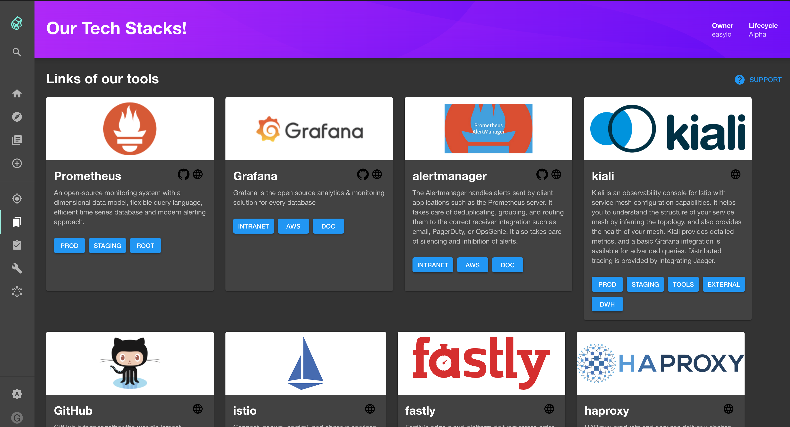

# tech-stack

Welcome to the tech-stack plugin!

_This plugin was created through the Backstage CLI_

## Getting started

Your plugin has been added to the example app in this repository, meaning you'll be able to access it by running `yarn start` in the root directory, and then navigating to [/tech-stack](http://localhost:3000/tech-stack).

You can also serve the plugin in isolation by running `yarn start` in the plugin directory.
This method of serving the plugin provides quicker iteration speed and a faster startup and hot reloads.
It is only meant for local development, and the setup for it can be found inside the [/dev](/dev) directory.

## Configuration

you can define your tool list in config/ToolsListConfig.ts

example :
’’’
{
    type: 'prometheus',
        scm: 'https://github.com/test-com/prometheus-config',
            actions: [
                {
                    caption: 'PROD',
                    link: 'https://prometheus.prod.test.com',
                },
                {
                    caption: 'Staging',
                    link: 'https://prometheus.staging.test.com',
                },
                {
                    caption: 'ROOT',
                    link: 'https://prod.test.com',
                },
            ],
},
’’’

to find what 'type' is already available you can check in 'config/ToolsDefaultConfig.json'

if you need new type open an issue for this plugin.
