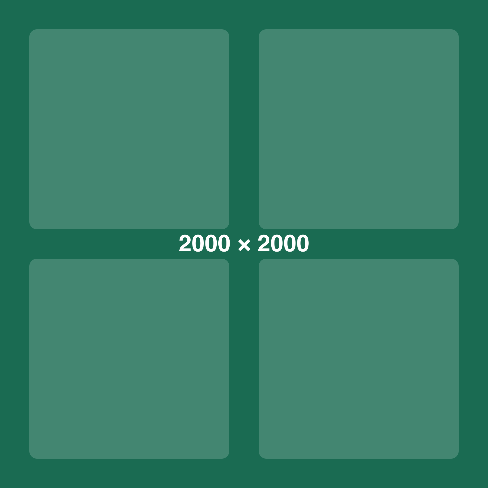

# Image gallery

Images for exercising image viewing: stepping through a set, the counter, and
zooming. Each placeholder has its dimensions drawn onto it, so it is easy to see
which image is on screen and at what size it is being shown.

## A set of images

Opening any of these should allow stepping through the others, with a counter of
the current position. The first two have opposite shapes, so zooming to fit
behaves differently for each.

The square image is larger than the width available to it, so the page scales it
down. Opening it shows it at that reduced size rather than at its full size, and a
further click enlarges it.

## Linked images

A linked image should follow its link rather than open in a viewer:

