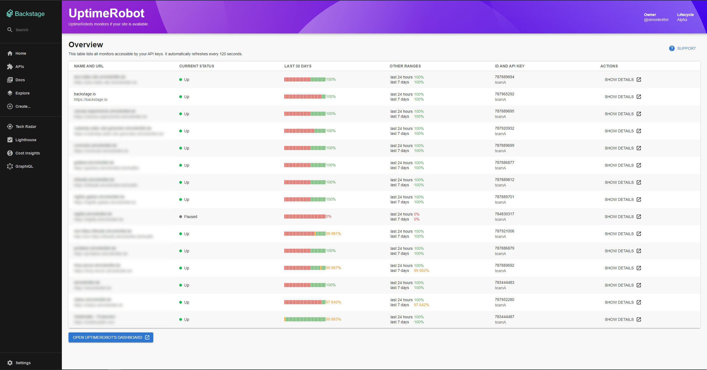
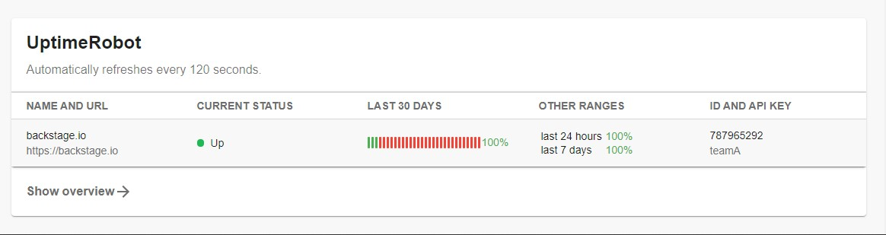

# Backstage plugin for integrating UptimeRobot

[UptimeRobot](https://uptimerobot.com) lets you track the availability of your services. This plugin provides the integration for Backstage so you can see the status of your monitors from within Backstage.

## Screenshots

### Overview page

The table on the overview page lists all monitors which are accessible with your configured API keys.



### EntityPage

You can add a card to your entity's overview page. That card then contains a table which only lists monitors which you've added to yours component's annotations.



## Installation

### 1. Install the dependencies

Run this from the root of your Backstage directory.

```sh
yarn --cwd packages/app add @backstage/plugin-uptimerobot
yarn --cwd packages/backend add @backstage/plugin-uptimerobot-backend
```

### 2. Create a file called `uptimerobot.ts` in your `backend/src/plugins` directory

```ts
import { CatalogClient } from '@backstage/catalog-client';
import { createRouter } from '@backstage/plugin-uptimerobot-backend';
import { PluginEnvironment } from '../types';
import { Router } from 'express';

export default async function createPlugin({
  config,
  discovery,
  logger,
}: PluginEnvironment): Promise<Router> {
  const catalogClient = new CatalogClient({ discoveryApi: discovery });

  return await createRouter({
    catalogClient,
    config,
    logger,
  });
}
```

### 3. Add the following to your `backend/src/index.ts`

```ts
import uptimerobot from './plugins/uptimerobot';
// ...
const uptimerobotEnv = useHotMemoize(module, () => createEnv('uptimerobot'));
//...
apiRouter.use('/uptimerobot', await uptimerobot(uptimerobotEnv));
```

### 4. (Optional) Import and add the card to your `EntityPage.tsx`

```tsx
import {
  EntityUptimerobotOverviewCard,
  isUptimerobotAvailable,
} from '@backstage/plugin-uptimerobot';
// ...
<EntitySwitch>
  <EntitySwitch.Case if={isUptimerobotAvailable}>
    <Grid item md={6}>
      <EntityUptimerobotOverviewCard />
    </Grid>
  </EntitySwitch.Case>
</EntitySwitch>;
```

### 5. Add the route for the overview page to your `App.tsx`

```tsx
import { UptimerobotPage } from '@backstage/plugin-uptimerobot';
// ...
<Route path="/uptimerobot" element={<UptimerobotPage />} />;
```

### 6. (Optional) Add the link to the overview page to your sidebar (`Root.tsx`)

```tsx
import TimelineIcon from '@material-ui/icons/Timeline';
// ...
<SidebarItem icon={TimelineIcon} to="uptimerobot" text="UptimeRobot" />;
```

### 7. Add your API keys to your `app-config.yaml`.

You can add multiple keys with their respective identifier/name which you have to reference from the component's annotations ([see below](#usage)).

Here can retrieve your API keys from UptimeRobot's website: <https://uptimerobot.com/dashboard#mySettings>

The overview page and the card on the EntityPage update automatically. You can change the update interval by adjusting `updateInterval` (default: 120 seconds).

Full example:

```yaml
uptimerobot:
  apiKeys:
    - name: teamA
      key: ur123456-1234567890abcdefghijklmn
    - name: teamB
      key: ur654321-nmlkjihgfedcba0987654321
  updateInterval: 120
```

## Usage

Add annotations to your components. You can add multiple monitors by separating their IDs with a plus symbol. You can use multiple API keys by separating them with a semicolon symbol.

Syntax: `apiKey=<NAME>,monitors=<ID>`

Examples:

```yaml
# Single key and single monitor
uptimerobot.com/monitors: 'apiKey=teamA,monitors=123456789'

# Single key and multiple monitors
uptimerobot.com/monitors: 'apiKey=teamA,monitors=123456789+987654321'

# Multiple keys and a single monitor each
uptimerobot.com/monitors: 'apiKey=teamA,monitors=123456789;apiKey=teamB,monitors=987654321'

# Multiple keys and multiple monitors
uptimerobot.com/monitors: 'apiKey=teamA,monitors=123456789+192837465;apiKey=teamB,monitors=987654321+918273645'
```

Full example:

```yaml
apiVersion: backstage.io/v1alpha1
kind: Component
metadata:
  name: backstage
  description: backstage.io
  annotations:
    uptimerobot.com/monitors: 'apiKey=teamA,monitors=123456789'
spec:
  type: website
  lifecycle: production
  owner: guest
```
