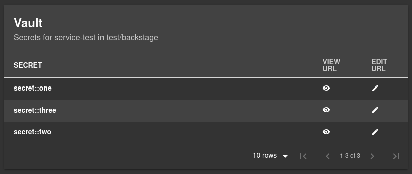
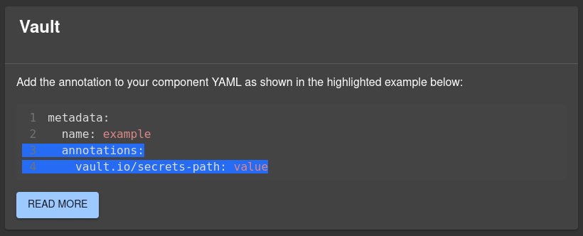

# @backstage/plugin-vault

A frontend for [Vault](https://www.vaultproject.io/), this plugin allows you to display a list of secrets in a certain path inside your vault instance. There are also some useful links to edit and/or view them using the official UI.



## Introduction

Vault is an identity-based secrets and encryption management system. A secret is anything that you want to tightly control access to, such as API encryption keys, passwords, or certificates. Vault provides encryption services that are gated by authentication and authorization methods.

This plugins allows you to view all the available secrets at a certain location, and redirect you to the official UI so backstage can rely on LIST permissions, which is safer.

## Getting started

To get started, first you need a running instance of Vault. You can follow [this tutorial](https://learn.hashicorp.com/tutorials/vault/getting-started-intro?in=vault/getting-started) to install vault and start your server locally.

1. When your Vault instance is up and running, then you will need to install the plugin into your app:

   ```bash
     # From your Backstage root directory
     yarn add --cwd packages/app @backstage/plugin-vault
   ```

2. Add the Vault card to the overview tab on the EntityPage:

   ```typescript
     // In packages/app/src/components/catalog/EntityPage.tsx
     import { EntityVaultCard } from '@backstage/plugin-vault';

     const overviewContent = (
       <Grid container spacing={3} alignItems="stretch">
         {/* ...other content */}
         <Grid item md={6} xs={12}>
           <EntityVaultCard />
         </Grid>
     );
   ```

3. Add some extra configurations in your [`app-config.yaml`](https://github.com/backstage/backstage/blob/master/app-config.yaml).

   ```yaml
   vault:
     baseUrl: http://your-vault-url
     token: <VAULT_TOKEN>
     secretEngine: 'customSecretEngine' # Optional. By default it uses 'secrets'
     kvVersion: <kv-version> # Optional. The K/V version that your instance is using. The available options are '1' or '2'
   ```

4. Get a `VAULT_TOKEN` with **LIST** permissions, as it's enough for the plugin. You can check [this tutorial](https://learn.hashicorp.com/tutorials/vault/tokens) for more info.

5. If you also want to use the `renew` functionality, you need to attach the following block to your custom policy, so that Backstage can perform a token-renew:
   ```
     # Allow tokens to renew themselves
     path "auth/token/renew-self" {
       capabilities = ["update"]
     }
   ```

## Integration with the Catalog

The plugin can be integrated into each Component in the catalog. To allow listing the available secrets a new annotation must be added to the `catalog-info.yaml`:

```yaml
apiVersion: backstage.io/v1alpha1
kind: Component
metadata:
  # ...
  annotations:
    vault.io/secrets-path: path/to/secrets
```

The path is relative to your secrets engine folder. So if you want to get the secrets for backstage and you have the following directory structure:

    .
    ├── ...
    ├── secrets                 # Your secret engine name (usually it is `secrets`)
    │   ├── test                # Folder with test secrets
    │   │   ├── backstage       # In this folder there are secrets for Backstage
    │   ├── other               # Other folder with more secrets inside
    │   └── folder              # And another folder
    └── ...

You will set the `vault.io/secret-path` to `test/backstage`. If the folder `backstage` contains other sub-folders, the plugin will fetch the secrets inside them and adapt the **View** and **Edit** URLs to point to the correct place.

If the annotation is missing for a certain component, then the card will show some information to the user:



## Features

- List the secrets present in a certain path
- Open a link to view the secret
- Open a link to edit the secret
- Renew the token automatically with a defined periodicity

The secrets cannot be edited/viewed from within Backstage to make it more secure. Backstage will only have permissions to LIST data from Vault. And the user who wants to edit/view a certain secret needs the correct permissions to do so.
